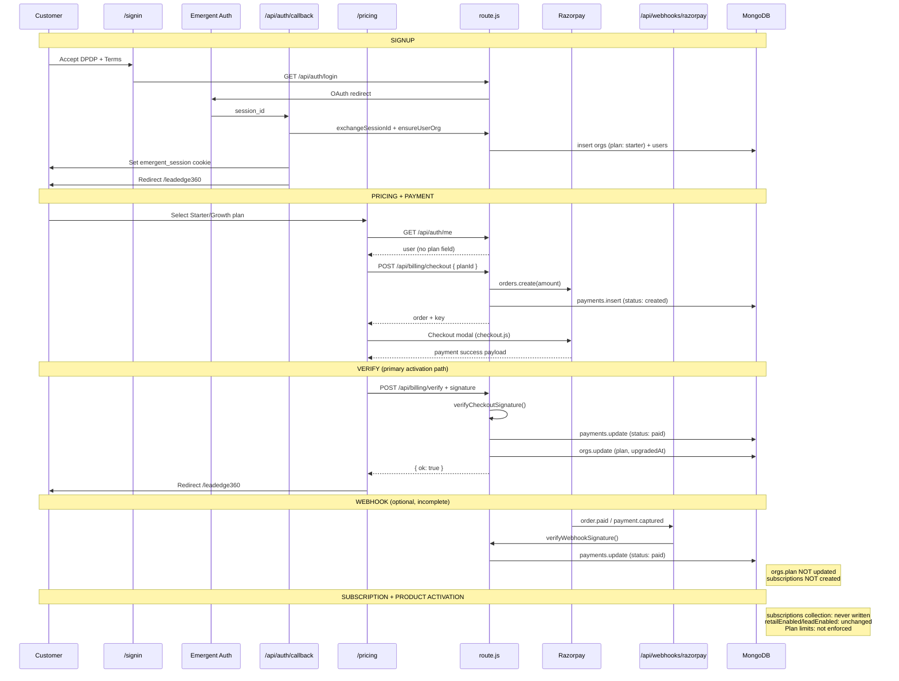

# Billing & Subscription Flow — Gap Analysis

**Product:** AsoftechInsightz v1.2.0  
**Date:** June 2026  
**Scope:** Signup → Pricing → Payment → Razorpay callback/webhook → Subscription creation → Org plan update → Product activation  
**Status:** Read-only trace — no code modified

---

## Executive Summary

The platform implements **one-time Razorpay Orders checkout**, not recurring Razorpay Subscriptions. A successful payment updates `payments.status` and `orgs.plan`, but **never creates a `subscriptions` document**, **does not activate products via `retailEnabled`/`leadEnabled`**, and **does not enforce plan limits**. The Razorpay webhook is a **partial backup** that updates payments only.

| Stage | Status |
|-------|--------|
| Signup / org provisioning | ✅ Working |
| Pricing UI + checkout initiation | ✅ Working (with gaps) |
| Razorpay client payment | ✅ Working (env-dependent) |
| Client verify callback | ✅ Working |
| Razorpay webhook | ⚠️ Partial (payments only) |
| Subscription record creation | ❌ Missing |
| Org plan update | ✅ On verify only |
| Product activation / gating | ❌ Not tied to billing |

---

## 1. End-to-End Journey Trace

### 1.1 Sequence diagram (as implemented today)



### 1.2 Stage-by-stage detail

#### Stage A — Signup

| Step | Component | File / endpoint |
|------|-----------|-----------------|
| 1 | Sign-in page with consent | `app/signin/page.js` |
| 2 | Auth config check | `GET /api/auth/me` → `{ configured }` |
| 3 | OAuth redirect | `GET /api/auth/login` → `lib/auth.js` `loginUrl()` |
| 4 | External login | `https://auth.emergent.sh/login` |
| 5 | Session exchange | `GET /api/auth/callback` → `exchangeSessionId()` |
| 6 | Org + user provision | `lib/tenant.js` `ensureUserOrg()` |
| 7 | Cookie + redirect | `emergent_session` (7 days) → `/leadedge360` |

**Database writes on first signup:**

| Collection | Fields written |
|------------|----------------|
| `orgs` | `id`, `name`, `ownerEmail`, `createdAt`, **`plan: 'starter'`** |
| `users` | `id`, `email`, `name`, `orgId`, `role: 'admin'`, `dpdpConsent` defaults |

**Billing relevance:** Every new org starts on **`starter`** before any payment. No trial period, no `subscriptions` row, no payment method on file.

---

#### Stage B — Pricing

| Step | Component | File / endpoint |
|------|-----------|-----------------|
| 1 | Pricing page load | `app/pricing/page.js` (`SiteShell`) |
| 2 | Auth check | `GET /api/auth/me` → `{ user }` (no plan) |
| 3 | Razorpay script | `https://checkout.razorpay.com/v1/checkout.js` |
| 4 | Plan display | **Hardcoded** `plans` array in page (not API) |
| 5 | Scale plan | Redirect to `/contact` (sales-led) |
| 6 | Unsigned subscribe | Redirect to `/signin` |

**Plans defined in two places (drift risk):**

| Source | Location |
|--------|----------|
| Server canonical | `lib/razorpay.js` → `PLANS` |
| UI copy | `app/pricing/page.js` → `plans` (features text, prices) |

**API available but unused by UI:** `GET /api/billing/plans`

---

#### Stage C — Payment (checkout initiation)

| Step | Component | Detail |
|------|-----------|--------|
| 1 | Create order | `POST /api/billing/checkout` `{ planId: 'starter' \| 'growth' }` |
| 2 | Tenant resolution | `resolveTenant(request)` → `orgId` (authenticated user org, or **`demo-org` if unsigned**) |
| 3 | Razorpay API | `rzp.orders.create({ amount: price * 100, currency, receipt, notes: { planId, orgId } })` |
| 4 | Persist pending payment | `payments.insertOne` |

**`payments` document shape:**

```json
{
  "id": "<uuid>",
  "orgId": "<tenant>",
  "razorpay_order_id": "order_...",
  "amount": 1499,
  "plan": "starter",
  "status": "created",
  "createdAt": "<iso>"
}
```

**Not used:** Razorpay Subscriptions API, Razorpay Customers API, payment links, invoices API.

---

#### Stage D — Razorpay client callback

| Step | Component | Detail |
|------|-----------|--------|
| 1 | Modal success | Razorpay `handler(response)` in `pricing/page.js` |
| 2 | Response fields | `razorpay_order_id`, `razorpay_payment_id`, `razorpay_signature` |
| 3 | Verify call | `POST /api/billing/verify` with response + `planId` |
| 4 | Signature check | `verifyCheckoutSignature()` HMAC with `RAZORPAY_KEY_SECRET` |
| 5 | Success UX | Toast + redirect `/leadedge360` after 1.5s |

**This is the only path that updates `orgs.plan` today.**

---

#### Stage E — Razorpay webhook

| Step | Component | Detail |
|------|-----------|--------|
| Endpoint | `POST /api/webhooks/razorpay` | Public (signature-verified) |
| Events handled | `order.paid`, `payment.captured` | |
| Verification | `verifyWebhookSignature(raw, x-razorpay-signature)` | Requires `RAZORPAY_WEBHOOK_SECRET` |
| DB update | `payments.updateOne` by `razorpay_order_id` | Sets `status: paid`, `razorpay_payment_id`, `webhookAt` |

**Webhook does NOT:**

- Update `orgs.plan` or `upgradedAt`
- Create `subscriptions` records
- Read `notes.planId` / `notes.orgId` from Razorpay order
- Handle `payment.failed`, `subscription.*`, refunds, or disputes
- Send customer notifications

**Failure mode:** If customer pays but closes browser before `POST /api/billing/verify`, webhook marks payment paid but **org stays on previous plan** unless verify is retried manually.

---

#### Stage F — Subscription creation

**Expected (per `docs/sql/01_schema.sql`, OpenAPI, mobile read APIs):**

| Field | Intended |
|-------|----------|
| `subscriptions.status` | `trialing` \| `active` \| `past_due` \| `cancelled` \| `expired` |
| `current_start` / `current_end` | Billing period |
| `razorpay_order_id` / `razorpay_payment_id` | Payment linkage |

**Actual:** **No code path inserts into `subscriptions`.**

Read-only consumers (always empty for billing-origin customers):

| Endpoint | Auth | File |
|----------|------|------|
| `GET /api/users/subscription` | JWT | `lib/mobile-routes.js` L233–236 |
| `GET /api/admin/subscriptions` | JWT admin | `lib/mobile-routes.js` L545–547 |

OpenAPI documents `POST /api/admin/subscriptions` — **not implemented**.

---

#### Stage G — Organization plan update

| Trigger | Collection | Update |
|---------|------------|--------|
| First signup | `orgs` | `plan: 'starter'` (default) |
| `POST /api/billing/verify` success | `orgs` | `plan: body.planId \|\| 'growth'`, `upgradedAt` |
| Webhook | `orgs` | **None** |
| Recurring renewal | `orgs` | **None** (no renewal flow) |

**Gaps:**

- `GET /api/auth/me` returns `{ user, isDemo, configured }` — **no `plan`**
- No `billingStatus`, `trialEndsAt`, or `lastPaymentAt` on org
- Verify uses `orgId` from **current request tenant**, not from `payments.orgId` or Razorpay order notes (mismatch risk if session changes)

---

#### Stage H — Product activation

**Expected product model (`orgs` + admin API):**

| Flag | Meaning | Default |
|------|---------|---------|
| `leadEnabled` | LeadEdge360 access | Not set on create; admin API can toggle |
| `retailEnabled` | RetailEdge360 access | Not set on create; defaults `true` in admin GET |

| Product | Web route | Gating enforced? |
|---------|-----------|------------------|
| LeadEdge360 | `/leadedge360` | **No** — always accessible |
| RetailEdge360 | `/retailedge360` | **No** — `retailEnabled` not checked in `route.js` |

**Billing → product linkage:** **None.** Paying for Growth does not:

- Set `retailEnabled` / `leadEnabled`
- Unlock features documented in plan marketing copy
- Enforce lead/month or user limits (`PLAN_LIMIT_EXCEEDED` in `error-codes.md` is **never returned** by code)

**Post-payment customer experience:** Redirect to `/leadedge360` — same UI as pre-payment; no “activation complete” screen.

---

## 2. Existing Working Components

### 2.1 Frontend

| Component | Path | Function |
|-----------|------|----------|
| Sign-in + consent | `app/signin/page.js` | DPDP/Terms gates OAuth |
| Pricing page | `app/pricing/page.js` | Plan cards, auth gate, Razorpay modal |
| Razorpay checkout.js | CDN script | Client payment UI |
| Success redirect | `pricing/page.js` handler | Verify + toast + `/leadedge360` |
| Navbar auth state | `components/site/Navbar.jsx` | Shows signed-in user |
| Product dashboards | `/leadedge360`, `/retailedge360` | Usable before and after pay |

### 2.2 Backend / libraries

| Component | Path | Function |
|-----------|------|----------|
| Emergent Auth | `lib/auth.js` | Login URL, session exchange, verify |
| Org provisioning | `lib/tenant.js` `ensureUserOrg()` | Creates org + user |
| Plan catalog (server) | `lib/razorpay.js` `PLANS` | Starter/Growth/Scale definitions |
| Razorpay client factory | `lib/razorpay.js` `getRazorpay()` | Graceful null if keys missing |
| Checkout signature | `verifyCheckoutSignature()` | HMAC validation |
| Webhook signature | `verifyWebhookSignature()` | HMAC validation |
| Checkout API | `POST /api/billing/checkout` | Order create + `payments` insert |
| Verify API | `POST /api/billing/verify` | Payment confirm + `orgs.plan` |
| Plans API | `GET /api/billing/plans` | Returns `PLANS` + `configured` flag |
| Webhook handler | `POST /api/webhooks/razorpay` | Payment status sync |
| Auth session | `GET /api/auth/me`, callback, logout | Cookie lifecycle |

### 2.3 Database (working writes)

| Collection | When written | Billing fields |
|------------|--------------|----------------|
| `orgs` | Signup, verify | `plan`, `upgradedAt` |
| `payments` | Checkout, verify, webhook | Full payment lifecycle (partial) |
| `users` | Signup | — |
| `consent_log` | DPDP POST (optional) | — |

### 2.4 Environment / ops

| Variable | Purpose |
|----------|---------|
| `EMERGENT_PROJECT_ID`, `EMERGENT_API_KEY` | Signup |
| `NEXT_PUBLIC_RAZORPAY_KEY_ID`, `RAZORPAY_KEY_SECRET` | Checkout + verify |
| `RAZORPAY_WEBHOOK_SECRET` | Webhook verification |
| `MONGO_URL`, `DB_NAME` | Persistence |

---

## 3. Missing Components

### 3.1 Business logic

| Missing component | Impact |
|-----------------|--------|
| Recurring subscription engine | “Monthly” plans are single charges; no auto-renewal |
| Razorpay Subscriptions / Customers integration | Cannot manage mandates, dunning, or retries |
| Subscription entity lifecycle | No `active` → `past_due` → `cancelled` states |
| Plan limit enforcement middleware | Marketing limits (500 leads/mo, 5 users) are honor-system |
| `SUBSCRIPTION_REQUIRED` / `PLAN_LIMIT_EXCEEDED` guards | Documented in `error-codes.md`; never thrown |
| Product activation on payment | Plan tier does not toggle `leadEnabled`/`retailEnabled` |
| Webhook → org plan sync | Payment can be `paid` while org plan stale |
| Idempotent verify / webhook deduplication | Double processing possible on retries |
| Unsigned checkout guard on API | `checkout`/`verify` use `demo-org` if no session (UI prevents, API does not) |
| Payment–org binding on verify | Does not cross-check `payments.orgId` vs session `orgId` |
| Invoice / receipt generation | No GST invoice PDF or email |
| Refund / cancellation flow | Not implemented |
| Trial period handling | No `trialing` state despite schema/docs |
| Scale / enterprise deal workflow | Only `/contact` handoff |

### 3.2 Infrastructure

| Missing component | Impact |
|-----------------|--------|
| Razorpay webhook registration docs in repo | Ops must configure dashboard manually |
| Billing reconciliation job | No cron to fix verify-missed payments |
| Payment failure alerting | No monitoring on stuck `created` payments |

---

## 4. Missing Database Writes

| Collection | Expected write | Actual |
|------------|----------------|--------|
| **`subscriptions`** | Insert on successful payment with `status`, `current_start`, `current_end`, Razorpay IDs | ❌ **Never written** |
| **`orgs`** | Webhook should update `plan` | ❌ Webhook skips |
| **`orgs`** | Set `retailEnabled`/`leadEnabled` by plan tier | ❌ Not implemented |
| **`orgs`** | `billingEmail`, `gstin`, `razorpayCustomerId` | ❌ Fields do not exist |
| **`payments`** | Store `planId` from verify on webhook-only path | ⚠️ Partial — webhook does not set `paidAt` (uses `webhookAt`) |
| **`payments`** | `failure_reason`, `refund_status` | ❌ Not tracked |
| **`audit_logs`** | Billing events (Postgres schema) | ❌ Not in Mongo implementation |
| **`users`** | Link subscription to purchaser | ❌ No purchaser id on payment |

### Write matrix by journey stage

| Stage | orgs | payments | subscriptions | users |
|-------|------|----------|---------------|-------|
| Signup | ✅ insert | — | — | ✅ insert |
| Checkout | — | ✅ insert `created` | — | — |
| Verify | ✅ update `plan` | ✅ update `paid` | ❌ | — |
| Webhook | ❌ | ✅ update `paid` | ❌ | — |
| Product activation | ❌ | — | — | — |

---

## 5. Missing API Calls

### 5.1 Server APIs not invoked when they should be

| API | Should be called by | Actually called? |
|-----|---------------------|------------------|
| `GET /api/billing/plans` | Pricing page, plan admin | ❌ UI uses hardcoded array |
| `POST /api/admin/subscriptions` | Post-payment provisioning (per OpenAPI) | ❌ Not implemented |
| `GET /api/users/subscription` | Web billing status page | ❌ JWT-only; no web consumer |
| `POST /api/auth/dpdp-consent` | Sign-in flow | ❌ Only localStorage on sign-in; banner calls it |

### 5.2 External APIs not integrated

| External API | Purpose | Status |
|--------------|---------|--------|
| Razorpay **Subscriptions** API | Recurring billing | ❌ Not used |
| Razorpay **Customers** API | Saved payment identity | ❌ Not used |
| Razorpay **Invoices** API | GST invoices | ❌ Not used |
| Razorpay **Refunds** API | Cancellations | ❌ Not used |

### 5.3 APIs called but insufficient for full journey

| API | Gap |
|-----|-----|
| `GET /api/auth/me` | Does not return `plan`, `subscription`, or `payments` summary |
| `POST /api/billing/verify` | Does not return updated org/subscription payload |
| `POST /api/webhooks/razorpay` | Does not complete activation chain |

---

## 6. Missing UI Screens

| Screen | Purpose | Status |
|--------|---------|--------|
| **Billing settings** | Current plan, renewal date, payment method | ❌ Missing |
| **Subscription confirmation** | Post-payment receipt + plan summary | ❌ Only toast; no dedicated page |
| **Invoice history** | List `payments` for org | ❌ Missing |
| **Plan comparison in AppShell** | `/app/revenue/plans` (Sprint 19 stub) | ❌ Placeholder only |
| **Upgrade / downgrade UI** | Change plan mid-cycle | ❌ Missing |
| **Cancel subscription** | Self-serve churn | ❌ Missing |
| **Payment failed** | Retry checkout | ❌ Missing (modal dismiss only) |
| **Trial expiring banner** | Conversion prompt | ❌ No trials |
| **Current plan badge** | Header/sidebar indicator | ❌ Missing |
| **Admin billing dashboard** | MRR, failed payments | ❌ Missing |
| **Product access blocked** | Paywall when `retailEnabled: false` | ❌ Missing (gating not enforced) |
| **GST invoice download** | Indian compliance | ❌ Missing |

### Existing UI that touches billing (partial)

| Screen | Billing capability |
|--------|-------------------|
| `/pricing` | Full checkout for Starter/Growth |
| `/signin` | Prerequisite gate |
| `/contact` | Scale plan sales handoff |
| `/terms` | Legal billing terms (static) |

---

## 7. Data Model: Intended vs Actual

### 7.1 MongoDB (runtime)

```
orgs.plan          ← set on signup ('starter') and verify (paid tier)
orgs.upgradedAt    ← set on verify only
payments           ← full checkout trail
subscriptions      ← READ ONLY (always empty from billing)
```

### 7.2 PostgreSQL schema (not runtime — documentation target)

`docs/sql/01_schema.sql` defines normalized `subscription_plans`, `subscriptions`, `payments`, `product_access` — **none of this is executed** against MongoDB. The gap between SQL docs and Mongo implementation is a source of product confusion.

---

## 8. Risk Register

| Risk | Severity | Description |
|------|----------|-------------|
| **Verify skipped after payment** | High | Webhook pays `payments` but not `orgs.plan` |
| **No recurring billing** | High | Customers must manually pay each month |
| **Plan limits unenforced** | Medium | Growth customer can exceed documented caps |
| **Duplicate plan definitions** | Medium | UI vs `lib/razorpay.js` drift |
| **demo-org checkout** | Medium | API allows checkout without auth if called directly |
| **No subscription record** | Medium | Mobile/admin subscription APIs always empty |
| **Product access not gated** | Low | Paying vs free same product access on web |
| **Webhook secret unset** | Low | Webhook rejects all events; relies 100% on client verify |

---

## 9. Recommended Completion Order (documentation only)

| Priority | Item | Closes gap |
|----------|------|------------|
| P0 | Webhook also updates `orgs.plan` from order `notes` | Verify-skipped payments |
| P0 | Insert `subscriptions` on verify (+ webhook idempotency) | Subscription creation stage |
| P0 | Return `plan` on `GET /api/auth/me` | Customer visibility |
| P1 | Pricing page uses `GET /api/billing/plans` | Single plan source |
| P1 | Billing settings page (plan + payment history) | Missing UI |
| P1 | Require auth on `checkout`/`verify` | demo-org payment risk |
| P2 | Razorpay Subscriptions API for true monthly billing | Recurring revenue |
| P2 | Enforce plan limits on `POST /api/leads` | `PLAN_LIMIT_EXCEEDED` |
| P2 | Set `retailEnabled` by plan tier on verify | Product activation |
| P3 | Invoice PDF / email | Compliance UX |

---

## 10. Summary Table

| Journey step | Working? | Primary artifact |
|--------------|----------|----------------|
| Signup | ✅ Yes | `users`, `orgs` (`plan: starter`) |
| Pricing | ✅ Yes | `/pricing` (hardcoded plans) |
| Payment | ✅ Yes | Razorpay Orders + `payments` (`created`) |
| Razorpay callback (verify) | ✅ Yes | `payments` (`paid`), `orgs.plan` |
| Razorpay webhook | ⚠️ Partial | `payments` (`paid`) only |
| Subscription creation | ❌ No | `subscriptions` never written |
| Org plan update | ⚠️ Verify only | `orgs.plan`, `upgradedAt` |
| Product activation | ❌ No | Flags unchanged; no enforcement |

---

*Analysis complete. No repository code was modified.*
