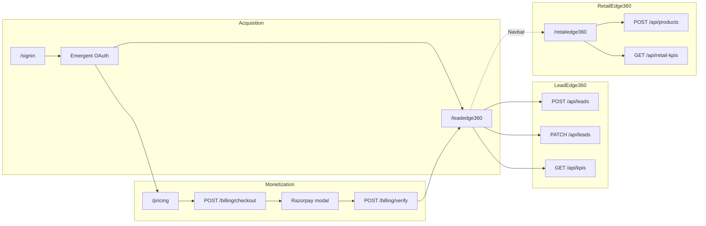

# Customer Journey Assessment — Production Workflows

**Product:** AsoftechInsightz v1.2.0  
**Basis:** `docs/SPRINT19_NAVIGATION_V2.md` + live codebase audit  
**Audience:** Paying customers (authenticated, org-scoped, post- or pre-checkout)  
**Date:** June 2026  
**Status:** Read-only assessment — no code modified

---

## Executive Summary

NAVIGATION V2 correctly identifies **two production data surfaces**: `/leadedge360` (CRM) and `/retailedge360` (retail AI). A paying customer can complete meaningful work today, but journeys are **fragmented across layouts** (`SiteShell` vs `AppShell`), **billing is disconnected from subscription records**, and **several APIs exist without web UI**.

This document ranks the **top 5 workflows** a paying customer can realistically finish **end-to-end in the current web app**, with honest success probabilities and gap analysis.

### Workflow ranking (paying-customer value)

| Rank | Workflow | Primary value |
|------|----------|---------------|
| 1 | Subscribe via Razorpay | Monetization / plan activation |
| 2 | Sign in & workspace provisioning | Tenant isolation & identity |
| 3 | Lead capture & pipeline management | LeadEdge360 core CRM |
| 4 | Retail SKU shelf-life management | RetailEdge360 core inventory AI |
| 5 | Cross-product analytics review | KPI visibility on both dashboards |

### Global assumptions affecting all workflows

| Assumption | If false |
|------------|----------|
| MongoDB reachable (`MONGO_URL`, `DB_NAME`) | All API calls fail — **0% success** |
| Next.js app deployed and reachable | No UI — **0% success** |
| `EMERGENT_PROJECT_ID` + `EMERGENT_API_KEY` set | Sign-in redirect fails (`auth_error=not_configured`) |
| `EMERGENT_LLM_KEY` set | AI scoring/prediction **degrades to rule engine** (workflow still completes) |
| `NEXT_PUBLIC_RAZORPAY_KEY_ID` + `RAZORPAY_KEY_SECRET` set | Checkout returns 503; payment workflow blocked |
| Customer uses **web + Emergent cookie auth** | Mobile JWT flows (follow-ups, admin) unavailable |

---

## Workflow 1 — Subscribe to a Paid Plan (Razorpay)

**Description:** Authenticated customer selects Starter or Growth on the pricing page, completes Razorpay checkout, and payment is verified server-side. Org plan is updated in MongoDB.

### 1. Entry Point

| Entry | Path |
|-------|------|
| Primary | `/pricing` (Navbar, Footer, or post-login CTA) |
| Prerequisite redirect | `/signin` if `GET /api/auth/me` returns no user |
| Scale plan | `/contact` (custom — not self-serve payment) |

### 2. Pages Used

| Order | Page | Role |
|-------|------|------|
| 1 | `/signin` | DPDP + Terms consent; launches OAuth (if not signed in) |
| 2 | `/api/auth/login` → Emergent hosted Google login | OAuth redirect (not a page) |
| 3 | `/api/auth/callback` | Session cookie issued; redirects to CRM |
| 4 | `/leadedge360` | Post-login landing (callback default) |
| 5 | `/pricing` | Plan selection + Razorpay modal |
| 6 | `/leadedge360` | Post-payment redirect (1.5s after success toast) |

### 3. APIs Used

| Step | Method | Endpoint | Trigger |
|------|--------|----------|---------|
| Auth check | GET | `/api/auth/me` | `pricing/page.js` on mount |
| Create order | POST | `/api/billing/checkout` | Subscribe button (`{ planId }`) |
| Verify payment | POST | `/api/billing/verify` | Razorpay `handler` callback |
| *(optional)* | POST | `/api/webhooks/razorpay` | Razorpay server webhook (not required for happy path) |

**Not called by UI today:** `GET /api/billing/plans` (plans hardcoded in `pricing/page.js`).

### 4. Mongo Collections Used

| Collection | Operation | When |
|------------|-----------|------|
| `users` | Read | `resolveTenant` during checkout/verify |
| `orgs` | Read; **update** `plan`, `upgradedAt` | On successful verify |
| `payments` | Insert (`status: created`); update (`status: paid`) | Checkout + verify |

**Not written:** `subscriptions` (no recurring subscription record created).

### 5. Completion Success Probability

| Environment | Estimate | Rationale |
|-------------|----------|-----------|
| Production (all keys configured) | **78%** | Full path tested in code; Razorpay UX depends on customer payment method |
| Auth OK, Razorpay missing | **0%** for paid checkout | 503 → redirect to `/contact` |
| Signed-out user | **70%** | Extra sign-in steps; some drop-off |
| Scale / custom plan | **N/A** | Routed to contact sales, not payment |

**Probability modifiers:**

- +10% if customer already signed in before visiting `/pricing`
- −15% if customer closes Razorpay modal (`ondismiss`)
- −10% if verify signature fails (misconfigured `RAZORPAY_KEY_SECRET`)

### 6. Missing Steps

| Gap | Impact |
|-----|--------|
| No subscription document in `subscriptions` collection | No renewal, trial, or billing history UI |
| No invoice/receipt download | Customer must use Razorpay email receipt only |
| Plan not shown in app after payment | `/api/auth/me` does not return `orgs.plan`; no “current plan” badge |
| Webhook does not update `orgs.plan` | Relies solely on client-side verify call |
| Pricing uses `SiteShell`, not `AppShell` | Disjoint UX from product dashboards |
| No enforcement of plan limits | Lead/user caps in plan marketing copy not enforced in API |
| `signup_consents` stored in `localStorage` only | Server DPDP on sign-in page not persisted until banner or `POST /api/auth/dpdp-consent` |

---

## Workflow 2 — Sign In & Workspace Provisioning

**Description:** Customer creates or resumes an account via Google (Emergent Auth). System provisions `orgs` + `users` on first login and scopes all subsequent API data to `user.orgId`.

### 1. Entry Point

| Entry | Path |
|-------|------|
| Primary | `/signin` |
| Secondary | Navbar “Sign in” / “Get started” |
| Forced | `/pricing` subscribe when `user` is null |
| OAuth deep link | `GET /api/auth/login` (after sign-in page consent) |

### 2. Pages Used

| Order | Page | Role |
|-------|------|------|
| 1 | `/signin` | Consent checkboxes + “Continue with Google” |
| 2 | Emergent Auth (external) | Google account selection |
| 3 | `/leadedge360` | Default post-auth destination |

### 3. APIs Used

| Step | Method | Endpoint | Purpose |
|------|--------|----------|---------|
| Config check | GET | `/api/auth/me` | `configured` flag on sign-in page |
| Login redirect | GET | `/api/auth/login` | Redirect to Emergent |
| Token exchange | *(server)* | Emergent `POST /v1/auth/exchange` | `lib/auth.js` |
| Org provision | *(server)* | `ensureUserOrg()` | Creates `orgs` + `users` if new |
| Session | GET | `/api/auth/callback` | Sets `emergent_session` cookie |
| Ongoing session | GET | `/api/auth/me` | Navbar, pricing, header |

### 4. Mongo Collections Used

| Collection | Operation | When |
|------------|-----------|------|
| `orgs` | Insert (first login) | `plan: 'starter'` default |
| `users` | Insert / update | `role: 'admin'`, `dpdpConsent` defaults |
| `users` | Read | Subsequent requests via email |

### 5. Completion Success Probability

| Environment | Estimate | Rationale |
|-------------|----------|-----------|
| `EMERGENT_*` configured | **88%** | Standard OAuth; Emergent dependency |
| Auth not configured | **5%** | Button proceeds but login redirects with error |
| Returning user | **92%** | Skips org creation; faster |

**Note:** Unauthenticated visitors can still use **demo-org** data on `/leadedge360` and `/retailedge360` without signing in — that is a **different journey** (demo, not paying customer).

### 6. Missing Steps

| Gap | Impact |
|-----|--------|
| No onboarding wizard after first login | Lands directly on CRM with no setup guidance |
| `dpdpConsent` on user record not set from `/signin` | Only localStorage `signup_consents`; server consent via banner if shown |
| No team invite flow on web | `POST /api/admin/users` is JWT-only |
| No email verification step on web | Mobile has OTP; web trusts Google via Emergent |
| Role is always `admin` on provision | RBAC role switcher on CRM is UI filter only, not persisted |
| No redirect to `/pricing` for greenfield paying intent | Callback always goes to `/leadedge360` |

---

## Workflow 3 — Lead Capture & Pipeline Management (LeadEdge360)

**Description:** Customer manages the sales pipeline: view/filter leads, capture new leads with AI scoring, update status, re-score, and initiate outreach via tel/mailto/WhatsApp deep links.

### 1. Entry Point

| Entry | Path |
|-------|------|
| Primary | `/leadedge360` (post-login default, Navbar, product links) |
| NAVIGATION V2 | Product switcher → LeadEdge360 |
| Secondary | Global search on `/app/*` → result click → `/leadedge360` (no deep link to lead) |

### 2. Pages Used

| Page | Role |
|------|------|
| `/leadedge360` | Single-page CRM: KPIs, charts, table, dialogs (all in one scroll) |

**No separate routes** for inbox vs pipeline vs analytics (NAVIGATION V2 defers splits to Phase 2).

### 3. APIs Used

| Customer action | Method | Endpoint |
|-----------------|--------|----------|
| Load dashboard | GET | `/api/leads` |
| Load KPIs/charts | GET | `/api/kpis` |
| Load agents | GET | `/api/agents` |
| Create lead | POST | `/api/leads` |
| Change status | PATCH | `/api/leads/:id` |
| Re-score | POST | `/api/leads/:id/rescore` |
| Filter by territory/status/role | GET | `/api/leads?territory=&status=&role=&agent=` |

**Available but unused in UI:** `GET /api/leads/:id`, `DELETE /api/leads/:id`, `POST .../status`, `POST .../assign`, `GET /api/leads/sources`.

**Outreach actions:** Client-side `tel:`, `mailto:`, `wa.me` links — **no** `POST /api/whatsapp/send` on web.

### 4. Mongo Collections Used

| Collection | Operation |
|------------|-----------|
| `leads` | Read, insert, update |
| `orgs` | Tenant scope via `orgId` |
| `users` | When authenticated |

**Indirect (via `aiScore` on POST/rescore):** no extra collections; LLM call is external.

**Not used in this UI:** `lead_activities`, `follow_ups` (detail API only).

### 5. Completion Success Probability

| Scenario | Estimate | Rationale |
|----------|----------|-----------|
| Authenticated paying customer | **90%** | Full CRUD path implemented |
| Demo (unsigned) user | **85%** | Works on shared `demo-org`; data not private |
| Without `EMERGENT_LLM_KEY` | **88%** | Rule-based scoring fallback in `lib/scoring.js` |
| Agent role filter | **80%** | Works but agent list is hardcoded, not customer's team |

### 6. Missing Steps

| Gap | Impact |
|-----|--------|
| No lead delete in UI | API supports DELETE; customer cannot remove bad leads |
| No activity timeline in UI | Status changes don't surface `lead_activities` |
| No follow-up scheduling on web | `follow_ups` collection unused in web UI |
| No in-app WhatsApp send | Web opens `wa.me`; no `whatsapp_messages` logging |
| No assignment UI beyond auto-assign on create | PATCH supports `assignedTo`; no picker in table |
| Pipeline board / kanban | Status changes via dropdown only |
| Plan-based lead limits not enforced | Growth “10,000 leads/mo” not checked on POST |
| Data persists in demo-org if never signed in | Paying customer must be signed in for private `orgId` |

---

## Workflow 4 — Retail SKU Shelf-Life Management (RetailEdge360)

**Description:** Customer maintains a product catalogue, adds SKUs with AI shelf-life prediction, monitors risk KPIs, re-predicts, and removes SKUs.

### 1. Entry Point

| Entry | Path |
|-------|------|
| Primary | `/retailedge360` |
| NAVIGATION V2 | Product switcher → RetailEdge360 |
| Navbar / Footer product links | Direct |

### 2. Pages Used

| Page | Role |
|------|------|
| `/retailedge360` | KPI strip, charts, SKU table, add/detail dialogs |

### 3. APIs Used

| Customer action | Method | Endpoint |
|-----------------|--------|----------|
| Load catalogue | GET | `/api/products` |
| Load retail KPIs | GET | `/api/retail-kpis` |
| Add SKU | POST | `/api/products` |
| Re-predict | POST | `/api/products/:id/repredict` |
| Remove SKU | DELETE | `/api/products/:id` |

### 4. Mongo Collections Used

| Collection | Operation |
|------------|-----------|
| `products` | Read, insert, update, delete |
| `orgs` | Tenant scope |

### 5. Completion Success Probability

| Scenario | Estimate | Rationale |
|----------|----------|-----------|
| Authenticated customer | **89%** | Full CRUD + AI path |
| Demo user | **84%** | Shared demo products |
| Without LLM key | **86%** | `heuristicShelf()` fallback in `lib/retail-ai.js` |
| First visit (cold seed) | **75%** | Demo seed runs parallel LLM calls; slower first load |

### 6. Missing Steps

| Gap | Impact |
|-----|--------|
| No bulk import / CSV upload | One SKU at a time via dialog |
| No store-level filtering UI | `store` field exists but no filter control |
| No expiry alert notifications | Read-only dashboard; no email/push |
| “Share via WhatsApp” uses empty `wa.me` | Generic share link, not integrated send API |
| `savedSoFar` KPI is projected (`atRiskValue * 0.65`) | Not tied to real financial transactions |
| Product gating (`retailEnabled`) not enforced on web | Admin flag exists mobile-only |
| No link from LeadEdge to RetailEdge in-app | Customer must use Navbar/switcher |

---

## Workflow 5 — Cross-Product Analytics & Performance Review

**Description:** Customer reviews business performance: CRM conversion KPIs and charts on LeadEdge360, retail inventory risk KPIs on RetailEdge360. Supports territory/source/agent filtering on CRM side.

### 1. Entry Point

| Entry | Path |
|-------|------|
| CRM analytics | `/leadedge360` (KPI strip + chart section — same page as Workflow 3) |
| Retail analytics | `/retailedge360` (KPI strip + category/risk charts) |
| Role-filtered view | Role `<Select>` on `/leadedge360` → refetch with `role`/`agent` query params |

### 2. Pages Used

| Page | Sections used |
|------|----------------|
| `/leadedge360` | KPI cards, 14-day trend, source pie, territory bar, agent leaderboard |
| `/retailedge360` | Inventory value, at-risk value, revenue shielded, category bar, risk pie |

**Not a unified dashboard:** NAVIGATION V2 excludes `/app` stub; no single page merges CRM + retail KPIs.

### 3. APIs Used

| Surface | Method | Endpoint | Data returned |
|---------|--------|----------|---------------|
| CRM | GET | `/api/kpis` | `total`, `qualified`, `conversion`, `won`, `hot`, `avgScore`, `trend`, `bySource`, `byTerritory`, `byAgent`, `byStatus` |
| CRM | GET | `/api/leads` | Underlying rows (for table; filters affect KPI refetch) |
| Retail | GET | `/api/retail-kpis` | `total`, `inventoryValue`, `atRiskValue`, `savedSoFar`, `byCategory`, `byRisk` |
| Retail | GET | `/api/products` | SKU list (table alongside KPIs) |

**Not available on web:** `GET /api/dashboard/revenue` (mobile JWT), `GET /api/dashboard/sales-performance`.

### 4. Mongo Collections Used

| Collection | Used via |
|------------|----------|
| `leads` | Aggregations in `GET /api/kpis` |
| `products` | Aggregations in `GET /api/retail-kpis` |
| `orgs` | Tenant filter |

**Agents leaderboard:** hardcoded in `route.js` — **not** MongoDB.

### 5. Completion Success Probability

| Scenario | Estimate | Rationale |
|----------|----------|-----------|
| View CRM KPIs (any user) | **93%** | Read-only; robust |
| View retail KPIs | **92%** | Read-only |
| Filtered CRM view (territory/status/role) | **88%** | Refetch on filter change |
| True “executive” cross-product view | **40%** | Requires visiting two pages manually |
| Revenue equals CRM won budgets | **N/A** | Not calculated in UI; mobile revenue API not on web |

### 6. Missing Steps

| Gap | Impact |
|-----|--------|
| No unified executive dashboard | Customer cannot see CRM + retail in one screen (`/app` is stub) |
| No date-range picker for KPIs | Trend is fixed 14-day window in API |
| No export (CSV/PDF) | Cannot share reports |
| Agent leaderboard not customer's real team | Hardcoded `AGENTS` array |
| `savedSoFar` / retail revenue figures are estimates | Not audit-grade for finance |
| No drill-down from chart to filtered table | Charts and table on same page but not linked clicks |
| Global search does not surface retail SKUs | Search only queries leads (`DashboardHeader`) |

---

## Cross-Workflow Journey Map (Paying Customer)

**Typical paying customer happy path:** Workflow 2 → Workflow 1 → Workflow 3 → (optional) Workflow 4 → Workflow 5.

**Minimum viable paying value without retail:** Workflows 2 + 1 + 3 + 5 (CRM half only).

---

## Workflows Deliberately Excluded (Not Top 5)

| Workflow | Why excluded |
|----------|--------------|
| Contact / sales inquiry | Marketing form; not product usage (`POST /api/contact`) |
| DPDP banner consent | Compliance utility; not core product value |
| `/app` global search | Utility; redirects without deep link; `/app` dashboard is stub |
| Mobile app (JWT) flows | Follow-ups, admin users, notifications — no web UI |
| n8n webhook lead ingest | Backend automation; not customer-initiated in app |
| Download source tarball | `/downloads/*` assets missing from repo (404) |
| Sign out | Single click; trivial (`POST /api/auth/logout`) |

---

## Paying Customer Readiness — Summary Scorecard

| Workflow | Success prob. (prod) | Blocks revenue? | Data isolated per org? |
|----------|----------------------|-----------------|------------------------|
| 1. Subscribe | 78% | **Yes** if Razorpay down | Updates `orgs.plan` |
| 2. Sign in | 88% | **Yes** if auth down | Creates `users` + `orgs` |
| 3. Lead CRM | 90% | No (demo works) | **Only when signed in** |
| 4. Retail SKUs | 89% | No | **Only when signed in** |
| 5. Analytics | 93% / 92% | No | **Only when signed in** |

**Critical path to “paying customer delivering value”:** Workflows **2 → 1 → 3** must succeed. Workflow **4** is optional (second product). Workflow **5** is read-only validation.

---

## Recommended Priorities (Documentation Only)

Aligned with NAVIGATION V2 — no code changes in this assessment:

1. **Mount `/pricing` in AppShell** and call `GET /api/billing/plans` — closes billing UX gap after payment.
2. **Redirect authenticated users from demo-org** — ensure paying customers never write leads to `demo-org`.
3. **Expose `orgs.plan` on `GET /api/auth/me`** — customer can confirm subscription (API change; future sprint).
4. **Split `/leadedge360` under AppShell** — satisfies NAVIGATION V2 without new backends.
5. **Write `subscriptions` on verify** — enables renewal workflow (API change; future sprint).

---

*Assessment complete. No repository code was modified.*
