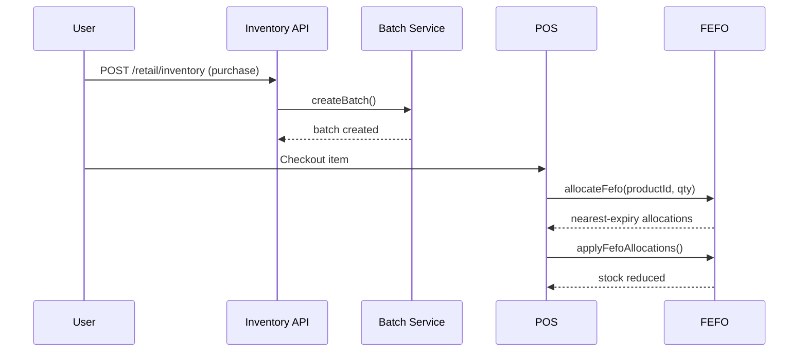

# Enterprise Expiry Management Module

## Overview

The Expiry Management module (`Inventory → Expiry Management`) provides enterprise-grade batch tracking, FEFO allocation, expiry alerts, supplier returns, inventory disposal, AI recommendations, and comprehensive reporting for RetailEdge360.

## Architecture

```
app/api/retail/expiry/          → REST API routes
lib/retail/expiry/              → Business logic services
components/retailedge360/expiry/ → UI components
database/schemas/               → Collection schemas + indexes
database/migrations/005_*       → Index migration
```

## Database Collections

| Collection | Purpose |
|------------|---------|
| `product_batches` | Batch/lot tracking with expiry dates |
| `expiry_alerts` | Automated expiry alert records |
| `expiry_returns` | Supplier return requests |
| `inventory_disposals` | Disposal tracking |
| `expiry_forecasts` | AI recommendations |
| `batch_movements` | Stock movement audit trail |
| `expiry_audit_logs` | Action audit logs |

## API Endpoints

| Method | Endpoint | Description |
|--------|----------|-------------|
| GET | `/api/retail/expiry/dashboard` | Dashboard KPIs, charts, widgets |
| GET/POST | `/api/retail/expiry/batches` | List/create batches, bulk ops |
| GET/PUT/DELETE | `/api/retail/expiry/batches/[id]` | Single batch CRUD |
| GET | `/api/retail/expiry/batches/export` | CSV export |
| GET/POST | `/api/retail/expiry/alerts` | List/acknowledge alerts |
| POST | `/api/retail/expiry/alerts/run` | Run alert engine |
| GET/POST | `/api/retail/expiry/returns` | Supplier returns |
| PUT | `/api/retail/expiry/returns/[id]` | Approve/reject returns |
| GET/POST | `/api/retail/expiry/disposals` | Inventory disposals |
| PUT | `/api/retail/expiry/disposals/[id]` | Approve/complete disposal |
| GET | `/api/retail/expiry/forecasts` | AI recommendations |
| POST | `/api/retail/expiry/forecasts/run` | Run forecast engine |
| GET | `/api/retail/expiry/scanner` | Barcode/batch lookup |
| GET | `/api/retail/expiry/reports` | Generate reports (CSV/JSON) |
| GET | `/api/retail/expiry/movements` | Batch movement history |
| GET | `/api/retail/expiry/audit` | Expiry audit logs |

## FEFO Integration

When `product_batches` exist for an org, POS checkout automatically:
1. Selects nearest-expiry batches (FEFO)
2. Blocks expired/recalled/blocked batches
3. Warns on 30/15/7-day thresholds
4. Supports authorized override via `overrideWarnings: true`

## Roles & Permissions

| Role | Permissions |
|------|-------------|
| Admin (ORG_ADMIN) | All actions |
| Store Manager | Override, dispose, approve returns, edit batches |
| Inventory Manager | Edit batches, bulk import/export |
| Cashier | Override expiry warnings only |
| Auditor / Read-only | View only |

## Setup

```bash
# Apply database indexes
npm run db:indexes
# Or run migration
node database/migrations/run.mjs up 005
```

## Feature Flag

Requires `retail_expiry` plan feature (BUSINESS_GROWTH, PROFESSIONAL, ENTERPRISE).

## UI

Navigate to **RetailEdge360 → Expiry Management** (`/retailedge360/expiry`).

Tabs: Dashboard, Batches, Alerts, Returns, Disposals, Scanner, AI Insights, Reports.

## Sequence: Purchase → Batch → Sale



## Tests

```bash
node --test tests/expiry-management.test.js
```
