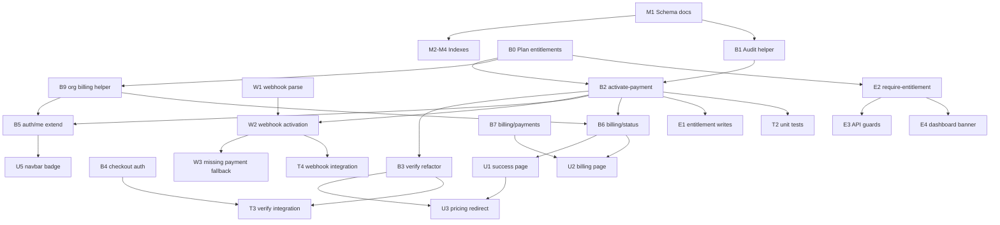

# Sprint 19A — Implementation Task List

**Status:** Approved — ready for implementation  
**Basis:** `docs/SPRINT19A_SUBSCRIPTION_FOUNDATION.md`  
**Constraint:** Planning only — **no code written yet**

---

## Overview

| Metric | Value |
|--------|-------|
| Total tasks | **42** |
| Estimated effort | **6.5–8.5 dev days** |
| Critical path | M1 → M2 → B1 → B2 → B3 → W1 → A* → U* → T* |
| Risk hotspots | B2 (idempotency), B3 (org mismatch), W2 (webhook-only activation), E3 (route gating regressions) |

### Task ID prefix

| Prefix | Area |
|--------|------|
| `M` | Mongo schema & indexes |
| `B` | Backend / API |
| `W` | Razorpay webhook |
| `U` | Billing UI |
| `E` | Entitlement enforcement |
| `T` | Testing & ops |

### Risk levels

| Level | Meaning |
|-------|---------|
| **Low** | Isolated change; easy rollback |
| **Medium** | Touches shared paths; needs careful QA |
| **High** | Money / tenant data / idempotency; production incident potential |

### Effort scale

| Size | Hours |
|------|-------|
| **XS** | 0.5–1h |
| **S** | 1–2h |
| **M** | 2–4h |
| **L** | 4–8h |
| **XL** | 8h+ |

---

## Execution Order (recommended)

```text
Week 1 — Backend foundation
  M1 → M2 → M3 → M4 → M5
  B0 → B1 → B2 → B3 → B4 → B5
  W1 → W2 → W3
  B6 → B7 → B8 → B9

Week 2 — UI + enforcement + QA
  U1 → U2 → U3 → U4 → U5 → U6
  E1 → E2 → E3 → E4
  T1 → T2 → T3 → T4 → T5 → T6
  Ops: T7, T8 (deploy + backfill)
```

---

## 1. Mongo Schema Updates

### M1 — Document schema reference

| Field | Value |
|-------|-------|
| **Task** | Add Mongo schema documentation for Sprint 19A collections |
| **Files** | `docs/mongo-schema.md` *(new)* |
| **Dependencies** | None |
| **Risk** | Low |
| **Effort** | S (1–2h) |

**Deliverable:** Document field-level schemas for `payments` (extended), `subscriptions`, `orgs` (extended), `users` (extended), `audit_logs`; include example documents and status enums.

---

### M2 — Index script: `payments`

| Field | Value |
|-------|-------|
| **Task** | Create indexes on `payments` collection |
| **Files** | `scripts/mongo-indexes.js` *(new)* or `lib/mongo-indexes.js` *(new)* |
| **Dependencies** | M1 |
| **Risk** | Low |
| **Effort** | S (1–2h) |

**Indexes:**

- `{ razorpay_order_id: 1 }` — unique
- `{ orgId: 1, createdAt: -1 }`

**Notes:** Run online in staging before prod. Verify no duplicate `razorpay_order_id` in existing data before unique index.

---

### M3 — Index script: `subscriptions`

| Field | Value |
|-------|-------|
| **Task** | Create indexes on `subscriptions` collection |
| **Files** | `scripts/mongo-indexes.js` |
| **Dependencies** | M1 |
| **Risk** | Low |
| **Effort** | XS (0.5–1h) |

**Indexes:**

- `{ orgId: 1, status: 1 }`
- `{ razorpay_order_id: 1 }` — unique, sparse

---

### M4 — Index script: `audit_logs`

| Field | Value |
|-------|-------|
| **Task** | Create indexes on new `audit_logs` collection |
| **Files** | `scripts/mongo-indexes.js` |
| **Dependencies** | M1 |
| **Risk** | Low |
| **Effort** | XS (0.5–1h) |

**Indexes:**

- `{ orgId: 1, createdAt: -1 }`
- `{ action: 1, createdAt: -1 }`

---

### M5 — Index bootstrap on app start (optional)

| Field | Value |
|-------|-------|
| **Task** | Wire `ensureIndexes()` call on first DB connection (dev convenience) |
| **Files** | `lib/mongo.js`, `lib/mongo-indexes.js` |
| **Dependencies** | M2, M3, M4 |
| **Risk** | Medium — index creation on cold start can slow first request |
| **Effort** | S (1–2h) |

**Recommendation:** Prefer one-time `node scripts/mongo-indexes.js` in CI/deploy over runtime bootstrap. Mark optional; skip if ops runs script manually.

---

### M6 — Backfill data audit query

| Field | Value |
|-------|-------|
| **Task** | Document + script query for legacy paid payments missing `subscriptionId` |
| **Files** | `scripts/billing-backfill.js` *(new)*, `docs/POST_DEPLOY_CHECKLIST.md` |
| **Dependencies** | B2 (activate-payment must exist before script is runnable) |
| **Risk** | Medium — mutates production billing state |
| **Effort** | M (2–4h) |

**Query:** `payments.find({ status: 'paid', subscriptionId: { $exists: false } })`

---

## 2. API Changes

### B0 — Plan entitlements map

| Field | Value |
|-------|-------|
| **Task** | Create plan → entitlement mapping module |
| **Files** | `lib/billing/plan-entitlements.js` *(new)* |
| **Dependencies** | None |
| **Risk** | Low |
| **Effort** | S (1–2h) |

**Exports:**

- `getEntitlementsForPlan(planId)` → `{ leadEnabled, retailEnabled, limits }`
- `getDefaultOrgBillingFields(planId)` → org patch object

**Source of truth for plan IDs:** `lib/razorpay.js` → `PLANS`

---

### B1 — Audit log writer

| Field | Value |
|-------|-------|
| **Task** | Create reusable audit log insert helper |
| **Files** | `lib/billing/audit.js` *(new)* |
| **Dependencies** | M1 |
| **Risk** | Low |
| **Effort** | S (1–2h) |

**Exports:** `writeAuditLog(db, { orgId, userId, action, entity, entityId, diff, request })`

**Actions (19A):** `payment.paid`, `subscription.activated`, `org.entitlements_updated`

---

### B2 — Payment activation orchestrator

| Field | Value |
|-------|-------|
| **Task** | Implement idempotent `activatePaymentSuccess()` |
| **Files** | `lib/billing/activate-payment.js` *(new)* |
| **Dependencies** | B0, B1, M1 |
| **Risk** | **High** — core money path |
| **Effort** | **L (6–8h)** |

**Behavior:**

1. Load `payments` by `razorpay_order_id`
2. Idempotency: if `paid` + `subscriptionId` → return existing
3. Cancel prior active `subscriptions` for `orgId`
4. Insert new `subscriptions` document
5. Update `payments`, `orgs`, `users` (purchaser)
6. Write audit log(s)
7. Return `{ alreadyActivated, payment, subscription, org, entitlements }`

**Transaction:** Use Mongo session if replica set; else ordered writes + documented recovery.

---

### B3 — Refactor `POST /api/billing/verify`

| Field | Value |
|-------|-------|
| **Task** | Replace inline DB updates with `activatePaymentSuccess()` |
| **Files** | `app/api/[[...path]]/route.js` |
| **Dependencies** | B2 |
| **Risk** | **High** |
| **Effort** | M (2–4h) |

**Changes:**

- Require `tenant.user` (reject `isDemo`)
- Verify signature (unchanged)
- Assert `payment.orgId === tenant.orgId` → `403` on mismatch
- Call `activatePaymentSuccess({ source: 'verify', actorUserId: user.id })`
- Response: `{ ok, alreadyActivated, payment, subscription, org, entitlements, redirectUrl: '/billing/success' }`

---

### B4 — Refactor `POST /api/billing/checkout`

| Field | Value |
|-------|-------|
| **Task** | Auth-guard checkout; persist `userId` on payment |
| **Files** | `app/api/[[...path]]/route.js` |
| **Dependencies** | None (can ship before B2) |
| **Risk** | Medium — may block unsigned API callers |
| **Effort** | S (1–2h) |

**Changes:**

- Return `401` if `!tenant.user || tenant.isDemo`
- Add `userId: tenant.user.id` to `payments.insertOne`
- Return `paymentId` in response

---

### B5 — Extend `GET /api/auth/me`

| Field | Value |
|-------|-------|
| **Task** | Include plan, billing status, entitlements, subscription summary |
| **Files** | `app/api/[[...path]]/route.js` |
| **Dependencies** | B2 (for meaningful subscription data) |
| **Risk** | Low |
| **Effort** | S (1–2h) |

**New response fields:**

```json
{
  "plan": "starter",
  "billingStatus": "active",
  "entitlements": { "leadEnabled": true, "retailEnabled": false },
  "subscription": { "planCode": "starter", "status": "active", "currentEnd": "..." }
}
```

**Implementation:** Load `orgs` + active `subscriptions` by `user.orgId`.

---

### B6 — Add `GET /api/billing/status`

| Field | Value |
|-------|-------|
| **Task** | Billing summary endpoint for settings UI |
| **Files** | `app/api/[[...path]]/route.js` |
| **Dependencies** | B2, B5 |
| **Risk** | Low |
| **Effort** | S (1–2h) |

**Auth:** Cookie session or JWT (`resolveTenant`).

**Response:** Plan, active subscription, entitlements, limits, `lastPaymentAt`, Razorpay configured flag.

---

### B7 — Add `GET /api/billing/payments`

| Field | Value |
|-------|-------|
| **Task** | Paginated payment history for org |
| **Files** | `app/api/[[...path]]/route.js` |
| **Dependencies** | M2 |
| **Risk** | Low |
| **Effort** | S (1–2h) |

**Query params:** `page`, `pageSize` (default 20, max 100).

**Response:** `{ payments: [...], meta: { page, pageSize, total, hasMore } }`

---

### B8 — Extend `GET /api/billing/plans` (optional)

| Field | Value |
|-------|-------|
| **Task** | Add `features[]` and `limits` to plans API for UI single-source |
| **Files** | `lib/razorpay.js`, `lib/billing/plan-entitlements.js`, `app/api/[[...path]]/route.js` |
| **Dependencies** | B0 |
| **Risk** | Low |
| **Effort** | S (1–2h) |

**Alternative:** Keep API unchanged; pricing page merges `PLANS` prices with local feature copy (higher drift risk). **Recommended:** extend API.

---

### B9 — Billing helper: resolve org billing context

| Field | Value |
|-------|-------|
| **Task** | Shared `getOrgBillingContext(db, orgId)` for me/status/entitlements |
| **Files** | `lib/billing/org-billing.js` *(new)* |
| **Dependencies** | B0 |
| **Risk** | Low |
| **Effort** | S (1–2h) |

**Used by:** B5, B6, E2 — avoids duplicate org+subscription fetch logic.

---

### B10 — Feature flag (optional, recommended)

| Field | Value |
|-------|-------|
| **Task** | Gate activation v2 behind `BILLING_ACTIVATION_V2` env var |
| **Files** | `lib/billing/activate-payment.js`, `app/api/[[...path]]/route.js` |
| **Dependencies** | B2, B3, W2 |
| **Risk** | Low |
| **Effort** | XS (0.5–1h) |

**Purpose:** Safe rollback without full redeploy of business logic.

---

## 3. Razorpay Webhook Changes

### W1 — Refactor webhook handler structure

| Field | Value |
|-------|-------|
| **Task** | Extract Razorpay webhook parsing into dedicated module |
| **Files** | `lib/billing/webhook-razorpay.js` *(new)*, `app/api/[[...path]]/route.js` |
| **Dependencies** | None |
| **Risk** | Medium |
| **Effort** | S (1–2h) |

**Exports:** `parseRazorpayEvent(raw)` → `{ event, orderId, paymentId }`

**Keep in route.js:** Raw body read, signature header, HTTP response.

---

### W2 — Wire webhook to `activatePaymentSuccess()`

| Field | Value |
|-------|-------|
| **Task** | Replace payments-only update with full activation |
| **Files** | `lib/billing/webhook-razorpay.js`, `app/api/[[...path]]/route.js` |
| **Dependencies** | B2, W1 |
| **Risk** | **High** — closes verify-skipped gap |
| **Effort** | M (2–4h) |

**Events:** `order.paid`, `payment.captured` (unchanged).

**Source:** `source: 'webhook'`, `actorUserId` from `payments.userId`.

**Always return `200`** on valid signature after processing (even if already activated).

---

### W3 — Missing payment row fallback

| Field | Value |
|-------|-------|
| **Task** | Fetch Razorpay order when `payments` row not found |
| **Files** | `lib/billing/webhook-razorpay.js`, `lib/razorpay.js` |
| **Dependencies** | W2 |
| **Risk** | Medium — edge case; creates orphan risk if notes wrong |
| **Effort** | M (2–4h) |

**Flow:**

1. Webhook arrives with `order_id`
2. No `payments` document → `rzp.orders.fetch(order_id)`
3. Create `payments` row from `notes.orgId`, `notes.planId` + webhook payment id
4. Call `activatePaymentSuccess()`

**Log:** `console.error` / structured log when fallback path used.

---

### W4 — Razorpay dashboard & env documentation

| Field | Value |
|-------|-------|
| **Task** | Document webhook URL, events, secret setup |
| **Files** | `DEPLOYMENT.md`, `docs/POST_DEPLOY_CHECKLIST.md` |
| **Dependencies** | W2 |
| **Risk** | Low |
| **Effort** | XS (0.5–1h) |

**Required env:** `RAZORPAY_WEBHOOK_SECRET` marked **required in production**.

---

### W5 — Webhook delivery smoke script

| Field | Value |
|-------|-------|
| **Task** | Local/staging script to send signed test webhook payload |
| **Files** | `scripts/test-razorpay-webhook.js` *(new)* |
| **Dependencies** | W2, B2 |
| **Risk** | Low |
| **Effort** | S (1–2h) |

**Used by:** T3 manual QA without live Razorpay payment.

---

## 4. Billing UI Pages

### U1 — Post-payment success page

| Field | Value |
|-------|-------|
| **Task** | Create `/billing/success` confirmation screen |
| **Files** | `app/billing/success/page.js` *(new)* |
| **Dependencies** | B6 (or B5) |
| **Risk** | Low |
| **Effort** | M (2–4h) |

**UI elements:**

- Plan name + price
- Billing period end (`currentEnd`)
- Enabled products (LeadEdge360 / RetailEdge360)
- Primary CTA → `/leadedge360`
- Secondary CTA → `/retailedge360` if `retailEnabled`
- Link → `/billing` (manage billing)

**Data:** `GET /api/billing/status` on mount; fallback to `?plan=` query param.

---

### U2 — Billing settings page

| Field | Value |
|-------|-------|
| **Task** | Create `/billing` account billing hub |
| **Files** | `app/billing/page.js` *(new)* |
| **Dependencies** | B6, B7 |
| **Risk** | Low |
| **Effort** | M (3–4h) |

**UI elements:**

- Current plan card (name, status, renewal/end date)
- Entitlements summary
- Payment history table (paginated)
- Upgrade button → `/pricing`
- Auth gate → redirect `/signin` if unsigned

**Layout:** Reuse `SiteShell` (matches `/pricing`).

---

### U3 — Update pricing checkout redirect

| Field | Value |
|-------|-------|
| **Task** | Redirect to `/billing/success` after verify |
| **Files** | `app/pricing/page.js` |
| **Dependencies** | B3, U1 |
| **Risk** | Low |
| **Effort** | XS (0.5–1h) |

**Change:** Replace `window.location.href='/leadedge360'` with `/billing/success?plan={planId}`.

**Handle:** `alreadyActivated` gracefully (still show success).

---

### U4 — Pricing page: fetch plans from API

| Field | Value |
|-------|-------|
| **Task** | Replace hardcoded plan prices with `GET /api/billing/plans` |
| **Files** | `app/pricing/page.js` |
| **Dependencies** | B8 (or merge local features only) |
| **Risk** | Low |
| **Effort** | S (1–2h) |

**Pattern:** API for `id`, `name`, `price`, `currency`; local constant `PLAN_FEATURES` for marketing bullets (or B8 extends API).

---

### U5 — Navbar plan badge

| Field | Value |
|-------|-------|
| **Task** | Show current plan pill when signed in |
| **Files** | `components/site/Navbar.jsx` |
| **Dependencies** | B5 |
| **Risk** | Low |
| **Effort** | S (1–2h) |

**Display:** `Starter` / `Growth` badge; link to `/billing`.

---

### U6 — Billing nav link

| Field | Value |
|-------|-------|
| **Task** | Add "Billing" entry to user menu / navbar |
| **Files** | `components/site/Navbar.jsx` |
| **Dependencies** | U2 |
| **Risk** | Low |
| **Effort** | XS (0.5–1h) |

---

## 5. Entitlement Enforcement

> **19A scope:** Activation-time writes + read APIs + **soft** UI gating. Hard API paywalls and `PLAN_LIMIT_EXCEEDED` metering are **19B** unless E3 is explicitly shipped.

### E1 — Entitlement write on activation

| Field | Value |
|-------|-------|
| **Task** | Apply `leadEnabled` / `retailEnabled` / limits during activation |
| **Files** | `lib/billing/activate-payment.js`, `lib/billing/plan-entitlements.js` |
| **Dependencies** | B0, B2 |
| **Risk** | Medium — wrong map locks customers out of retail |
| **Effort** | S (included in B2; track separately for QA) |

**Verify:** Starter → `retailEnabled: false`; Growth → both `true`.

---

### E2 — Entitlement read helper

| Field | Value |
|-------|-------|
| **Task** | `requireProductAccess(db, orgId, productCode)` helper |
| **Files** | `lib/billing/require-entitlement.js` *(new)* |
| **Dependencies** | B0, B9 |
| **Risk** | Low |
| **Effort** | S (1–2h) |

**Returns:** `{ allowed: boolean, reason?: 'SUBSCRIPTION_REQUIRED', entitlements }`

**Product codes:** `leadedge360`, `retailedge360`

---

### E3 — API route guards (retail)

| Field | Value |
|-------|-------|
| **Task** | Gate retail API routes when `retailEnabled === false` |
| **Files** | `app/api/[[...path]]/route.js` |
| **Dependencies** | E2 |
| **Risk** | **Medium** — can break demo org + existing retail users |
| **Effort** | M (2–4h) |

**Routes to guard:**

- `GET/POST /api/products`
- `GET /api/retail-kpis`
- `POST /api/shelf-life` (if present)

**Behavior:**

- `demo-org` → skip guard (preserve demo experience)
- Paid org with `retailEnabled: false` → `403` `{ code: 'SUBSCRIPTION_REQUIRED' }`
- Align with `docs/error-codes.md`

---

### E4 — Dashboard soft paywall banners

| Field | Value |
|-------|-------|
| **Task** | Show upgrade banner on `/retailedge360` when retail disabled |
| **Files** | `app/retailedge360/page.js`, `components/billing/EntitlementBanner.jsx` *(new)* |
| **Dependencies** | B5, E2 |
| **Risk** | Low |
| **Effort** | S (1–2h) |

**Banner copy:** "RetailEdge360 requires Growth plan" + CTA → `/pricing`.

**LeadEdge360:** No banner in 19A (always enabled per plan map).

---

### E5 — Mobile product-access alignment

| Field | Value |
|-------|-------|
| **Task** | Ensure `GET /api/admin/product-access` reflects activation flags |
| **Files** | `lib/mobile-routes.js` |
| **Dependencies** | E1 |
| **Risk** | Low |
| **Effort** | XS (0.5–1h) |

**Change:** `leadEnabled: org?.leadEnabled ?? true` (today hardcoded `true` for lead).

---

### E6 — Default org entitlements on signup (optional)

| Field | Value |
|-------|-------|
| **Task** | Set explicit `leadEnabled`/`retailEnabled` in `ensureUserOrg()` |
| **Files** | `lib/tenant.js` |
| **Dependencies** | B0 |
| **Risk** | Low |
| **Effort** | XS (0.5–1h) |

**Defaults for new orgs:** `plan: 'starter'` → `leadEnabled: true`, `retailEnabled: false`, `billingStatus: 'none'`.

**Prevents:** Ambiguous `undefined` vs `false` in guards.

---

## 6. Testing Strategy

### T1 — Unit tests: plan entitlements & audit

| Field | Value |
|-------|-------|
| **Task** | Test entitlement map and audit payload shape |
| **Files** | `lib/billing/plan-entitlements.test.js` *(new)*, `lib/billing/audit.test.js` *(new)* |
| **Dependencies** | B0, B1 |
| **Risk** | Low |
| **Effort** | S (1–2h) |

**Note:** Repo has no test runner today. Either add `vitest` devDependency or run as plain Node assertions in `scripts/`. Document chosen approach in task PR.

**Cases:**

- Each plan returns correct flags
- Unknown plan throws or returns safe default
- Audit log document has required fields

---

### T2 — Unit tests: `activatePaymentSuccess` idempotency

| Field | Value |
|-------|-------|
| **Task** | Test activation orchestrator with mocked Mongo |
| **Files** | `lib/billing/activate-payment.test.js` *(new)* |
| **Dependencies** | B2 |
| **Risk** | Low |
| **Effort** | M (2–4h) |

**Cases:**

- First activation → all collections written
- Second call → `alreadyActivated: true`, no duplicate subscription
- Upgrade → prior subscription `cancelled`, new `active`
- Missing payment row → throws clear error

---

### T3 — Integration: verify path

| Field | Value |
|-------|-------|
| **Task** | Manual/automated staging test for full verify flow |
| **Files** | `docs/SPRINT19A_TEST_PLAN.md` *(new)*, `scripts/test-billing-verify.js` *(new, optional)* |
| **Dependencies** | B3, B4, B2 |
| **Risk** | Medium |
| **Effort** | M (2–4h) |

**Steps:**

1. Authenticated session cookie
2. `POST /api/billing/checkout` → order id
3. Simulate verify with Razorpay test signature (or mock in dev)
4. Assert DB state across 5 collections

---

### T4 — Integration: webhook-only path

| Field | Value |
|-------|-------|
| **Task** | Confirm activation without client verify |
| **Files** | `scripts/test-razorpay-webhook.js`, `docs/SPRINT19A_TEST_PLAN.md` |
| **Dependencies** | W2, W5 |
| **Risk** | Medium |
| **Effort** | M (2–4h) |

**Steps:**

1. Create checkout (payment `created`)
2. **Do not** call verify
3. Send signed `order.paid` webhook
4. Assert org plan + subscription + entitlements updated

---

### T5 — Integration: security & negative cases

| Field | Value |
|-------|-------|
| **Task** | Negative test matrix |
| **Files** | `docs/SPRINT19A_TEST_PLAN.md` |
| **Dependencies** | B3, B4, W2, E3 |
| **Risk** | Medium |
| **Effort** | M (2–4h) |

| Case | Expected |
|------|----------|
| Unsigned checkout | `401` |
| Verify wrong org session | `403` |
| Invalid verify signature | `400` |
| Invalid webhook signature | `400` |
| Double verify | Idempotent success |
| Double webhook | Idempotent `200` |
| Retail API on starter plan | `403 SUBSCRIPTION_REQUIRED` (if E3 shipped) |

---

### T6 — UI smoke tests

| Field | Value |
|-------|-------|
| **Task** | Manual UI checklist for billing pages |
| **Files** | `docs/SPRINT19A_TEST_PLAN.md` |
| **Dependencies** | U1–U6, B5–B7 |
| **Risk** | Low |
| **Effort** | S (1–2h) |

**Checklist:**

- [ ] Pricing → pay → lands on `/billing/success`
- [ ] Success page shows correct plan + products
- [ ] `/billing` shows history after payment
- [ ] Navbar plan badge visible
- [ ] Retail banner on starter (if E4 shipped)

---

### T7 — Pre-deploy checklist update

| Field | Value |
|-------|-------|
| **Task** | Add Sprint 19A items to deploy checklist |
| **Files** | `docs/POST_DEPLOY_CHECKLIST.md`, `DEPLOYMENT.md` |
| **Dependencies** | All backend tasks |
| **Risk** | Low |
| **Effort** | XS (0.5–1h) |

---

### T8 — Production backfill runbook

| Field | Value |
|-------|-------|
| **Task** | Document backfill procedure for legacy paid payments |
| **Files** | `scripts/billing-backfill.js`, `docs/POST_DEPLOY_CHECKLIST.md` |
| **Dependencies** | M6, B2 |
| **Risk** | **High** if run without snapshot |
| **Effort** | S (1–2h) |

**Prerequisite:** `mongodump` of `orgs`, `payments`, `subscriptions` before execution.

---

### T9 — OpenAPI sync (optional)

| Field | Value |
|-------|-------|
| **Task** | Document new billing endpoints in OpenAPI |
| **Files** | `docs/openapi.json` |
| **Dependencies** | B6, B7 |
| **Risk** | Low |
| **Effort** | S (1–2h) |

**Add:** `/billing/status`, `/billing/payments`; extend `/auth/me` response schema.

---

## 7. Task Dependency Graph



---

## 8. Effort Summary by Area

| Area | Tasks | Effort (hours) |
|------|-------|----------------|
| 1. Mongo schema | M1–M6 | 6–10h |
| 2. API changes | B0–B10 | 18–28h |
| 3. Webhook | W1–W5 | 6–10h |
| 4. Billing UI | U1–U6 | 8–12h |
| 5. Entitlements | E1–E6 | 5–9h |
| 6. Testing & ops | T1–T9 | 12–20h |
| **Total** | **42** | **55–89h (≈ 7–11 dev days)** |

*Foundation plan estimated 5–7 days; task list includes optional items (M5, B8, B10, E3, E6, T9) and fuller test coverage.*

---

## 9. Minimum Viable Sprint 19A (if time-constrained)

Ship these **28 tasks** first to meet success criteria:

| Must ship | Skip/defer |
|-----------|------------|
| M1–M4, B0–B7, B9, W1–W2, W4 | M5, M6 (until prod backfill needed) |
| U1–U3, U5 | U4 (keep hardcoded features temporarily) |
| E1, E2, E4, E5 | E3 (hard API guards → 19B), E6 |
| T3–T6, T7 | T1–T2 (if no test runner), T8–T9, W5, B10 |

**MVP effort:** ~5–6 dev days

---

## 10. Definition of Done (per task)

- [ ] Code merged to feature branch `sprint-19a/subscription-foundation`
- [ ] No regression on `/pricing` checkout for authenticated user
- [ ] Staging smoke test passed (T3 or T4)
- [ ] `docs/POST_DEPLOY_CHECKLIST.md` updated if task affects deploy
- [ ] Peer review for **High** risk tasks (B2, B3, W2, T8)

---

## 11. File Manifest (all touched / new files)

### New files

| File | Area |
|------|------|
| `lib/billing/plan-entitlements.js` | API |
| `lib/billing/audit.js` | API |
| `lib/billing/activate-payment.js` | API |
| `lib/billing/org-billing.js` | API |
| `lib/billing/require-entitlement.js` | Entitlements |
| `lib/billing/webhook-razorpay.js` | Webhook |
| `lib/mongo-indexes.js` or `scripts/mongo-indexes.js` | Mongo |
| `scripts/billing-backfill.js` | Mongo / ops |
| `scripts/test-razorpay-webhook.js` | Webhook / test |
| `scripts/test-billing-verify.js` | Test |
| `app/billing/page.js` | UI |
| `app/billing/success/page.js` | UI |
| `components/billing/EntitlementBanner.jsx` | UI / entitlements |
| `docs/mongo-schema.md` | Mongo |
| `docs/SPRINT19A_TEST_PLAN.md` | Test |

### Modified files

| File | Area |
|------|------|
| `app/api/[[...path]]/route.js` | API, webhook, entitlements |
| `lib/razorpay.js` | API (optional B8) |
| `lib/tenant.js` | Entitlements (optional E6) |
| `lib/mobile-routes.js` | Entitlements |
| `lib/mongo.js` | Mongo (optional M5) |
| `app/pricing/page.js` | UI |
| `components/site/Navbar.jsx` | UI |
| `app/retailedge360/page.js` | Entitlements |
| `docs/POST_DEPLOY_CHECKLIST.md` | Ops |
| `DEPLOYMENT.md` | Ops |
| `docs/openapi.json` | Docs (optional T9) |

---

## 12. References

- `docs/SPRINT19A_SUBSCRIPTION_FOUNDATION.md` — approved architecture
- `docs/BILLING_GAP_ANALYSIS.md` — gap source
- `docs/SPRINT19_NAVIGATION_V2.md` — dashboard redirect targets
- `docs/error-codes.md` — `SUBSCRIPTION_REQUIRED`, `PLAN_LIMIT_EXCEEDED`

---

*Task list generated for Sprint 19A implementation. No application code was modified.*
