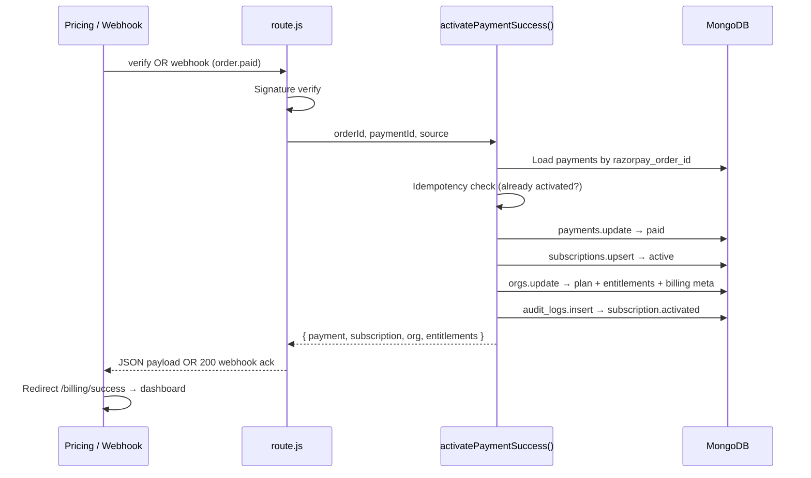

# Sprint 19A — Subscription Foundation Implementation Plan

**Product:** AsoftechInsightz v1.2.0  
**Date:** June 2026  
**Basis:** `docs/BILLING_GAP_ANALYSIS.md`  
**Goal:** On every successful payment, atomically complete the activation chain:

1. Create / finalize **payment** record  
2. Create **subscription** record  
3. Update **org.plan**  
4. Update **user entitlements** (product access)  
5. Create **audit log**  
6. Redirect customer to **dashboard**

**Scope:** Foundation only — one-time Razorpay Orders (existing model). Razorpay Subscriptions API, renewals, dunning, and plan-limit enforcement are **Phase 19B+** unless noted as optional stretch.

**Status:** Planning document — **no code written yet**

---

## 1. Problem Statement

Today, `POST /api/billing/verify` updates `payments` and `orgs.plan` only. The webhook updates `payments` only. Nothing writes `subscriptions`, nothing sets `leadEnabled`/`retailEnabled`, nothing writes `audit_logs`, and the client redirect gives no confirmation of what was activated.

**Failure mode:** Customer pays, closes the browser before verify → payment is `paid` (via webhook) but org plan and entitlements stay stale.

**Sprint 19A fixes this** by introducing a single, idempotent **payment activation** routine invoked from both verify and webhook, plus minimal UI to surface the result.

---

## 2. Target Architecture

### 2.1 Activation flow (target state)



### 2.2 Design principles

| Principle | Rationale |
|-----------|-----------|
| **Single activation function** | Verify and webhook must not diverge |
| **Idempotent** | Safe on Razorpay retries and double verify |
| **Payment record is source of truth** | `payments.orgId` and `payments.plan` drive activation, not session `orgId` |
| **Auth required on checkout/verify** | Prevents `demo-org` mis-attribution |
| **Backward compatible reads** | Existing mobile `GET /users/subscription` starts returning data |
| **No Postgres migration** | Mongo collections only (runtime DB) |

### 2.3 New module (planned)

| Module | Responsibility |
|--------|----------------|
| `lib/billing/activate-payment.js` | Idempotent activation orchestrator |
| `lib/billing/plan-entitlements.js` | Plan → `leadEnabled`, `retailEnabled`, `limits` map |
| `lib/billing/audit.js` | `writeAuditLog({ orgId, userId, action, entity, entityId, diff, request })` |

---

## 3. Data Model (Mongo)

### 3.1 `payments` (extend existing)

**Existing at checkout** (`POST /api/billing/checkout`):

```json
{
  "id": "<uuid>",
  "orgId": "<org>",
  "userId": "<purchaser user id — NEW>",
  "razorpay_order_id": "order_...",
  "amount": 1499,
  "plan": "starter",
  "status": "created",
  "createdAt": "<iso>"
}
```

**On activation** (verify or webhook):

```json
{
  "status": "paid",
  "razorpay_payment_id": "pay_...",
  "paidAt": "<iso>",
  "activatedAt": "<iso — NEW>",
  "activationSource": "verify | webhook",
  "subscriptionId": "<uuid — NEW>"
}
```

**Indexes to add:**

- `{ razorpay_order_id: 1 }` unique (likely exists implicitly; make explicit)
- `{ orgId: 1, createdAt: -1 }` for billing history

---

### 3.2 `subscriptions` (new writes)

Align with `GET /api/users/subscription` consumer (`lib/mobile-routes.js`) and OpenAPI `Subscription` schema.

```json
{
  "id": "<uuid>",
  "orgId": "<org>",
  "productCode": "platform",
  "planCode": "starter | growth",
  "status": "active",
  "currentStart": "<iso>",
  "currentEnd": "<iso — start + 30 days for monthly>",
  "razorpay_order_id": "order_...",
  "razorpay_payment_id": "pay_...",
  "paymentId": "<payments.id>",
  "limits": {
    "leadsPerMonth": 500,
    "maxUsers": 1
  },
  "createdAt": "<iso>",
  "updatedAt": "<iso>"
}
```

**Rules:**

- One **active** subscription per org at a time (`status ∈ ['trialing','active']`).
- On upgrade: mark prior subscription `status: 'cancelled'`, `cancelledAt`, insert new `active` row (preserve history).
- `currentEnd` is informational for Sprint 19A (no auto-expire job yet); documents billing period for UI.

**Indexes:**

- `{ orgId: 1, status: 1 }`
- `{ razorpay_order_id: 1 }` unique sparse

---

### 3.3 `orgs` (extend existing)

**Existing:** `plan`, `upgradedAt` (set on verify today)

**Add on activation:**

```json
{
  "plan": "starter | growth",
  "upgradedAt": "<iso>",
  "lastPaymentAt": "<iso>",
  "billingStatus": "active",
  "leadEnabled": true,
  "retailEnabled": false,
  "activeSubscriptionId": "<subscriptions.id>"
}
```

**Plan → entitlement map** (`lib/billing/plan-entitlements.js`):

| Plan | `leadEnabled` | `retailEnabled` | `limits.leadsPerMonth` | `limits.maxUsers` |
|------|---------------|-------------------|------------------------|-------------------|
| `starter` | `true` | `false` | 500 | 1 |
| `growth` | `true` | `true` | 10000 | 5 |
| `scale` | `true` | `true` | null (unlimited) | null |

> Scale remains sales-led (`/contact`) in 19A; map exists for admin/manual provisioning later.

---

### 3.4 `users` (minimal touch)

**Add on activation (purchaser only):**

```json
{
  "lastSubscriptionId": "<subscriptions.id>",
  "lastPaymentAt": "<iso>"
}
```

No per-user RBAC change in 19A; org-level entitlements gate products. Purchaser link supports audit and future invoice emails.

---

### 3.5 `audit_logs` (new collection)

Mirror `docs/sql/01_schema.sql` in Mongo shape:

```json
{
  "id": "<uuid>",
  "orgId": "<tenant>",
  "userId": "<actor or null for webhook>",
  "action": "subscription.activated",
  "entity": "subscription",
  "entityId": "<subscriptions.id>",
  "diff": {
    "planCode": "growth",
    "previousPlan": "starter",
    "paymentId": "<payments.id>",
    "razorpay_order_id": "order_...",
    "source": "verify | webhook"
  },
  "ip": "<x-forwarded-for>",
  "userAgent": "<ua>",
  "createdAt": "<iso>"
}
```

**Additional actions (19A):**

| Action | When |
|--------|------|
| `payment.checkout_created` | Checkout (optional, lower priority) |
| `payment.paid` | Activation |
| `subscription.activated` | Activation |
| `org.entitlements_updated` | Activation |

**Indexes:**

- `{ orgId: 1, createdAt: -1 }`
- `{ action: 1, createdAt: -1 }`

---

## 4. Required APIs

### 4.1 Modify existing

| Method | Path | Changes |
|--------|------|---------|
| `POST` | `/api/billing/checkout` | Require authenticated user (`tenant.user`); reject `isDemo`. Persist `userId` on payment. Return `paymentId`. |
| `POST` | `/api/billing/verify` | After signature check, call `activatePaymentSuccess()`. Cross-check `payments.orgId` === session `orgId`. Return `{ ok, payment, subscription, org: { plan, entitlements }, redirectUrl }`. |
| `POST` | `/api/webhooks/razorpay` | On `order.paid` / `payment.captured`, call same `activatePaymentSuccess()` (no session user; `userId` from payment record). |
| `GET` | `/api/auth/me` | Add `plan`, `billingStatus`, `entitlements: { leadEnabled, retailEnabled }`, `subscription: { planCode, status, currentEnd }`. |
| `GET` | `/api/billing/plans` | No change; wire UI to consume it. |

### 4.2 Add new (web cookie + JWT where noted)

| Method | Path | Auth | Purpose |
|--------|------|------|---------|
| `GET` | `/api/billing/status` | Cookie or JWT | Current plan, active subscription, entitlements, last payment — powers billing settings UI |
| `GET` | `/api/billing/payments` | Cookie or JWT | Paginated payment history for org (`payments` where `orgId`) |
| `GET` | `/api/billing/entitlements` | Cookie or JWT | Explicit entitlements + limits (optional if folded into `/status`) |

### 4.3 Mobile APIs (no new routes; behavior fixes)

| Method | Path | Change |
|--------|------|--------|
| `GET` | `/api/users/subscription` | Starts returning real `subscription` after activation (no code change if query matches new documents) |
| `GET` | `/api/admin/subscriptions` | Lists historical + active subscriptions |
| `GET` | `/api/admin/product-access` | Reflects `leadEnabled`/`retailEnabled` set by activation |

### 4.4 Defer to Sprint 19B

| Method | Path | Reason |
|--------|------|--------|
| `POST` | `/api/admin/subscriptions` | OpenAPI stub; admin checkout can reuse `billing/checkout` in 19A |
| Plan limit guards | `POST /api/leads`, user invite | Needs metering; out of foundation scope |
| `POST` | `/api/billing/cancel` | No recurring engine yet |

### 4.5 Internal function contract

```text
activatePaymentSuccess(db, {
  razorpay_order_id,
  razorpay_payment_id,
  source: 'verify' | 'webhook',
  actorUserId?: string,
  request?: Request
}) → { alreadyActivated, payment, subscription, org }
```

**Idempotency:** If `payments.status === 'paid'` AND `payments.subscriptionId` exists → return existing records, no duplicate subscription or audit row (or use dedupe key on audit).

**Transaction:** Use Mongo multi-document transaction if replica set available; otherwise ordered writes with compensating admin script documented in rollback.

---

## 5. Required Mongo Writes (activation summary)

| Step | Collection | Operation | Fields |
|------|------------|-----------|--------|
| 1 | `payments` | `updateOne` | `status: paid`, `razorpay_payment_id`, `paidAt`, `activatedAt`, `activationSource`, `subscriptionId` |
| 2 | `subscriptions` | `updateOne` cancel old + `insertOne` | New active subscription with period + limits |
| 3 | `orgs` | `updateOne` | `plan`, `upgradedAt`, `lastPaymentAt`, `billingStatus`, `leadEnabled`, `retailEnabled`, `activeSubscriptionId` |
| 4 | `users` | `updateOne` (purchaser) | `lastSubscriptionId`, `lastPaymentAt` |
| 5 | `audit_logs` | `insertOne` | `subscription.activated` (+ optional `payment.paid`) |

**Checkout stage (unchanged + small additions):**

| Collection | Operation |
|------------|-----------|
| `payments` | `insertOne` with `userId` |

---

## 6. Required Webhook Changes

### 6.1 Handler updates (`POST /api/webhooks/razorpay`)

| Today | Target |
|-------|--------|
| Verify signature | Unchanged |
| Handle `order.paid`, `payment.captured` | Unchanged event filter |
| Update `payments` only | Call `activatePaymentSuccess()` |
| Ignore order notes | Load `payments` by `razorpay_order_id`; fallback fetch Razorpay order API for `notes.orgId` / `notes.planId` if payment row missing |

### 6.2 Razorpay dashboard configuration

| Setting | Value |
|---------|-------|
| Webhook URL | `{NEXT_PUBLIC_APP_URL}/api/webhooks/razorpay` |
| Secret | `RAZORPAY_WEBHOOK_SECRET` (must be set in prod) |
| Events (19A minimum) | `order.paid`, `payment.captured` |
| Events (19B) | `payment.failed`, `refund.created` |

### 6.3 Webhook-specific safeguards

1. **No session** — activation uses `payments.orgId`, never request tenant.
2. **Idempotent** — duplicate webhook deliveries must not create duplicate subscriptions or audit entries.
3. **Ordering** — if verify runs first, webhook should no-op activation but still return `200`.
4. **Logging** — structured log when payment row not found (reconciliation alert).

### 6.4 Optional reconciliation job (19A stretch)

Cron or manual script: find `payments` where `status: paid` AND `subscriptionId` missing → re-run `activatePaymentSuccess()`. Document in `docs/POST_DEPLOY_CHECKLIST.md`.

---

## 7. Required UI Pages

### 7.1 New pages

| Route | Purpose | Key behavior |
|-------|---------|--------------|
| `/billing/success` | Post-payment confirmation | Query `?plan=` or fetch `/api/billing/status`; show plan name, period end, enabled products; CTA → dashboard |
| `/billing` | Billing settings | Current plan badge, subscription status, `currentEnd`, payment history table (`GET /api/billing/payments`), link to `/pricing` upgrade |

**Recommended redirect change** in `app/pricing/page.js`:

```text
Today:  verify ok → toast → /leadedge360 (1.5s)
Target: verify ok → /billing/success?plan={planId} → user clicks "Go to dashboard" → /leadedge360
```

Default dashboard target: **`/leadedge360`** (production route per `SPRINT19_NAVIGATION_V2.md`). If `retailEnabled` only, offer choice or deep-link to `/retailedge360`.

### 7.2 Modify existing pages

| Page | Change |
|------|--------|
| `/pricing` | Fetch plans from `GET /api/billing/plans`; merge feature copy client-side or extend API with `features[]` |
| `/signin` | No change |
| `components/site/Navbar.jsx` | Show plan pill (`Starter` / `Growth`) when signed in — data from `/api/auth/me` |
| `/leadedge360`, `/retailedge360` | **Optional 19A:** soft banner if product disabled (entitlement mismatch); hard paywall deferred to 19B |

### 7.3 Explicitly out of scope (19A UI)

- GST invoice PDF download  
- Cancel / downgrade flows  
- Admin MRR dashboard  
- `/app/revenue/plans` stub (Sprint 19 UX track)  

---

## 8. Implementation Phases (within Sprint 19A)

| Phase | Work | Est. |
|-------|------|------|
| **A1 — Backend core** | `activate-payment.js`, `plan-entitlements.js`, `audit.js`; refactor verify + webhook; auth guard on checkout | 2–3 days |
| **A2 — Read APIs** | Extend `/api/auth/me`, add `/api/billing/status`, `/api/billing/payments` | 1 day |
| **A3 — Indexes** | Mongo indexes on `payments`, `subscriptions`, `audit_logs` | 0.5 day |
| **A4 — UI** | `/billing/success`, `/billing`, pricing redirect, navbar plan badge | 1–2 days |
| **A5 — Ops** | Webhook registration, env checklist, smoke tests | 0.5 day |

**Total:** ~5–7 dev days

---

## 9. Deployment Order

Deploy in this sequence to avoid partial states and customer-facing regressions.

### Step 1 — Pre-deploy (no traffic impact)

1. Review and merge backend modules (`lib/billing/*`) behind unused code paths.
2. Add Mongo indexes (online, non-blocking).
3. Set `RAZORPAY_WEBHOOK_SECRET` in staging/production if missing.
4. Register Razorpay webhook URL in dashboard (can point to prod before code deploy if handler is backward compatible).

### Step 2 — Deploy API changes (backend first)

1. Deploy `activatePaymentSuccess` + updated `verify` + updated `webhook`.
2. Deploy auth guard on `checkout` (ensure pricing page always has session — already does).
3. Deploy extended `GET /api/auth/me` and new billing read endpoints.
4. **Smoke test on staging:**
   - Full checkout → verify → confirm all 5 collections written.
   - Simulate webhook-only path (verify blocked) → confirm activation still completes.
   - Repeat payment callback → confirm idempotent (no duplicate subscription).

### Step 3 — Deploy UI

1. Deploy `/billing/success` and `/billing`.
2. Update pricing redirect to success page.
3. Deploy navbar plan badge.

### Step 4 — Post-deploy verification

Use checklist derived from `docs/POST_DEPLOY_CHECKLIST.md`:

- [ ] Test Razorpay test-mode checkout end-to-end  
- [ ] `subscriptions` document exists for test org  
- [ ] `audit_logs` contains `subscription.activated`  
- [ ] `GET /api/users/subscription` (mobile JWT) returns subscription  
- [ ] Webhook delivery shows `200` in Razorpay dashboard  
- [ ] Unsigned `POST /api/billing/checkout` returns `401`  

### Step 5 — Backfill (if production has paid payments without subscriptions)

Run one-time reconciliation script:

```text
Find: payments.status = 'paid' AND subscriptionId missing
For each: activatePaymentSuccess({ source: 'backfill' })
```

Run in maintenance window; review `audit_logs` after.

---

## 10. Rollback Plan

### 10.1 Rollback triggers

- Duplicate subscriptions created (idempotency failure)  
- Wrong org receiving plan upgrades  
- Webhook errors causing Razorpay retry storms  
- Checkout `401` blocking all purchases  

### 10.2 Application rollback (preferred)

| Step | Action |
|------|--------|
| 1 | Redeploy previous app version (verify/webhook revert to payment-only updates) |
| 2 | Leave new collections (`audit_logs`, new `subscriptions` rows) — reads are additive |
| 3 | Disable Razorpay webhook temporarily if it errors against old handler (old handler still returns 200 for payments-only update) |

**Note:** Old code ignores `subscriptionId` on payments; extra fields are harmless.

### 10.3 Data rollback (only if bad activations occurred)

| Scenario | Remediation |
|----------|-------------|
| Wrong plan applied | `orgs.updateOne` restore `plan`, `leadEnabled`, `retailEnabled` from backup or pre-change snapshot |
| Duplicate subscriptions | Keep latest `active`; set older duplicates `status: cancelled` |
| Refund issued | Manual: set subscription `cancelled`, org `plan: starter`, entitlements to starter map, audit `subscription.cancelled` |

**Take Mongo snapshot** (`mongodump` orgs/payments/subscriptions) immediately before Step 2 of deployment.

### 10.4 Feature flags (recommended for deploy)

| Flag | Default | Purpose |
|------|---------|---------|
| `BILLING_ACTIVATION_V2` | `false` → `true` | Gate new `activatePaymentSuccess` in verify/webhook |
| `BILLING_REQUIRE_AUTH_CHECKOUT` | `true` | Can disable quickly if checkout breaks |

If flags are not implemented in 19A, rollback is **redeploy only**.

### 10.5 Communication

If rollback affects paying customers during incident:

1. Identify affected `payments.razorpay_order_id` from `audit_logs` or Razorpay dashboard.  
2. Manually correct `orgs.plan` and entitlements.  
3. Re-run activation after fix forward.

---

## 11. Testing Matrix

| Case | Path | Expected |
|------|------|----------|
| Happy path | verify after payment | 5 writes + redirect payload |
| Webhook only | skip client verify | Same activation via webhook |
| Double verify | two verify calls | One subscription; second returns `alreadyActivated` |
| Double webhook | Razorpay retry | Idempotent |
| Wrong org session | verify with mismatched orgId | `403` — no writes |
| Unsigned checkout | API direct | `401` |
| Invalid signature | verify / webhook | `400` — no writes |
| Upgrade starter → growth | second payment | Old sub cancelled; new active; org plan growth |
| Mobile read | `GET /users/subscription` | Returns active subscription |

---

## 12. Environment Variables

| Variable | Required | Notes |
|----------|----------|-------|
| `NEXT_PUBLIC_RAZORPAY_KEY_ID` | Yes | Client checkout |
| `RAZORPAY_KEY_SECRET` | Yes | Orders + verify signature |
| `RAZORPAY_WEBHOOK_SECRET` | **Yes in prod** | Was optional de facto; mandatory for reliable activation |
| `NEXT_PUBLIC_APP_URL` | Yes | Webhook URL construction |
| `MONGO_URL`, `DB_NAME` | Yes | Persistence |

---

## 13. Success Criteria

Sprint 19A is complete when:

1. Every successful Razorpay payment produces exactly one **active** `subscriptions` row.  
2. `orgs.plan` and `leadEnabled`/`retailEnabled` match the purchased plan.  
3. `audit_logs` records every activation with `subscription.activated`.  
4. Verify **and** webhook paths produce identical outcomes.  
5. Customer lands on `/billing/success` then proceeds to `/leadedge360`.  
6. `GET /api/auth/me` and `GET /api/users/subscription` expose plan and subscription.  
7. No regression to existing checkout for authenticated users.

---

## 14. References

| Document | Relevance |
|----------|-----------|
| `docs/BILLING_GAP_ANALYSIS.md` | Gap source |
| `lib/razorpay.js` | Plan catalog, signatures |
| `app/api/[[...path]]/route.js` | Billing + webhook handlers |
| `lib/mobile-routes.js` | Subscription read consumers |
| `docs/openapi.json` | `Subscription` schema |
| `docs/error-codes.md` | Future `SUBSCRIPTION_REQUIRED`, `PLAN_LIMIT_EXCEEDED` |
| `docs/SPRINT19_NAVIGATION_V2.md` | Dashboard redirect targets |
| `docs/sql/01_schema.sql` | Audit log shape (reference) |

---

## 15. Sprint 19B Preview (not in scope)

- Razorpay Subscriptions API (true recurring)  
- Auto-expire / `past_due` when `currentEnd` passes  
- `PLAN_LIMIT_EXCEEDED` on `POST /api/leads`  
- Hard product paywalls on web routes  
- Invoice PDF + email  
- `POST /api/billing/cancel`  

---

*Planning document only. No repository application code was modified.*
