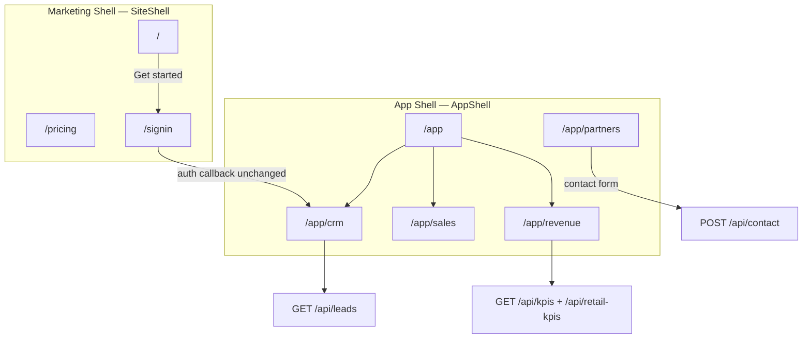

# Sprint 19 — Enterprise SaaS UX Modernization Plan

**Product:** AsoftechInsightz (LeadEdge360 + RetailEdge360)  
**Version:** 1.2.0 → 1.3.0 (UX-only release)  
**Sprint:** 19  
**Date:** June 2026  
**Status:** Planning — frontend-only scope

---

## Executive Summary

This plan modernizes AsoftechInsightz from a **marketing site with two monolithic dashboard pages** into an **enterprise SaaS application shell** with five purpose-built workspaces: **Dashboard**, **CRM**, **Sales**, **Revenue**, and **Partner**.

All changes are **presentation-layer only**. No backend APIs, MongoDB collections, authentication flows, or business logic will be modified. Existing endpoints remain the single source of truth; workspaces differ only in how data is composed, filtered, and displayed on the client.

### Goals

| Goal | Outcome |
|------|---------|
| Enterprise navigation | Persistent app sidebar, workspace switcher, contextual breadcrumbs |
| Role-aware layouts | Admin / Manager / Agent views using existing query-param filters |
| Reduced cognitive load | Split 400+ line page monoliths into focused workspace views |
| Cross-product visibility | Unified Dashboard surfacing LeadEdge + RetailEdge KPIs |
| Partner readiness | Dedicated Partner workspace shell for channel enablement (static + contact) |

### Non-Goals (Hard Constraints)

- ❌ No changes to `app/api/[[...path]]/route.js` or `lib/mobile-routes.js`
- ❌ No new or renamed MongoDB collections
- ❌ No changes to Emergent Auth, JWT, cookies, or `lib/tenant.js`
- ❌ No changes to AI scoring (`lib/scoring.js`), shelf-life prediction (`lib/retail-ai.js`), Razorpay checkout logic, or webhook handlers
- ❌ No new API endpoints or request/response shape changes

---

## 1. Current State Assessment

### 1.1 UX Pain Points

| Area | Current behavior | Enterprise gap |
|------|------------------|----------------|
| **Navigation** | Marketing `Navbar` with 8 flat links; product dashboards buried in same nav as Blog/About | No app-mode vs marketing-mode separation |
| **Layout** | `SiteShell` = Navbar + Footer on every dashboard page | Footer and marketing chrome waste vertical space in CRM |
| **Dashboard** | No unified home; post-login lands on `/leadedge360` | Executives lack cross-product snapshot |
| **CRM** | `/leadedge360` is 426 lines: KPIs + 4 charts + table + dialogs in one scroll | No inbox vs pipeline vs analytics separation |
| **Sales** | Role switcher exists but is a single `<Select>` in page header | No pipeline board, no agent-centric workspace |
| **Revenue** | Retail metrics on `/retailedge360`; billing on `/pricing` (marketing layout) | Revenue signals fragmented across 3 routes |
| **Partner** | No dedicated surface; partners see same marketing site | No channel/partner enablement entry point |
| **Components** | `KpiCard` duplicated in leadedge360 and retailedge360 pages | No shared workspace primitives |
| **Data fetching** | Raw `fetch()` + `useState` per page; no shared cache | Duplicate API calls when switching workspaces |

### 1.2 Existing Assets to Leverage

| Asset | Location | Reuse in Sprint 19 |
|-------|----------|-------------------|
| shadcn/ui `Sidebar` | `components/ui/sidebar.jsx` | App shell primary navigation (already installed, unused) |
| Design tokens | `app/globals.css` | Extend with workspace accent variables only |
| `SiteShell` | `components/site/SiteShell.jsx` | Keep for marketing routes |
| `Navbar` auth dropdown | `components/site/Navbar.jsx` | Pattern for `AppHeader` user menu |
| Recharts + Card patterns | Dashboard pages | Extract to `components/workspace/*` |
| TanStack Query + SWR | `package.json` (installed) | Optional client cache — no API change |

### 1.3 Existing API Surface (Read-Only Contract)

Workspaces may **only** call these existing endpoints:

| Endpoint | Used by |
|----------|---------|
| `GET /api/auth/me` | All authenticated workspaces |
| `GET /api/leads` (+ query filters) | CRM, Sales, Dashboard, Revenue |
| `POST /api/leads` | CRM (capture dialog) |
| `PATCH /api/leads/:id` | CRM, Sales (status updates) |
| `POST /api/leads/:id/rescore` | CRM |
| `GET /api/kpis` | Dashboard, CRM, Sales, Revenue |
| `GET /api/agents` | Sales, CRM |
| `GET /api/products` | Revenue (retail tab) |
| `POST /api/products` | Revenue (retail tab) |
| `POST /api/products/:id/repredict` | Revenue |
| `DELETE /api/products/:id` | Revenue |
| `GET /api/retail-kpis` | Dashboard, Revenue |
| `GET /api/billing/plans` | Revenue (plan catalog display) |
| `POST /api/billing/checkout` | Revenue → links to existing `/pricing` checkout flow |
| `POST /api/billing/verify` | Revenue → via `/pricing` only (unchanged) |
| `POST /api/contact` | Partner workspace |

> **Note:** Mobile-only JWT endpoints (`/api/dashboard/revenue`, `/api/followups`, `/api/admin/*`) are **out of scope** for web workspaces in Sprint 19 unless a future sprint adds cookie-auth passthrough. Revenue workspace will derive CRM revenue from `GET /api/kpis` (`won`, `conversion`) and lead `budget` fields client-side.

---

## 2. Target Information Architecture

### 2.1 Route Map

```
MARKETING SHELL (SiteShell — unchanged routes)
├── /                    Home
├── /about               About
├── /products            Product suite overview
├── /pricing             Razorpay checkout (unchanged logic)
├── /blog                Blog
├── /contact             Contact
├── /signin              Sign in
├── /privacy, /terms     Legal
└── /download            Source download

APP SHELL (AppShell — new)
├── /app                         Dashboard (executive overview)
├── /app/crm                     CRM Workspace
│   ├── /app/crm                 Inbox (default)
│   ├── /app/crm/pipeline        Pipeline board (client-side status grouping)
│   └── /app/crm/analytics       Charts (extracted from current leadedge360)
├── /app/sales                   Sales Workspace
│   ├── /app/sales               My pipeline (agent-filtered)
│   ├── /app/sales/team          Leaderboard + territory
│   └── /app/sales/activities    Quick actions on leads (WhatsApp/call/email)
├── /app/revenue                 Revenue Workspace
│   ├── /app/revenue             CRM revenue (kpis + won pipeline)
│   ├── /app/revenue/retail      RetailEdge360 catalogue + retail-kpis
│   └── /app/revenue/plans       Plan catalog (GET /billing/plans) + link to /pricing
└── /app/partners                Partner Workspace (enablement shell)

REDIRECTS (Next.js redirects in next.config.js — config only, no API change)
├── /leadedge360  →  /app/crm
└── /retailedge360  →  /app/revenue/retail
```

### 2.2 Shell Separation



---

## 3. Navigation Modernization

### 3.1 App Sidebar (`components/app/AppSidebar.jsx`)

Replace marketing nav inside app routes with a collapsible sidebar built on `components/ui/sidebar.jsx`.

**Primary nav groups:**

| Group | Items | Icon |
|-------|-------|------|
| **Overview** | Dashboard | `LayoutDashboard` |
| **Workspaces** | CRM, Sales, Revenue, Partners | `Target`, `TrendingUp`, `IndianRupee`, `Handshake` |
| **Products** | LeadEdge360 → `/app/crm`, RetailEdge360 → `/app/revenue/retail` | Product switcher sub-menu |
| **Account** | Pricing (external `/pricing`), Sign out | `CreditCard`, `LogOut` |

**Sidebar behaviors:**

- Collapse to icon rail on `lg+` (use existing `SidebarProvider` cookie persistence)
- Mobile: sheet drawer via existing `Sheet` integration in sidebar component
- Active state from `usePathname()` — prefix match for nested routes
- Workspace badge: show live count from cached leads length (CRM) or at-risk SKU count (Revenue retail tab)

### 3.2 App Header (`components/app/AppHeader.jsx`)

| Zone | Content |
|------|---------|
| Left | Breadcrumbs (`Dashboard › CRM › Inbox`) |
| Center | Global search (client-side filter on cached leads — no new API) |
| Right | Role switcher (Admin / Manager / Agent), territory filter, user avatar dropdown |

**Role switcher:** Preserve existing behavior — sets query params `role=agent&agent=<name>` on API calls. UI-only relocation from page body to header.

### 3.3 Product Switcher (`components/app/ProductSwitcher.jsx`)

Compact dropdown in sidebar header:

- **LeadEdge360** — orange accent (`--primary`)
- **RetailEdge360** — green accent (`--accent`)
- Navigates to last-visited tab within that product's workspace

No backend `retailEnabled` / `leadEnabled` checks (those are mobile-admin only today). Switcher is always visible.

### 3.4 Marketing Nav (unchanged logic, minor tweak)

`Navbar.jsx` keeps current links for public pages. When `user` is authenticated:

- Replace inline LeadEdge360 / RetailEdge360 links with single **"Open App"** → `/app`
- Keep user dropdown with Sign out

---

## 4. Layout System

### 4.1 AppShell (`components/app/AppShell.jsx`)

```
┌─────────────────────────────────────────────────────────────┐
│ AppHeader (breadcrumbs · search · role · user)            │
├──────────┬──────────────────────────────────────────────────┤
│          │                                                  │
│ App      │  Workspace content area                          │
│ Sidebar  │  (max-w-none, px-6 py-6, overflow-auto)         │
│          │                                                  │
│          │                                                  │
└──────────┴──────────────────────────────────────────────────┘
```

**Layout rules:**

- No `Footer` in app shell (marketing footer stays on `SiteShell` only)
- No `DpdpConsentBanner` duplication — render once in `app/layout.js` or keep on `SiteShell` only; app users already consented at sign-in
- `min-h-screen` with `flex`; content area scrolls independently
- Background: retain `globals.css` gradient; add subtle `grid-bg` utility to workspace content only

### 4.2 Workspace Page Template (`components/workspace/WorkspacePage.jsx`)

Standardized page scaffold:

```jsx
<WorkspacePage
  eyebrow="CRM WORKSPACE"
  title="Lead inbox"
  description="Capture, score and convert."
  actions={<Button>New lead</Button>}
  tabs={[{ href: '/app/crm', label: 'Inbox' }, ...]}
>
  {children}
</WorkspacePage>
```

### 4.3 Shared Primitives (extract from existing pages)

| Component | Source | Purpose |
|-----------|--------|---------|
| `KpiStrip` | Merge duplicate `KpiCard` from leadedge360 + retailedge360 | 4–5 column responsive KPI row |
| `ChartCard` | Extract chart wrapper + title pattern | Consistent chart chrome |
| `DataTable` | Thin wrapper over `components/ui/table` | Sortable headers (client-side), empty states |
| `EntityDrawer` | Replace lead/product `Dialog` detail views | Right-side `Sheet` for detail (better enterprise UX) |
| `FilterBar` | Territory + status + source selects | Shared across CRM and Sales |
| `EmptyState` | New | Illustration + CTA when no leads/SKUs |
| `LoadingSkeleton` | Use `components/ui/skeleton` | KPI + table loading placeholders |

### 4.4 Responsive Breakpoints

| Breakpoint | Sidebar | KPI strip | Table |
|------------|---------|-----------|-------|
| `< md` | Sheet overlay | 2 columns | Horizontal scroll |
| `md–lg` | Collapsed icon rail | 3 columns | Horizontal scroll |
| `lg+` | Full sidebar | 4–5 columns | Full width |

---

## 5. Workspace Specifications

### 5.1 Dashboard (`/app`)

**Purpose:** Executive command center — cross-product health at a glance.

**Data sources (parallel fetch on mount):**

```js
Promise.all([
  fetch('/api/kpis'),
  fetch('/api/retail-kpis'),
  fetch('/api/auth/me'),
])
```

**Layout sections:**

| Section | Content | Source |
|---------|---------|--------|
| Welcome bar | User name, org context, quick links | `/api/auth/me` |
| KPI strip (6 tiles) | Total leads, conversion %, hot leads, SKUs at risk, inventory value, revenue shielded | `/api/kpis` + `/api/retail-kpis` |
| Activity row | 14-day trend chart (leads vs won) | `/api/kpis.trend` |
| Product cards | LeadEdge360 + RetailEdge360 deep links with mini sparkline | Same APIs |
| Quick actions | New lead, Add SKU, View pricing | Navigation only |

**No new business logic:** All numbers come directly from existing API responses.

---

### 5.2 CRM Workspace (`/app/crm/*`)

**Purpose:** Lead lifecycle management — inbox, pipeline, analytics.

Refactor existing `app/leadedge360/page.js` into three sub-views sharing one data hook.

#### 5.2.1 Inbox (`/app/crm`)

| Element | Behavior | API |
|---------|----------|-----|
| Lead table | Same columns as today | `GET /api/leads` |
| Filters | Territory, status, source | Query params (unchanged) |
| Row click | Open `EntityDrawer` with AI score detail | Client state |
| Inline status | `Select` → `PATCH /api/leads/:id` | Unchanged |
| Actions | Re-score, WhatsApp, call, email | Unchanged |
| New lead dialog | `LeadDialog` form | `POST /api/leads` |

#### 5.2.2 Pipeline (`/app/crm/pipeline`)

| Element | Behavior | API |
|---------|----------|-----|
| Kanban columns | One per status: New → Lost | Client-side `groupBy(leads, 'status')` from same `GET /api/leads` |
| Drag-and-drop | **Visual only in Sprint 19** — drop triggers existing `PATCH` with new status | `PATCH /api/leads/:id` |
| Card | Name, score badge, assigned agent, source icon | Client render |

> Drag-and-drop is a UX affordance; it calls the same PATCH endpoint already used by the status `<Select>`.

#### 5.2.3 Analytics (`/app/crm/analytics`)

Move existing chart grid from `leadedge360/page.js`:

- 14-day trend line chart
- Source pie chart
- Territory bar chart
- Agent leaderboard

Same `GET /api/kpis` call — no duplication of aggregation logic (server-side KPIs unchanged).

---

### 5.3 Sales Workspace (`/app/sales/*`)

**Purpose:** Agent-centric selling — pipeline ownership, team performance, outreach.

Uses **identical APIs** as CRM; differs in default filters and layout emphasis.

#### 5.3.1 My Pipeline (`/app/sales`)

| Default state | `role=agent`, first agent from `GET /api/agents` |
| Layout | Compact lead cards grouped by status |
| Emphasis | Next-action buttons (WhatsApp, call) prominent |
| API | `GET /api/leads?role=agent&agent=<name>` |

#### 5.3.2 Team (`/app/sales/team`)

| Element | Source |
|---------|--------|
| Agent leaderboard | `GET /api/kpis.byAgent` |
| Territory heatmap bar chart | `GET /api/kpis.byTerritory` |
| Conversion KPI | `GET /api/kpis.conversion` |

#### 5.3.3 Activities (`/app/sales/activities`)

| Element | Behavior |
|---------|----------|
| Hot leads list | Client filter: `label === 'Hot'` from cached leads |
| Quick outreach row | WhatsApp deep link (existing `whatsappLink()` helper, extracted to `lib/client/whatsapp.js`) |
| Re-score batch | Sequential `POST /api/leads/:id/rescore` — same as today, UI groups hot leads |

---

### 5.4 Revenue Workspace (`/app/revenue/*`)

**Purpose:** Unified revenue intelligence — CRM wins, retail inventory risk, subscription plans.

#### 5.4.1 CRM Revenue (`/app/revenue`)

| Metric | Derivation | API |
|--------|------------|-----|
| Won deals count | `kpis.won` | `GET /api/kpis` |
| Conversion rate | `kpis.conversion` | `GET /api/kpis` |
| Pipeline value | Sum of `budget` on leads where `status !== 'Lost'` | `GET /api/leads` — **client-side sum only** |
| Won revenue | Sum of `budget` on leads where `status === 'Won'` | `GET /api/leads` — **client-side sum only** |
| Trend | `kpis.trend` won line | `GET /api/kpis` |

Display with `IndianRupee` formatting (reuse `fmt()` from retailedge360).

#### 5.4.2 Retail Intelligence (`/app/revenue/retail`)

Migrate entire `app/retailedge360/page.js` content here:

- SKU table, add SKU dialog, AI shelf-life detail drawer
- Retail KPI strip and charts
- APIs: `GET/POST /api/products`, `GET /api/retail-kpis`, `POST .../repredict`, `DELETE .../:id`

Green accent (`--accent`) for retail-specific UI elements.

#### 5.4.3 Plans & Billing (`/app/revenue/plans`)

| Element | Behavior | API |
|---------|----------|-----|
| Plan cards | Fetch and display plan catalog | `GET /api/billing/plans` |
| Subscribe CTA | Navigate to `/pricing` (existing Razorpay flow) | No inline checkout duplication |
| Current plan | Display static "Starter" default or post-checkout session hint from `localStorage` key set by pricing page on verify success | **UI hint only** — no new org plan endpoint |

> Plan status display is best-effort UX until a future sprint exposes org plan via `/api/auth/me`. Sprint 19 shows plan catalog and links to existing `/pricing` checkout without API changes.

---

### 5.5 Partner Workspace (`/app/partners`)

**Purpose:** Channel partner enablement portal — no dedicated backend today.

**Composition (static + existing contact API):**

| Section | Content | Data source |
|---------|---------|-------------|
| Hero | Partner program value prop | Static copy |
| Product cards | LeadEdge360 + RetailEdge360 summaries with demo links | Links to `/app/crm`, `/app/revenue/retail` |
| Resources | Links to `/download`, docs checklist | Static |
| Co-sell pipeline | Placeholder metrics ("Coming soon") | Static — no fake API calls |
| Partner inquiry form | Name, company, email, message | `POST /api/contact` (same as `/contact`) |
| FAQ accordion | shadcn `Accordion` | Static |

This workspace establishes IA and layout for future partner APIs without requiring backend work in Sprint 19.

---

## 6. Component & File Architecture

### 6.1 New Directory Structure

```
components/
├── app/                          # App shell (new)
│   ├── AppShell.jsx
│   ├── AppSidebar.jsx
│   ├── AppHeader.jsx
│   ├── ProductSwitcher.jsx
│   └── Breadcrumbs.jsx
├── workspace/                    # Shared workspace primitives (new)
│   ├── WorkspacePage.jsx
│   ├── KpiStrip.jsx
│   ├── ChartCard.jsx
│   ├── DataTable.jsx
│   ├── EntityDrawer.jsx
│   ├── FilterBar.jsx
│   ├── EmptyState.jsx
│   └── LeadCaptureDialog.jsx     # extracted from leadedge360
├── crm/                          # CRM-specific (new)
│   ├── LeadInbox.jsx
│   ├── LeadPipeline.jsx
│   ├── LeadAnalytics.jsx
│   └── LeadDetailDrawer.jsx
├── sales/                        # Sales-specific (new)
│   ├── AgentPipeline.jsx
│   ├── TeamLeaderboard.jsx
│   └── HotLeadsActivities.jsx
├── revenue/                      # Revenue-specific (new)
│   ├── CrmRevenuePanel.jsx
│   ├── RetailCatalog.jsx         # extracted from retailedge360
│   ├── RetailKpiCharts.jsx
│   └── PlanCatalog.jsx
└── partners/                     # Partner-specific (new)
    ├── PartnerHero.jsx
    ├── PartnerInquiryForm.jsx
    └── PartnerResources.jsx

app/
├── app/                          # App shell route group (new)
│   ├── layout.js                 # AppShell wrapper
│   ├── page.js                   # Dashboard
│   ├── crm/
│   │   ├── page.js
│   │   ├── pipeline/page.js
│   │   └── analytics/page.js
│   ├── sales/
│   │   ├── page.js
│   │   ├── team/page.js
│   │   └── activities/page.js
│   ├── revenue/
│   │   ├── page.js
│   │   ├── retail/page.js
│   │   └── plans/page.js
│   └── partners/
│       └── page.js
├── leadedge360/page.js           # Thin redirect wrapper → /app/crm
└── retailedge360/page.js         # Thin redirect wrapper → /app/revenue/retail

hooks/
├── use-leads.js                  # Shared fetch + filter (new)
├── use-kpis.js                   # Shared KPI fetch (new)
├── use-retail.js                 # Products + retail-kpis (new)
└── use-auth.js                   # Wraps /api/auth/me (new)

lib/client/
└── whatsapp.js                   # Extract whatsappLink() helper (new)
```

### 6.2 Shared Data Hooks (Client-Only)

Hooks wrap existing `fetch()` calls — no API contract change:

```js
// hooks/use-leads.js — example shape
export function useLeads(filters) {
  // fetch `/api/leads?${params}` — same params as today
  // returns { leads, isLoading, refresh }
}
```

Optional: adopt **SWR** (already in `package.json`) for deduplication across CRM + Sales + Dashboard mounting in same session.

---

## 7. Design System Updates (CSS Only)

Add to `app/globals.css` under `:root`:

```css
--workspace-crm: 22 100% 62%;      /* primary orange */
--workspace-sales: 199 89% 60%;    /* sky */
--workspace-revenue: 142 71% 45%; /* accent green */
--workspace-partner: 280 70% 65%; /* purple */
```

**Workspace accent rules:**

- CRM: orange left border on active sidebar item
- Sales: sky blue chart accents
- Revenue: green retail elements, orange CRM revenue elements
- Partner: purple hero gradient

No changes to Tailwind config required — use arbitrary values or extend in `tailwind.config.js` if preferred.

---

## 8. Sprint 19 Implementation Plan

### Phase 1 — Foundation (Days 1–3)

| Task | Owner | Deliverable |
|------|-------|-------------|
| Create `AppShell`, `AppSidebar`, `AppHeader` | Frontend | Collapsible sidebar with workspace nav |
| Create `app/app/layout.js` route group | Frontend | App routes isolated from marketing |
| Extract `KpiStrip`, `WorkspacePage`, `ChartCard` | Frontend | Shared primitives |
| Add `use-auth`, `use-kpis`, `use-leads` hooks | Frontend | Shared data layer |
| Update `Navbar` — "Open App" for signed-in users | Frontend | Marketing/app bridge |
| Add redirects `/leadedge360` → `/app/crm` | Frontend | `next.config.js` redirects only |

**Acceptance criteria:**

- [ ] `/app` renders shell with sidebar; marketing pages unchanged
- [ ] Auth flow still lands on CRM (via redirect from `/leadedge360`)
- [ ] No API files modified

### Phase 2 — Dashboard + CRM (Days 4–6)

| Task | Deliverable |
|------|-------------|
| Build Dashboard page | Cross-product KPIs from existing APIs |
| Extract CRM Inbox from `leadedge360/page.js` | `components/crm/LeadInbox.jsx` |
| Build Pipeline kanban | Client-side grouping + PATCH on drop |
| Build Analytics tab | Charts moved from monolith |
| Replace Dialog with `EntityDrawer` for lead detail | Sheet-based detail panel |

**Acceptance criteria:**

- [ ] All CRM actions work identically to current `/leadedge360`
- [ ] New lead capture, rescore, status change, WhatsApp links functional
- [ ] `leadedge360/page.js` is ≤ 10 lines (redirect only)

### Phase 3 — Sales + Revenue (Days 7–9)

| Task | Deliverable |
|------|-------------|
| Build Sales workspace (3 sub-routes) | Agent pipeline, team, activities |
| Migrate RetailEdge to `/app/revenue/retail` | Extract from `retailedge360/page.js` |
| Build CRM Revenue panel | Client-side budget sums + kpis |
| Build Plan catalog view | `GET /api/billing/plans` + link to `/pricing` |
| Redirect `/retailedge360` | Config redirect |

**Acceptance criteria:**

- [ ] SKU add/predict/delete works identically to current retail page
- [ ] Revenue metrics match previous dashboard values for same data
- [ ] Pricing/checkout on `/pricing` unchanged

### Phase 4 — Partner + Polish (Days 10–12)

| Task | Deliverable |
|------|-------------|
| Build Partner workspace | Static content + contact form |
| Global search in header | Client-side filter on cached leads |
| Loading skeletons + empty states | All workspace views |
| Mobile responsive pass | Sidebar sheet, table scroll |
| Accessibility pass | Focus order, aria labels on sidebar, keyboard nav |
| Update auth callback redirect | Change `/leadedge360` → `/app` in `route.js` — **WAIT: route.js is backend** |

> **Auth callback redirect:** `route.js` L144 redirects to `/leadedge360` after OAuth. Changing this **would modify backend**. **Sprint 19 workaround:** Keep callback redirect to `/leadedge360`; the page-level redirect to `/app/crm` handles the transition with zero API changes.

| Task | Deliverable |
|------|-------------|
| QA regression | Full lead + product CRUD, pricing checkout, sign in/out |
| Update `README.md` route table | Document new `/app/*` paths |

---

## 9. Migration & Backward Compatibility

| Concern | Strategy |
|---------|----------|
| Bookmarked `/leadedge360` | `next.config.js` permanent redirect to `/app/crm` |
| Bookmarked `/retailedge360` | Redirect to `/app/revenue/retail` |
| OAuth callback URL | Unchanged — still `/api/auth/callback` |
| Post-login destination | `/leadedge360` → redirect → `/app/crm` (no `route.js` edit) |
| Pricing success redirect | Keep `/leadedge360` in `pricing/page.js` OR update to `/app` (frontend-only, allowed) |
| Mobile app | Unaffected — uses JWT API routes, not web app shell |
| n8n webhooks | Unaffected — POST to `/api/leads` unchanged |

---

## 10. Accessibility & Enterprise UX Standards

| Requirement | Implementation |
|-------------|----------------|
| Keyboard navigation | Sidebar `SIDEBAR_KEYBOARD_SHORTCUT` (existing `b` key) |
| Focus management | Trap focus in `EntityDrawer` / dialogs |
| Color contrast | Existing dark theme tokens meet WCAG AA for text |
| Screen readers | `aria-current="page"` on active nav; table headers scoped |
| Motion | Respect `prefers-reduced-motion` for `Reveal` / chart animations |
| Touch targets | Minimum 44×44px on mobile action buttons |

---

## 11. Success Metrics

| Metric | Baseline | Sprint 19 target |
|--------|----------|------------------|
| Time to first action (signed-in) | ~3 clicks to CRM from home | 1 click ("Open App" → Dashboard → CRM) |
| Dashboard page weight | N/A (no dashboard) | < 200KB JS for `/app` route |
| Duplicate API calls per session | 2–3 per page navigation | 1 per resource (with SWR dedup) |
| Mobile usability score (Lighthouse) | Unmeasured | ≥ 85 |
| User-reported navigation clarity | Informal | Post-sprint survey ≥ 4/5 |

---

## 12. Risks & Mitigations

| Risk | Impact | Mitigation |
|------|--------|------------|
| Page monolith extraction introduces regressions | High | Side-by-side QA checklist mapped to current leadedge360 behaviors |
| Kanban drag-and-drop complexity | Medium | Ship read-only kanban in Phase 2; add DnD in Phase 4 if time permits |
| No org plan in `/api/auth/me` | Low | Plans tab shows catalog; "current plan" deferred with honest "View on pricing" CTA |
| `bg-${accent}` dynamic Tailwind classes | Medium | Replace with static class maps (existing bug in KpiCard) during extraction |
| Scope creep into API changes | High | PR review gate: only `app/`, `components/`, `hooks/`, `lib/client/`, `next.config.js` allowed |

---

## 13. Out of Scope / Future Sprints

| Item | Why deferred |
|------|--------------|
| `/api/dashboard/revenue` on web | Requires JWT; web uses cookies — needs auth unification sprint |
| Follow-ups UI | Mobile API only (`/api/followups`) |
| Admin user management UI | Mobile JWT admin routes |
| Real-time notifications | No web notification API |
| AI Copilot chat panel | New feature, not UX refactor |
| TypeScript migration | Separate engineering initiative |
| Product access gating (`retailEnabled`) | Backend flag not enforced on web today |

---

## 14. QA Checklist (Regression)

Before Sprint 19 release, verify against **existing behavior**:

- [ ] Sign in via Emergent OAuth → lands on CRM workspace
- [ ] Sign out clears session
- [ ] DPDP consent banner still works on marketing pages
- [ ] Create lead → AI score returned → appears in inbox
- [ ] Change lead status via select and via pipeline board
- [ ] Re-score lead
- [ ] WhatsApp / tel / mailto links correct
- [ ] KPI charts match previous values for same filters
- [ ] Role switcher filters agent leads
- [ ] Add SKU → shelf-life prediction → appears in retail tab
- [ ] Re-predict and delete SKU
- [ ] Pricing Razorpay checkout + verify still works
- [ ] Contact form on partner page submits successfully
- [ ] Demo mode (unsigned) still loads demo data on CRM and retail views

---

## 15. Summary

Sprint 19 transforms AsoftechInsightz into an enterprise SaaS experience by introducing an **app shell with five workspaces**, extracting monolithic dashboard pages into focused views, and composing existing APIs client-side. The approach delivers modern navigation, layout, and information architecture **without touching backend contracts** — making it safe to ship as a pure frontend release on top of v1.2.0.

**Primary entry point after Sprint 19:** `/app`  
**CRM:** `/app/crm` · **Sales:** `/app/sales` · **Revenue:** `/app/revenue` · **Partners:** `/app/partners`

---

*Document owner: Engineering · Sprint 19 · AsoftechInsightz v1.3.0 UX Release*
