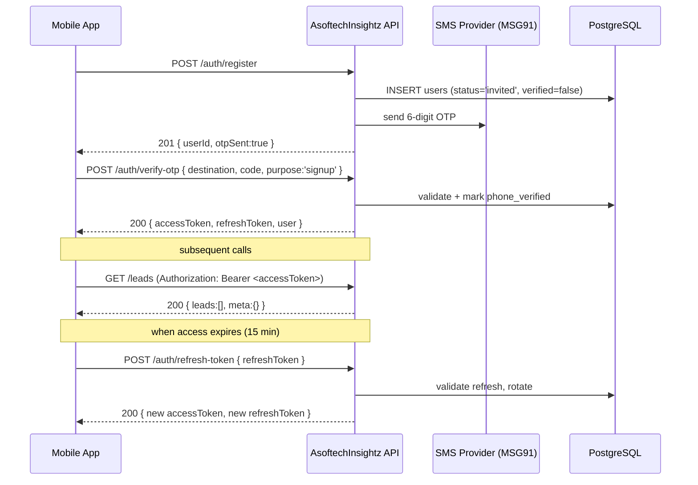
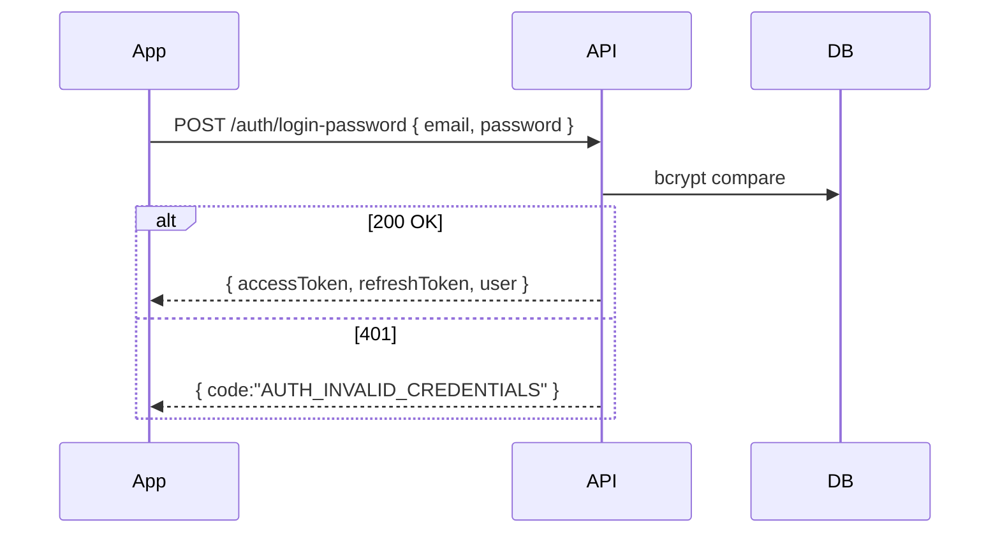
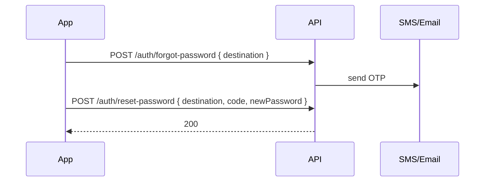

# Authentication Flow

## Mobile sign-up + login (recommended)

## Email + password login

## Forgot / reset

## Token model

| Token         | TTL     | Storage on client                | Notes                                                              |
|---------------|---------|----------------------------------|--------------------------------------------------------------------|
| accessToken   | 15 min  | Memory only                      | Signed JWT, contains `userId`, `tenantId`, `role`, `permissions`   |
| refreshToken  | 30 days | Secure Storage / Keychain        | Opaque, rotated on every refresh, stored hashed in DB              |
| OTP           | 5 min   | Server-side only                 | bcrypt-hashed, max 5 attempts                                      |
