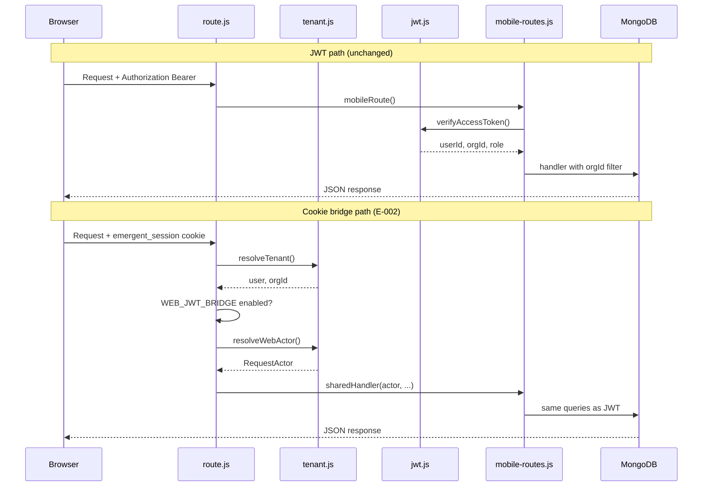
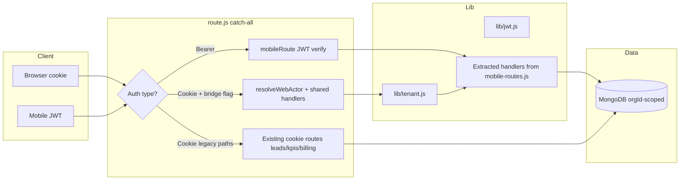
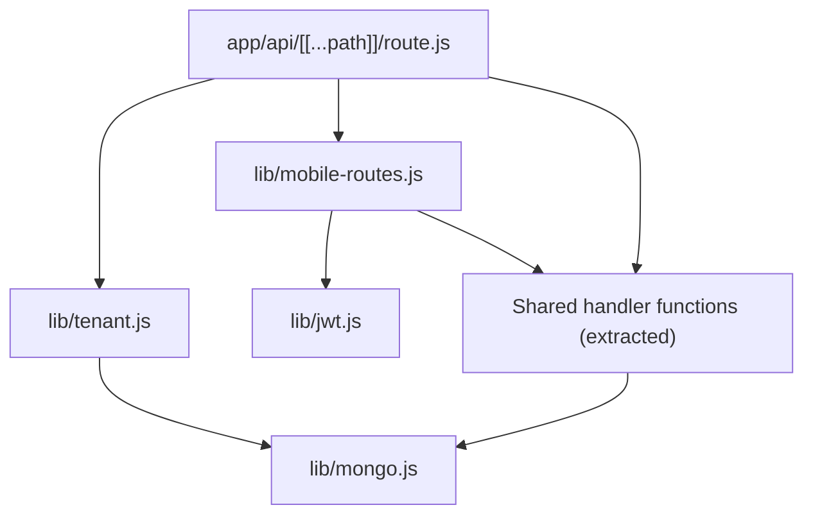

# E-002 — Cookie ↔ JWT Bridge — Technical Design

**Epic:** E-002  
**Version:** 1.0  
**Date:** 3 August 2026  
**Status:** Design only — no implementation  
**Tag:** Enhancement  
**Parent:** [SPRINT1_TECHNICAL_DESIGN_OVERVIEW.md](./SPRINT1_TECHNICAL_DESIGN_OVERVIEW.md)  

---

## 1. Executive Summary

Enable **web cookie sessions** (Emergent OAuth via `emergent_session`) to invoke the **same business handlers** currently reachable only with JWT Bearer tokens in `lib/mobile-routes.js`. The bridge is an **internal auth-context adapter** inside the existing catch-all API — not a new API server, not a second auth system, and not a JWT issuance path for web.

**Unlocks (post-epic, not in E-002 UI scope):** E-006 follow-ups web, E-007 admin web, E-008 WA inbox, E-003 profile PATCH via `users/me`.

**Estimated effort:** 21 story points · 5–7 sprint days · 1 engineer primary.

---

## 2. Business Problem

MSME owners and sales teams use the **browser workspace** (`/dashboard`, `/leadedge360`) but cannot access follow-ups, team admin, WhatsApp inbox, notifications, or mobile dashboard revenue APIs without a separate mobile login. This splits the product and blocks Commercial GA team workflows documented in CS playbooks.

**Evidence:** `SPRINT0_ARCHITECTURE_VALIDATION.md` §2.3 — cookie web ❌ vs JWT mobile ✅ for 6 capability areas.

---

## 3. Business Value

| Stakeholder | Value |
|-------------|-------|
| Customer | One sign-in; browser becomes full workspace |
| CS | Playbooks executable on web; SLA on follow-ups measurable |
| Commercial | Growth/Scale team features sellable without mobile app |
| Engineering | Single handler implementation — no duplicate APIs |

---

## 4. Existing Reusable Components

| Component | Path | Role in design |
|-----------|------|----------------|
| `resolveTenant()` | `lib/tenant.js` | Cookie → `user`, `orgId`, `isDemo` |
| `mobileRoute()` | `lib/mobile-routes.js` | JWT dispatch — **extract handlers from here** |
| `verifyAccessToken()` | `lib/jwt.js` | Unchanged JWT path |
| `route()` master router | `app/api/[[...path]]/route.js` | Add cookie dispatch after tenant resolve |
| `ensureUserOrg()` | `lib/tenant.js` | Already links Emergent user to `users` + `orgs` |

---

## 5. Existing APIs (reuse — no new public routes required)

Bridge exposes **existing paths** to cookie auth when flag enabled:

| Root | Operations | Current auth |
|------|------------|--------------|
| `followups` | CRUD, reminders, close | JWT only |
| `dashboard` | kpis, followups-due, revenue, sales-performance | JWT only |
| `whatsapp` | send, send-template, conversation/:leadId | JWT only |
| `notifications` | list, read, devices, settings | JWT only |
| `admin` | users CRUD, roles GET, subscriptions GET | JWT admin |
| `users` | me GET/PATCH, change-password, subscription | JWT |

**Cookie paths already work:** `leads`, `kpis`, `billing`, `auth/me` — unchanged.

---

## 6. Existing Database Collections

| Collection | Bridge usage |
|------------|--------------|
| `users` | Resolve `userId`, `role` from cookie email + orgId |
| `orgs` | `orgId` scoping — **mandatory on every handler** |
| `follow_ups` | Read/write via bridged followups handlers |
| `whatsapp_messages` | Bridged WA handlers |
| `notifications`, `push_devices` | Bridged notification handlers |

**No new collections.**

---

## 7. Existing UI Components

E-002 is **API-layer only** — no UI in this epic.

**Future reuse (E-006–E-008):** `AppShell.jsx`, shadcn `Table`, `Dialog`, `Badge` — not modified in E-002.

---

## 8. Existing AI Components

None directly. Bridged `dashboard/kpis` may feed same KPIs as executive dashboard — no LLM change.

---

## 9. Existing n8n Workflows

No n8n changes. Ingest webhooks remain cookie/JWT-agnostic (`webhooks/*` with token header).

`whatsapp-followup-automation.json` benefits indirectly when web UI (E-006) ships — not E-002.

---

## 10. Files Expected to Change (implementation phase)

| File | Change type |
|------|-------------|
| `lib/mobile-routes.js` | Extract `runHandler(ctx, ...)` functions; JWT path calls with JWT ctx |
| `lib/tenant.js` | Add `resolveWebActor(request)` → `{ userId, orgId, role, email }` |
| `lib/request-actor.js` | **New file (optional)** — unified `RequestActor` type — same module pattern as existing `lib/*` |
| `app/api/[[...path]]/route.js` | Cookie dispatch branch when `WEB_JWT_BRIDGE` + cookie present |
| `docs/mobile/MOBILE_API_GUIDE.md` | Bridge section |
| `docs/mobile/auth-flow.md` | Dual auth diagram |
| `.env.example` | Document `WEB_JWT_BRIDGE` |

**Not changed:** `lib/jwt.js` token format, mobile client contracts, OpenAPI path list (behavior extension only).

---

## 11. Sequence Diagram

---

## 12. Data Flow Diagram

---

## 13. Component Interaction Diagram

**Key rule:** `handlers` are **one implementation** — JWT and cookie differ only in **actor resolution**.

---

## 14. Error Handling

| Condition | HTTP | Response shape |
|-----------|------|----------------|
| Bridge disabled | 404 | Same as today for JWT-only paths via cookie |
| No cookie / invalid session | 401 | `{ error: "Not signed in" }` — match existing `err()` |
| JWT invalid (mobile) | 401 | Unchanged |
| Cross-tenant resource | 403/404 | No leak — query always includes `orgId` |
| Admin action non-admin | 403 | Match mobile admin checks |
| Handler not found | 404 | `err('Not found', 404)` |
| DB error | 500 | Generic error; log server-side |

**No silent fallback** from cookie to demo org for bridged paths.

---

## 15. Security Considerations

| Topic | Design |
|-------|--------|
| Tenant isolation | Every handler query MUST include `actor.orgId` — same as JWT |
| Privilege | Map `users.role` from DB — cookie user cannot self-elevate |
| Token leakage | Bridge does **not** expose JWT to browser |
| CSRF | Cookie routes use SameSite=Lax (existing); bridged POSTs same-origin from app |
| Admin audit | Extend `audit_logs` on admin mutations (align E-007) |
| Feature flag | `WEB_JWT_BRIDGE=false` → zero behavior change |
| Demo org | `isDemo` users — define policy: bridge allowed for demo or 403 ( **PO-D7**: recommend allow for WS3 demo) |

---

## 16. Performance Considerations

| Topic | Approach |
|-------|----------|
| Extra DB read | `resolveWebActor` may read `users` by email — cache on request object |
| Double dispatch | Avoid calling `mobileRoute` then bridge — order: JWT try first if Bearer present |
| Handler size | Extraction only — no additional LLM or external IO |

---

## 17. Backward Compatibility

| Surface | Compatibility |
|---------|---------------|
| Mobile JWT clients | **100%** — JWT path first when Bearer present |
| Web cookie CRM | Unchanged |
| OpenAPI contracts | Same paths/methods — auth matrix expanded |
| n8n webhooks | Unchanged |

---

## 18. Regression Risks

| Risk | Likelihood | Mitigation |
|------|------------|------------|
| Wrong orgId on cookie actor | High if buggy | Automated isolation tests |
| JWT regression | Medium | Run mobile contract tests pre-merge |
| Duplicate handler logic | Medium | Single extracted module |
| Route order bug | Medium | Bearer checked before cookie bridge |
| Admin escalation | Low | Role check in shared handler |

---

## 19. Feature Flag Strategy

| Env var | Default | Behavior |
|---------|---------|----------|
| `WEB_JWT_BRIDGE` | `false` | Bridged paths return 404 for cookie (current) |
| `WEB_JWT_BRIDGE=true` | staging first | Cookie can invoke shared handlers |

**Rollout:** Staging → pilot tenant → GA cohort. PO-D5 governs prod default.

---

## 20. Rollback Strategy

1. Set `WEB_JWT_BRIDGE=false` and redeploy — immediate.  
2. No data migration — safe rollback.  
3. Mobile clients unaffected.  
4. If bad merge: revert Git tag from `04_RUNTIME_RECONCILIATION_MATRIX.md`.

---

## 21. Acceptance Criteria

- [ ] Cookie session user can `GET/POST/PATCH/DELETE` followups — same data as JWT for same user  
- [ ] Cookie session can `GET admin/users` (if admin role)  
- [ ] Cookie session can `GET whatsapp/conversation/:leadId` and `POST whatsapp/send` (env WA configured)  
- [ ] User A cookie cannot read User B org leads/followups (403/404)  
- [ ] Mobile JWT regression: existing OpenAPI smoke paths PASS  
- [ ] `WEB_JWT_BRIDGE=false` restores pre-epic behavior  
- [ ] WS3 follow-ups/admin/WA steps pass when flag on (CS validation)

---

## 22. Test Plan

| Layer | Tests |
|-------|-------|
| Unit | `resolveWebActor` with mock cookie; role mapping |
| Integration | Cookie vs JWT same orgId on followups CRUD |
| Security | Cross-tenant IDs in URL/body |
| Regression | Mobile JWT paths via `backend_test.py` subset or manual matrix |
| Manual | `03_AUTHENTICATED_VALIDATION_CHECKLIST.md` WS3 |
| CI | Add env `WEB_JWT_BRIDGE=true` job post-implementation |

---

## 23. Definition of Done

- Code merged to staging with flag off in prod  
- Tests above green  
- `MOBILE_API_GUIDE.md` updated  
- No P1 in action register for bridge scope  
- TPM sign-off on isolation tests  

---

## 24. Out of Scope

- Web UI pages (E-006, E-007, E-008)  
- Issuing JWT to web clients  
- OAuth changes / Emergent flow changes  
- New API roots or OpenAPI path additions  
- n8n workflow changes  
- SSO / enterprise RBAC  

---

## Implementation planning

| Metric | Value |
|--------|-------|
| Story points | 21 (E-002-S1–S5) |
| Sprint days | 5–7 |
| Dependencies | PO freeze lift; E-001 recommended |
| Parallel with | E-004 (different files) |
| Merge order | **2nd** (after E-004) |
| Validation gate | G3 cross-tenant tests |

**STOP** — Design only.
