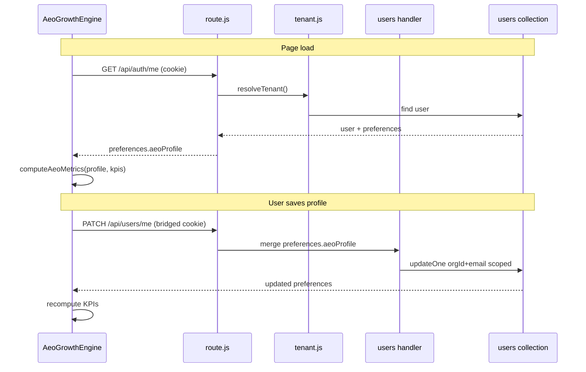
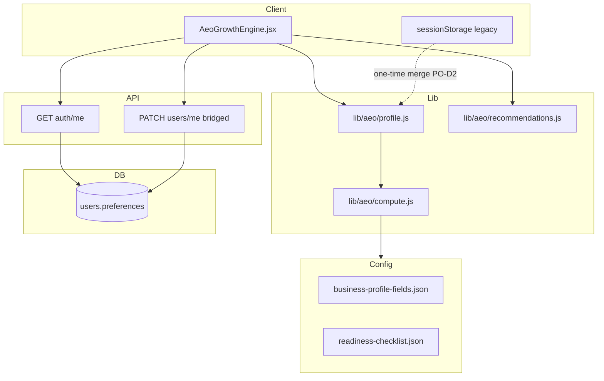
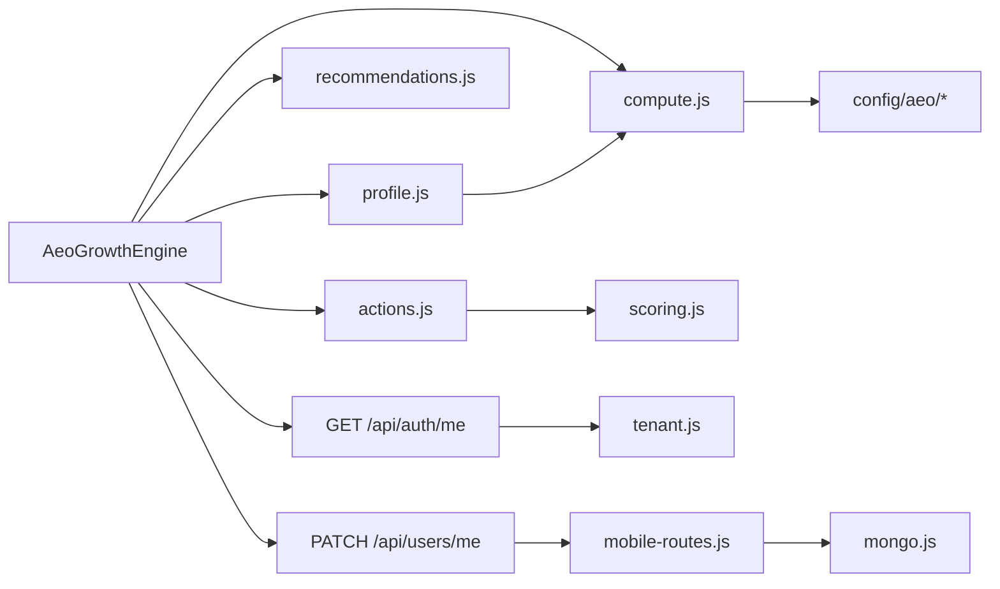

# E-003 — Server AEO Profile — Technical Design

**Epic:** E-003  
**Version:** 1.0  
**Date:** 3 August 2026  
**Status:** Design only — no implementation  
**Tag:** Enhancement  
**Parent:** [SPRINT1_TECHNICAL_DESIGN_OVERVIEW.md](./SPRINT1_TECHNICAL_DESIGN_OVERVIEW.md)  

---

## 1. Executive Summary

Persist the **AEO business profile** and optional **checklist state** on the server (`users.preferences`) instead of **browser-only `sessionStorage`** (`lib/aeo/profile.js`). Hydrate `AeoGrowthEngine.jsx` from server on load; save via PATCH. **Extends** existing AEO compute, config JSON, and prompts — no new AEO architecture.

**Depends on:** E-002 recommended for `PATCH /api/users/me` reuse; alternative PO-approved path extends `auth/me` PATCH.

**Estimated effort:** 13 story points · 3–4 sprint days.

---

## 2. Business Problem

Business profile data is lost when users switch devices, clear browser storage, or when CS validates completeness from a different session. AEO KPIs (completeness, FAQ readiness, local visibility) become unreliable for onboarding and expansion gates.

**Evidence:** `SPRINT0_TECH_DEBT.md` TD-H02; CS-06 documents sessionStorage limitation.

---

## 3. Business Value

| Stakeholder | Value |
|-------------|-------|
| Customer | Enter business data once; persists everywhere |
| CS | Trust completeness KPI; Tenant #1 dashboard accurate |
| AEO automation | n8n reminders align with server truth (ops doc) |
| AI prompts | Server profile enriches LLM context consistently |

---

## 4. Existing Reusable Components

| Component | Path | Role |
|-----------|------|------|
| `AeoGrowthEngine.jsx` | `components/aeo/` | Load/save UX — wire to API |
| `loadAeoProfile` / `saveAeoProfile` | `lib/aeo/profile.js` | Migrate to server-first + optional local merge |
| `computeAeoMetrics` | `lib/aeo/compute.js` | Same compute — input from server profile |
| `buildRecommendations` | `lib/aeo/recommendations.js` | Unchanged |
| `invokeAeoPrompt` | `lib/aeo/actions.js` → `scoring.js` | Profile in prompt context |
| `emptyAeoProfile()` | `lib/aeo/compute.js` | Default shape for merge |
| Field defs | `config/aeo/business-profile-fields.json` | Validation reference |
| Checklist | `config/aeo/readiness-checklist.json` | Weights unchanged |
| Defaults | `config/aeo/defaults.json` | Territories, FAQ target |

---

## 5. Existing APIs

| API | Current | E-003 extension |
|-----|---------|-----------------|
| `GET /api/auth/me` | user + billing | Add `preferences.aeoProfile`, `preferences.aeoChecklistState` |
| `PATCH /api/users/me` | JWT only | **Bridged cookie** via E-002 — PATCH preferences |
| `GET /api/kpis` | CRM territories | Unchanged — local visibility still uses `byTerritory` |

**Design preference (PO-D1):** PATCH via bridged `users/me` — reuses mobile user update handler with preferences merge.

**Alternative:** `PATCH /api/auth/me` body `{ preferences }` — smaller change but new cookie PATCH surface.

---

## 6. Existing Database Collections

| Collection | Field (planned) | Type | Notes |
|------------|-----------------|------|-------|
| `users` | `preferences.aeoProfile` | object | Mirrors client profile shape from `emptyAeoProfile()` |
| `users` | `preferences.aeoChecklistState` | object | Optional — manual checklist toggles (PO-D6) |

**No new collection.** Mongo flexible schema — documents without field behave as empty profile.

**Shape authority:** `emptyAeoProfile()` + `business-profile-fields.json` — document in PR.

---

## 7. Existing UI Components

| Component | Change |
|-----------|--------|
| `AeoGrowthEngine.jsx` | `useEffect` load from `auth/me`; save debounced PATCH |
| `KpiCard` | No change — displays computed KPIs |
| `/dashboard`, `/leadedge360` | Host pages — no structural change |

**No new pages.**

---

## 8. Existing AI Components

| Asset | Use |
|-------|-----|
| 8 prompt JSON files | Context built from server `preferences.aeoProfile` |
| `runAeoPrompt` | Server-side invoke already possible via `actions.js` |
| `llmCallsPerHour` | Unchanged cap in `defaults.json` |

**No new LLM vendor or model.**

---

## 9. Existing n8n Workflows

| Workflow | E-003 impact |
|----------|--------------|
| `aeo-profile-reminder.json` | Ops: document server field; optional future HTTP to `auth/me` — **not implemented in E-003 code** |
| `aeo-faq-nudge.json` | Same |
| `aeo-review-reminder.json` | Same |

E-003 delivers **data layer**; n8n read path is **ops follow-up** (export doc in epic PR).

---

## 10. Files Expected to Change

| File | Change |
|------|--------|
| `components/aeo/AeoGrowthEngine.jsx` | Server load/save |
| `lib/aeo/profile.js` | `hydrateFromServer`, merge policy |
| `lib/tenant.js` or mobile `handleUsers` | PATCH preferences merge |
| `app/api/[[...path]]/route.js` | `auth/me` read preferences if not via users handler |
| `lib/mobile-routes.js` | PATCH `users/me` accepts `preferences` subset |
| `scripts/test-aeo-compute.mjs` | Server profile fixtures |
| `docs/aeo/` | Persistence note |
| `docs/customer-success/CUSTOMER_ONBOARDING_KIT.md` | CS-06 close |

---

## 11. Sequence Diagram

---

## 12. Data Flow Diagram

---

## 13. Component Interaction Diagram

---

## 14. Error Handling

| Condition | Behavior |
|-----------|----------|
| Not signed in | 401; UI shows sign-in prompt |
| PATCH validation fail | 400 with field errors from `business-profile-fields.json` rules |
| Partial preferences merge | Deep merge at `preferences.aeoProfile` keys — don't wipe unrelated preferences |
| Server read fail | UI fallback: empty profile + toast (not silent sessionStorage override) |
| Concurrent edits | Last-write-wins on PATCH — document for MSME single-user default |

---

## 15. Security Considerations

| Topic | Design |
|-------|--------|
| Scope | User can only PATCH own `users` doc (email + orgId match) |
| PII | Profile may contain phone, address — no log body |
| Cross-tenant | `updateOne({ email, orgId })` — mandatory |
| Demo org | Profile persists for demo user — acceptable for WS3 |

---

## 16. Performance Considerations

| Topic | Approach |
|-------|----------|
| Payload size | Profile object ~2–5KB — acceptable on `auth/me` |
| Save frequency | Debounce PATCH 500–1000ms on field blur |
| Compute | Client-side compute unchanged — no extra LLM on save |

---

## 17. Backward Compatibility

| Case | Behavior |
|------|----------|
| Old clients sessionStorage only | One-time merge on first load (PO-D2) then server wins |
| Users without preferences field | `emptyAeoProfile()` default |
| JWT mobile `users/me` | PATCH preferences supported for mobile parity |

**Rollback flag:** `AEO_PROFILE_SERVER=false` — revert to sessionStorage read/write (implementation detail).

---

## 18. Regression Risks

| Risk | Mitigation |
|------|------------|
| KPI drift vs pre-epic | Golden tests on compute with same profile object |
| sessionStorage overrides server | Server-first load order |
| Broken AEO on dashboard | WS3 AEO steps |
| PATCH without E-002 | Implement auth/me PATCH alternative if bridge delayed |

---

## 19. Feature Flag Strategy

| Flag | Purpose |
|------|---------|
| `AEO_SERVER_PROFILE=true` | Enable server load/save |
| `AEO_MERGE_SESSION_ONCE=true` | PO-D2 merge policy |

Default **off** until staging validation.

---

## 20. Rollback Strategy

1. Disable `AEO_SERVER_PROFILE` — UI uses sessionStorage only.  
2. Server data retained — no data loss.  
3. Re-enable when fixed.

---

## 21. Acceptance Criteria

- [ ] Profile saved on server survives new browser / incognito (after sign-in)  
- [ ] `GET /api/auth/me` includes `preferences.aeoProfile`  
- [ ] Completeness % matches `npm run test:aeo` for same profile object  
- [ ] `leadedge360` and `/dashboard` AEO sections show consistent KPIs  
- [ ] No regression on CRM KPI charts  
- [ ] CS-06 documentation updated / closed  

---

## 22. Test Plan

| Test | Method |
|------|--------|
| Compute parity | Extend `test-aeo-compute.mjs` |
| PATCH merge | Integration: PATCH then GET me |
| Cross-user | User A cannot PATCH User B |
| UI manual | Cross-browser profile |
| WS3 | AEO profile checklist steps |

---

## 23. Definition of Done

- Merged to staging; flag configurable  
- `test:aeo` green  
- Docs updated  
- CS sign-off on onboarding kit step  

---

## 24. Out of Scope

- New AEO KPIs or prompts  
- Server-side only compute (still client compute in E-003)  
- n8n HTTP profile fetch implementation  
- Industry packs (E-017)  
- Public AEO API  

---

## Implementation planning

| Metric | Value |
|--------|-------|
| Story points | 13 |
| Sprint days | 3–4 |
| Dependencies | Freeze lift; E-002 for PATCH path (recommended) |
| Parallel with | E-004 only if PATCH on `auth/me` chosen without E-002 |
| Merge order | **3rd** (after E-002) |
| Validation gate | G4 `test:aeo` + G5 WS3 AEO |

**STOP** — Design only.
