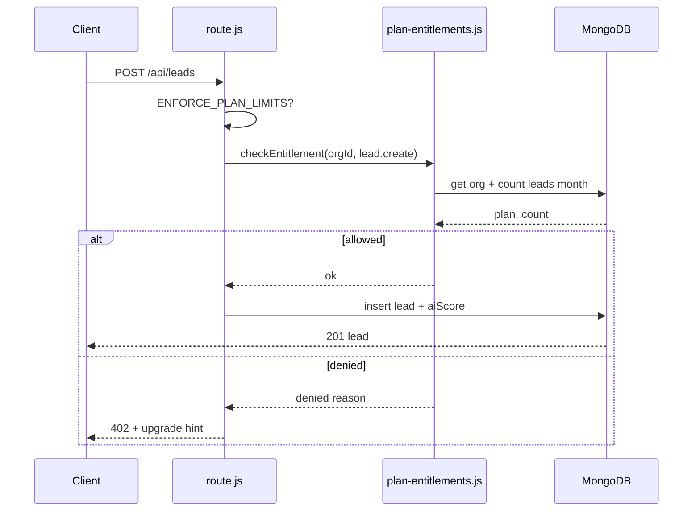
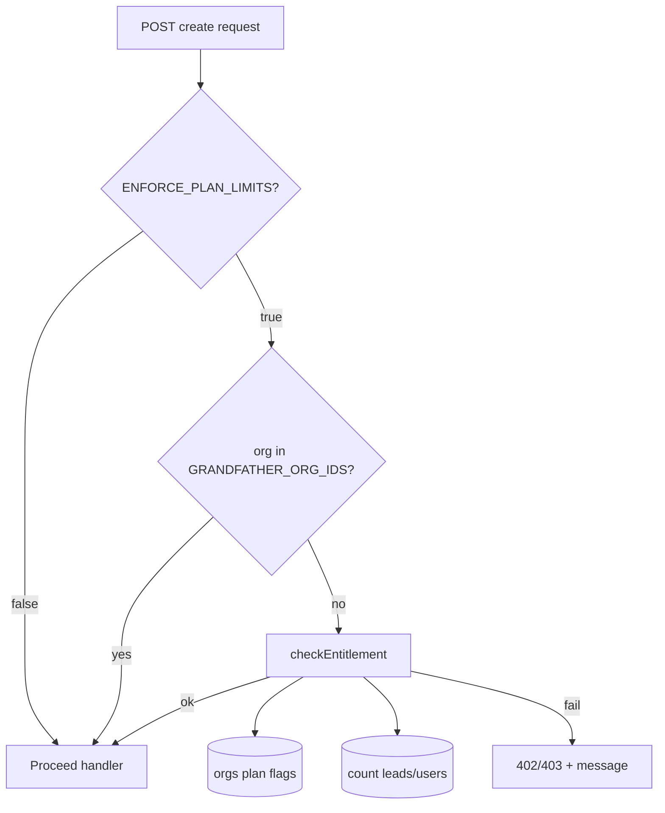
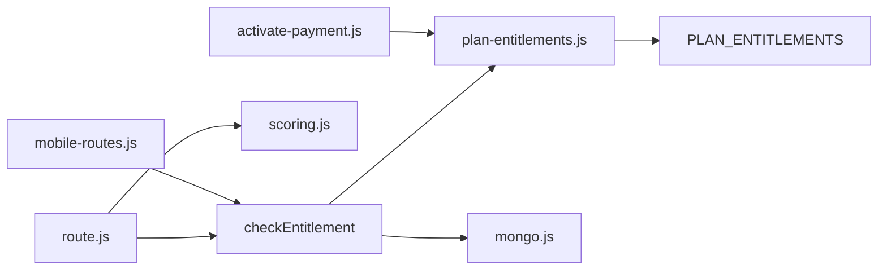

# E-004 — Plan Limit Enforcement — Technical Design

**Epic:** E-004  
**Version:** 1.0  
**Date:** 3 August 2026  
**Status:** Design only — no implementation  
**Tag:** Enhancement  
**Parent:** [SPRINT1_TECHNICAL_DESIGN_OVERVIEW.md](./SPRINT1_TECHNICAL_DESIGN_OVERVIEW.md)  

---

## 1. Executive Summary

**Enforce** plan entitlements already defined in `lib/billing/plan-entitlements.js` at API create boundaries: lead create, retail SKU create, and admin user create. Uses existing `orgs.plan`, `leadEnabled`, `retailEnabled`, and limit constants — **no new billing product**, no Razorpay change in this epic.

**Estimated effort:** 10 story points · 2–3 sprint days.

---

## 2. Business Problem

Starter/Growth/Scale plans advertise lead caps, user seats, and retail gating — but API accepts unlimited creates. Commercial integrity and self-serve upgrade path are broken.

**Evidence:** `SPRINT0_TECH_DEBT.md` TD-H03; `PLATFORM_CURRENT_STATE` billing §.

---

## 3. Business Value

| Stakeholder | Value |
|-------------|-------|
| Commercial | Plans mean something; upgrade CTA valid |
| Finance | Usage aligned to MRR tier |
| CS | Clear messaging when customer hits cap |
| Engineering | Single `checkEntitlement()` helper |

---

## 4. Existing Reusable Components

| Module | Path | Role |
|--------|------|------|
| `PLAN_ENTITLEMENTS` | `lib/billing/plan-entitlements.js` | Source of limits |
| `getEntitlementsForPlan()` | Same | Resolve plan → limits |
| `getOrgBillingPatch()` | Same | Used on payment activate |
| `activatePaymentSuccess()` | `lib/billing/activate-payment.js` | Sets org flags |
| `getOrgBillingContext()` | `lib/billing/org-billing.js` | `auth/me` billing slice |
| `PLANS` | `lib/razorpay.js` | Plan IDs starter/growth/scale |

---

## 5. Existing APIs (guard points)

| Endpoint | Action key | Current |
|----------|------------|---------|
| `POST /api/leads` | `lead.create` | No limit check |
| `POST /api/products` | `retail.create` | No `retailEnabled` check |
| `POST /api/admin/users` (mobile) | `user.create` | No maxUsers check |
| Webhook lead ingest | `lead.create` | **Design decision PO-D8** — count or exempt |

**Read paths unchanged:** GET leads, kpis, billing status.

---

## 6. Existing Database Collections

| Collection | Use in enforcement |
|------------|-------------------|
| `orgs` | `plan`, `leadEnabled`, `retailEnabled`, `billingStatus` |
| `leads` | `countDocuments({ orgId, createdAt in month })` |
| `users` | `countDocuments({ orgId })` for seat limit |
| `products` | Count optional — limit is retail **access** not SKU count (Growth allows retail) |

**Limits from config (existing):**

| Plan | leadsPerMonth | maxUsers | retailEnabled |
|------|---------------|----------|---------------|
| starter | 500 | 1 | false |
| growth | 10000 | 5 | true |
| scale | null (unlimited) | null | true |

---

## 7. Existing UI Components

| Component | Enhancement |
|-----------|-------------|
| `leadedge360/page.js` create dialog | Show error from 402 response + link to `/pricing` |
| `retailedge360/page.js` create dialog | Block when retail disabled |
| Admin UI (future E-007) | Error on user create — API error sufficient for E-004 |

**Reuse:** existing `toast` (sonner) for error messages.

---

## 8. Existing AI Components

`POST /api/leads` triggers `aiScore()` — enforcement runs **before** insert to avoid LLM cost on rejected creates.

---

## 9. Existing n8n Workflows

Lead ingest workflows POST to webhooks → create lead. **PO-D8:** Either enforce limits on webhook path (consistent) or `INGEST_BYPASS_LIMITS` for ops — **recommend enforce** with CS awareness for campaigns.

---

## 10. Files Expected to Change

| File | Change |
|------|--------|
| `lib/billing/plan-entitlements.js` | Export `checkEntitlement(db, orgId, action)` |
| `app/api/[[...path]]/route.js` | Guard POST leads, POST products; webhook if PO-D8 enforce |
| `lib/mobile-routes.js` | Guard admin user create |
| `app/(application)/leadedge360/page.js` | Error UX |
| `app/(application)/retailedge360/page.js` | Error UX |
| `scripts/simulate-billing-flow.mjs` | At-cap scenarios |
| `.env.example` | `ENFORCE_PLAN_LIMITS`, `GRANDFATHER_ORG_IDS` |

---

## 11. Sequence Diagram

---

## 12. Data Flow Diagram

---

## 13. Component Interaction Diagram

---

## 14. Error Handling

| Case | HTTP | Body example |
|------|------|----------------|
| Lead cap exceeded | 402 | `{ error, code: "PLAN_LIMIT_LEADS", limit, current, plan, upgradeUrl }` |
| Retail not enabled | 403 | `{ code: "PLAN_RETAIL_DISABLED" }` |
| User cap exceeded | 402 | `{ code: "PLAN_LIMIT_USERS" }` |
| Unknown plan | 500 | Log; fail safe **deny** or allow — **PO-D9: recommend deny** |
| Enforcement disabled | — | Pass through |

**Stable `code` strings** for UI mapping.

---

## 15. Security Considerations

| Topic | Design |
|-------|--------|
| Bypass | Enforcement server-side only — UI hide is not security |
| Webhook ingest | Same `orgId` on payload — reject if over cap |
| Demo org | `DEMO_ORG_ID` — exempt or separate cap (**PO-D10**: recommend exempt for demo) |
| Grandfather list | Env-only — not client controllable |

---

## 16. Performance Considerations

| Topic | Approach |
|-------|----------|
| Count query | Index `{ orgId, createdAt }` on leads — verify index exists or add compound in ops |
| Per-request overhead | One count per POST — acceptable at MSME scale |
| Scale plan | `null` limits → skip count |

---

## 17. Backward Compatibility

| Case | Behavior |
|------|----------|
| `ENFORCE_PLAN_LIMITS=false` | Identical to today |
| Existing tenants over cap | Blocked when enabled — grandfather env (PO-D3) |
| Free/trial orgs without plan | Treat as starter or block — **PO-D11** |

---

## 18. Regression Risks

| Risk | Mitigation |
|------|------------|
| Pilot tenant blocked | Grandfather list |
| Webhook lead loss | Monitor ingest errors; CS playbook |
| Wrong month window | Use calendar month Asia/Kolkata |
| Double count webhook + manual | Same `leads` collection |

---

## 19. Feature Flag Strategy

| Env | Default | Behavior |
|-----|---------|----------|
| `ENFORCE_PLAN_LIMITS` | `false` | No guards |
| `GRANDFATHER_ORG_IDS` | empty | Comma-separated org ids |

Staging: enforce on test org without grandfather.

---

## 20. Rollback Strategy

1. `ENFORCE_PLAN_LIMITS=false` — immediate.  
2. No data rollback needed.  
3. Revert code if logic bug — flag as interim.

---

## 21. Acceptance Criteria

- [ ] Starter org at 500 leads in month → POST lead returns 402  
- [ ] Growth org can create retail SKU; Starter cannot  
- [ ] Growth org at 5 users → admin create returns 402  
- [ ] Scale org unlimited leads/users  
- [ ] `ENFORCE_PLAN_LIMITS=false` → no blocking  
- [ ] Grandfather org exempt when listed  
- [ ] UI shows upgrade path to `/pricing`  
- [ ] `npm run test:billing` includes limit cases  

---

## 22. Test Plan

| Test | Tool |
|------|------|
| Under/at/over cap | `simulate-billing-flow.mjs` |
| Retail gating | Integration POST products |
| User cap | Mobile admin create JWT |
| Flag off | Regression — creates succeed |
| Webhook | POST webhook with cap — PO-D8 |

---

## 23. Definition of Done

- Merged staging; flags documented  
- `test:billing` green  
- CS/commercial toolkit mentions limits  
- PO sign-off on grandfather policy  

---

## 24. Out of Scope

- Recurring billing (E-005)  
- Invoice generation  
- Soft UI gating only without API enforcement  
- New plan tiers  
- Usage metering dashboard  
- Enforcement on GET/list (read always allowed)

---

## Implementation planning

| Metric | Value |
|--------|-------|
| Story points | 10 |
| Sprint days | 2–3 |
| Dependencies | Freeze lift; accurate org plan from billing |
| Parallel with | E-002 |
| Merge order | **1st** |
| Validation gate | G2 billing tests |

**STOP** — Design only.
