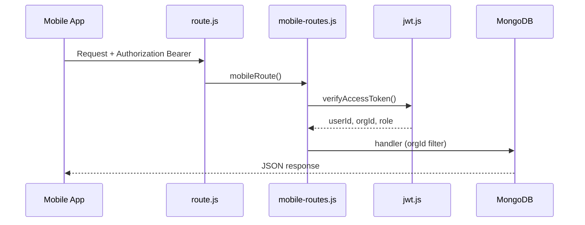
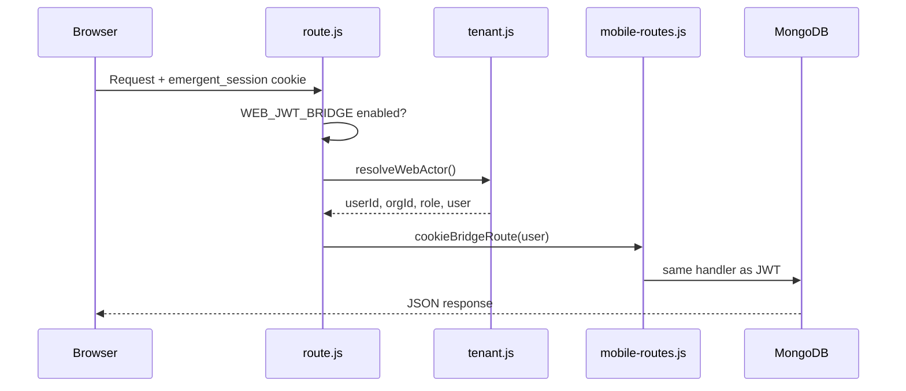

# Authentication Flow — Dual Auth (JWT + Cookie Bridge)

**Epic:** E-002  
**Date:** 3 August 2026

---

## JWT path (mobile — unchanged)

---

## Cookie bridge path (E-002)

---

## Dispatch order in `route.js`

1. **Bearer present** → `mobileRoute` (JWT verify) — always first  
2. **Bridged root, no Bearer, flag ON** → `resolveWebActor` + `cookieBridgeRoute`  
3. **Bridged root, no Bearer, flag OFF** → 404  
4. **Legacy roots** (`leads`, `kpis`, `billing`, …) → existing cookie handlers  

The bridge does **not** issue JWT to the browser and does **not** change Emergent OAuth login.
