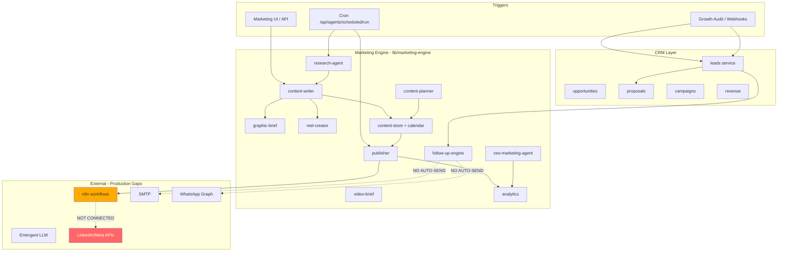
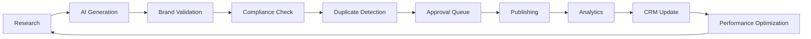

# AsoftechInsightz — Autonomous Marketing System Implementation Plan

**Directive:** Dogfood LeadEdge360 as the complete marketing engine for AsoftechInsightz **before** any new customer-facing LeadEdge360 features.  
**Audit date:** 22 June 2026  
**Phase 1 status:** Complete (read-only — no code modified)  
**Implementation:** Phases 2–8 deferred until this plan is approved  

**Related audits:** `LEADEDGE360_FULL_PLATFORM_AUDIT.md`, `AI_DIGITAL_MARKETING_EMPLOYEE.md`

---

## Executive summary

LeadEdge360 already contains **~60% of the plumbing** for an autonomous marketing department: Marketing Engine (`lib/marketing-engine/`), Campaign Engine (`lib/campaigns/`), event bus, n8n webhooks, CRM, proposals, and 27 marketing API routes. **~40% is missing or non-production:** approval workflow, media rendering, native OAuth, auto-send follow-ups, competitor/keyword research, engagement analytics, and org alignment on VPS.

**Blocking production today:**

1. Org ID mismatch (admin login org ≠ seeded marketing data)
2. VPS running **old UI bundle** (not “AI Digital Marketing Employee”)
3. No LinkedIn/Meta OAuth → nothing publishes
4. No approval queue → cannot safely automate
5. Follow-up/campaign engines **record** but do not **send**
6. Phase 4 integrations (15 platforms) — **0 fully production-ready** except SMTP + partial WhatsApp + Razorpay

**Rule:** No new LeadEdge360 product features until AsoftechInsightz publishes daily, captures leads, and runs pipeline on-platform for **30 consecutive days**.

---

# Phase 1 — Audit (Complete)

## 1.1 Component inventory

| Component | Path | Status | Notes |
|-----------|------|--------|-------|
| **Marketing Engine core** | `lib/marketing-engine/` | ✅ Implemented | 21 modules |
| **Campaign Engine** | `lib/campaigns/` | ✅ Implemented | Manual execute; SMTP |
| **AI Content Writer** | `content-writer.js` | ✅ Implemented | Daily + product pitches |
| **Research Agent** | `research-agent.js` | ⚠️ Partial | LLM/template; no news/SEO API |
| **Calendar Planner** | `content-planner.js` | ⚠️ Partial | 130-item weekly batch timeouts |
| **Publishing Queue** | `publisher.js` + `marketing_publish_queue` | ⚠️ Partial | Dispatches to n8n only |
| **Social Scheduler** | `daily-orchestrator.js` + `marketing_calendar` | ⚠️ Partial | IST slots; needs cron |
| **Growth Audit** | `app/growth-audit/`, `app/api/growth-audit/` | ⚠️ Partial | Public form ✅; in-app engine client-only |
| **CRM Integration** | `lead-ingest.js`, events, webhooks | ✅ Implemented | |
| **Proposal Generator** | `lib/proposals/service.js` | ✅ Implemented | Auto-generate API |
| **Analytics Dashboard** | `analytics.js`, `/marketing-engine` | ⚠️ Partial | CRM metrics; no social reach |
| **AI Agents (marketing)** | `agents.js` (15 agents) | ⚠️ Partial | Registry ✅; several agents brief-only |
| **AI Agents (platform)** | `lib/agents/` (12 agents) | ⚠️ Partial | Handlers vary; tools stub |
| **n8n workflows** | `n8n/workflows/`, `n8n/*.json` | ⚠️ Partial | 5 workflows; `.bak` duplicates |
| **Background jobs** | `worker.js`, `scheduled-jobs.js` | ✅ Implemented | Needs VPS cron |
| **Cron services** | `POST /api/agents/scheduled/run` | ⚠️ Partial | Not confirmed on VPS crontab |
| **Queue workers** | Mongo collections (no Redis) | ⚠️ Partial | Adequate for pilot |
| **OAuth integrations** | — | ❌ Missing | n8n-only design |
| **Email services** | `lib/email/`, `lib/campaigns/smtp.js` | ✅ Implemented | Dry-run without SMTP env |
| **WhatsApp** | `lib/whatsapp.js`, `lib/whatsapp/service.js` | ⚠️ Partial | Graph send exists; CRM UI partial |

### Marketing Engine modules (file map)

```
lib/marketing-engine/
├── agents.js              ✅ Registry (15 agents)
├── analytics.js           ⚠️ CRM-only metrics
├── ceo-marketing-agent.js ✅ Daily report
├── config.js              ✅ Per-org toggles
├── constants.js           ✅ Schedule, content mix, brand
├── content-planner.js       ⚠️ Weekly batch (heavy)
├── content-store.js         ✅ Dedup + calendar
├── content-writer.js        ✅ Daily multi-platform
├── daily-orchestrator.js    ✅ IST job runner
├── engagement-agent.js      ⚠️ Suggestions only
├── follow-up-engine.js      ⚠️ No auto-send
├── graphic-brief.js         ⚠️ Briefs not images
├── index.js                 ⚠️ Incomplete exports
├── lead-ingest.js           ✅
├── llm.js                   ⚠️ Emergent proxy + template fallback
├── product-pitch.js         ✅ LeadEdge + RetailEdge pitches
├── publisher.js             ⚠️ n8n webhook only
├── reel-creator.js          ⚠️ Scripts only
├── research-agent.js        ⚠️ No competitor/keyword APIs
├── video-brief.js           ⚠️ Briefs only
├── worker.js                ✅
└── seeds/asoftechinsightz-launch.js ✅ Week 1 seed
```

### API routes (`app/api/marketing-engine/`)

| Route | Purpose | Status |
|-------|---------|--------|
| `GET/POST /agents` | Agent list | ✅ |
| `GET/PATCH /config` | Org config | ✅ |
| `GET /content` | Content list | ✅ |
| `GET /calendar` | Schedule | ✅ |
| `GET /analytics` | Dashboard data | ✅ |
| `POST /planner/run` | Weekly planner | ⚠️ Timeout risk |
| `POST /publisher/run` | Publish due | ⚠️ Needs n8n |
| `POST /worker/run` | Job orchestrator | ✅ |
| `POST /daily/run` | Daily pipeline | ✅ |
| `GET/POST /research/run` | Research | ✅ |
| `GET /report` | CEO daily report | ✅ |
| `POST /leads/ingest` | Lead capture | ✅ |

**Missing APIs (required for Phases 3–7):**

- `/marketing-engine/approval/*` — approval queue
- `/marketing-engine/competitors/*` — competitor research
- `/marketing-engine/keywords/*` — SEO keywords
- `/marketing-engine/media/*` — rendered assets
- `/marketing-engine/engagement/*` — social metrics ingest
- `/marketing-engine/health` — OAuth/cron/queue status
- `/marketing-engine/performance` — Phase 7 command center

---

## 1.2 Dependency map (current state)



---

## 1.3 Gap classification

| Category | Items |
|----------|-------|
| **✅ Existing** | Content writer, research (basic), calendar, publisher queue, lead ingest, CRM, proposals, campaigns (email), daily orchestrator, CEO report, seeds, 12 platform agents |
| **⚠️ Partial** | Weekly planner, graphic/video/reel (briefs only), follow-up (no send), engagement (no ingest), analytics (no social), n8n (not deployed), WhatsApp, Growth Audit in-app |
| **❌ Missing** | Approval workflow, competitor research, keyword research, image/carousel render, video render, blog CMS, landing page gen, WordPress, all native OAuth, GA/GSC/Ads, performance command center |
| **🔄 Duplicate** | Growth Audit (2 UIs), Revenue (2 UIs), n8n `.bak` files, catch-all API vs dedicated routes, weekly planner vs daily writer |
| **💀 Dead / placeholder** | `lib/auth.js` session stub, Google OAuth stub route, Automation Hub workflow builder toasts, Reports demo download, `ExecutiveCommandCenter` unused |
| **🎭 Mock APIs** | `src/services/api/mock/*` — Command Center, Insights, Automation, Revenue Intel, Conversations, Reports (dev default unless `NEXT_PUBLIC_USE_MOCK_API=false`) |
| **🚫 Production blockers** | Org mismatch, VPS old bundle, no cron, no n8n OAuth, no approval gate, SMTP unset, `GROWTH_AUDIT_ORG_ID` drift |

---

## 1.4 Target architecture (Phases 3–7)



---

# Phase 2 — Make AsoftechInsightz the First Customer

**Goal:** Single org `asoftechinsightz` (or aligned slug) owns **all** marketing + CRM data.

## 2.1 Verification checklist

| System | Verify | Command / URL |
|--------|--------|---------------|
| Marketing dashboard | New UI loads | `/marketing-engine` — title “AI Digital Marketing Employee” |
| CRM | Leads visible | `/leads` |
| Campaigns | 3 nurture drafts | `/campaigns` |
| AI agents | 15 marketing + 12 platform | `/marketing-engine` + `/ops/agents` |
| Daily scheduler | Pipeline runs | `POST /api/marketing-engine/daily/run` `{full:true}` |
| Calendar | 7+ entries | `/marketing-engine` calendar section |
| Proposals | ASI prefix | `/proposals` |
| Lead pipeline | Growth audit → lead | `/growth-audit` test submit |
| Revenue | Dashboard loads | `/revenue` |
| Org alignment | Admin org = data org | `npm run marketing-engine:diagnose` |

## 2.2 Org mismatch resolution (no new code — ops)

```bash
cd /opt/asoftech-insightz

# 1. Diagnose
npm run marketing-engine:diagnose

# 2. Align org (if UUID vs slug)
PILOT_ADMIN_EMAIL=admin@asoftechinsightz.com \
PILOT_ORG_ID=asoftechinsightz \
npm run pilot:align-org -- --from-email

# 3. Re-seed to admin org
npm run marketing-engine:seed-asoftech

# 4. Env
grep GROWTH_AUDIT_ORG_ID .env   # must match aligned orgId

# 5. Rebuild + verify
docker compose build app --no-cache && docker compose up -d app
npm run marketing-engine:retest
```

## 2.3 Production env (required)

```bash
GROWTH_AUDIT_ORG_ID=asoftechinsightz
NEXT_PUBLIC_APP_ENV=production
NEXT_PUBLIC_USE_MOCK_API=false
DEV_AUTH_BYPASS=false
REQUIRE_AUTH=true
N8N_ENABLED=true
N8N_WEBHOOK_URL=http://n8n:5678/webhook/marketing-social-publish
AGENT_CRON_SECRET=<strong-secret>
EMERGENT_LLM_KEY=<key>          # optional; templates work without
SMTP_HOST / SMTP_USER / SMTP_PASS # for campaigns + follow-up
WHATSAPP_ACCESS_TOKEN / WHATSAPP_PHONE_NUMBER_ID
CERT_ADMIN_EMAIL=admin@asoftechinsightz.com
```

---

# Phase 3 — Autonomous Marketing Employee (27-step workflow)

| Step | Capability | Current | Phase 3 work |
|------|------------|---------|--------------|
| 1 | Research trends | ⚠️ | Add news/RSS feed |
| 2 | Research competitors | ❌ | New `competitor-agent` |
| 3 | Research keywords | ❌ | New `seo-agent` / GSC later |
| 4 | Research pain points | ⚠️ | Extend research-agent |
| 5 | Content ideas | ✅ | research → writer |
| 6–9 | LinkedIn/FB/IG/X posts | ✅ | Already in content-writer |
| 10 | Blog articles | ⚠️ | Planner only; need publish target |
| 11 | Email newsletters | ⚠️ | Campaigns manual execute |
| 12 | Proposal templates | ✅ | `proposal_templates` |
| 13–14 | Case studies / success stories | ⚠️ | Planner quotas; no approval |
| 15 | Hashtags | ✅ | `publisher.js` rotation |
| 16 | Image prompts | ✅ | `graphic-brief.js` |
| 17–18 | Reel/video scripts | ✅ | `reel-creator`, `video-brief` |
| 19 | Queue all content | ✅ | `content-store` + calendar |
| 20 | Submit for approval | ❌ | **Build approval module** |
| 21 | Publish after approval | ⚠️ | Wire publisher to approved only |
| 22 | Track engagement | ❌ | n8n inbound + engagement store |
| 23 | Capture leads | ✅ | Growth audit, ingest, webhooks |
| 24 | Score leads | ✅ | lead-qualification-ai |
| 25 | Assign follow-ups | ⚠️ | Creates records; no send |
| 26 | Update CRM | ✅ | Events + leads service |
| 27 | Daily executive report | ✅ | ceo-marketing-agent |

**Phase 3 completion criteria:** Steps 20–22 + 25 send path = production.

---

# Phase 4 — Integrations (production-only mandate)

| Integration | Current | Phase 4 deliverable |
|-------------|---------|---------------------|
| LinkedIn | n8n skeleton | OAuth in n8n + publish node tested |
| Facebook | n8n skeleton | Meta Business OAuth |
| Instagram | n8n skeleton | IG Graph via Meta |
| Google Business Profile | ❌ | GBP API post node |
| X (Twitter) | content types only | X API v2 via n8n |
| YouTube | briefs only | Upload API or manual handoff |
| WordPress Blog | ❌ | REST API publish |
| SMTP Email | ✅ | Configure Hostinger/production |
| WhatsApp | ⚠️ | Full Graph + template messages |
| Google Calendar | ❌ | OAuth + meeting-scheduler |
| Microsoft Calendar | ❌ | Graph API |
| Google Meet | ❌ | Calendar attach |
| Microsoft Teams | ❌ | Phase 4b |
| Zoom | ❌ | Phase 4b |
| Google Analytics | ❌ | GA4 Data API |
| Google Search Console | ❌ | Search Analytics API |
| Google Ads | ⚠️ | Webhook ingest exists |
| Meta Ads | ⚠️ | Webhook ingest exists |

**No mock rule:** Disable `USE_MOCK_API` in production; remove toast-only UI actions in marketing paths.

---

# Phase 5 — Approval Workflow

**New collections:** `marketing_approval_queue`  
**New UI:** `/marketing-engine/approvals`  
**States:** `pending_review` → `approved` → `scheduled` → `published` | `rejected`

| Gate | Implementation |
|------|----------------|
| Brand validation | Rule engine: logo, colors, CTA required (`constants.BRAND`) |
| Compliance | No fake testimonials; DPDP consent on lead forms |
| Duplicate detection | Existing `contentHash` + `publishBodyHash` |
| CEO approval | Single-click approve/reject; optional auto-approve for score>90 |

Publisher must **only** publish `status: approved` calendar entries.

---

# Phase 6 — Daily automation (unattended after approval)

| Time (IST) | Job | Exists |
|------------|-----|--------|
| 06:00 | Research + competitors + keywords | Partial |
| 07:00 | Generate all platform posts + blog draft | ✅ |
| 08:00 | Image prompts → render | Partial |
| 09:00 | Reel/video scripts | ✅ |
| 10:00–13:00 | Submit to approval queue | ❌ |
| 14:00 | Auto-publish approved | ⚠️ |
| 18:00 | Reel publish slot | ⚠️ |
| 20:00 | Analytics snapshot | ✅ |
| 21:00 | CEO email report | ⚠️ (DB only; need SMTP send) |

**Cron (VPS):**

```cron
0 * * * * curl -s -X POST http://127.0.0.1:3000/api/agents/scheduled/run \
  -H "Authorization: Bearer $AGENT_CRON_SECRET" \
  -H "Content-Type: application/json" \
  -d '{"orgId":"asoftechinsightz"}'
```

---

# Phase 7 — AI Performance Dashboard

**New route:** `/marketing-engine/command-center` (or extend `/marketing-engine`)

| Metric | Source | Status |
|--------|--------|--------|
| Marketing Score | Composite KPI | ❌ Build |
| Campaign Performance | `campaign_executions` | ✅ |
| Social Reach | GA + platform APIs | ❌ |
| Engagement | `marketing_engagement_queue` | ❌ |
| Lead Generation | `leads` by source | ✅ |
| Lead Conversion | Hot → Won | ✅ |
| Website Visitors | GA4 | ❌ |
| SEO Ranking | GSC | ❌ |
| Email Performance | `campaign_messages` | ✅ |
| WhatsApp Performance | threads | ⚠️ |
| Revenue / MRR / ARR | `payments`, `subscriptions` | ✅ |
| Pipeline Value | opportunities | ✅ |
| Agent Activity | `marketing_agent_runs` | ✅ |
| Failed Jobs | `dead_letter_events` | ✅ |
| OAuth / Cron / API Health | New health service | ❌ |

---

# Phase 8 — Technical debt removal

| Item | Action | When |
|------|--------|------|
| Duplicate Growth Audit UIs | Public `/growth-audit` + redirect in-app | Phase 2 |
| Duplicate Revenue pages | Merge into one | Phase 8 |
| `src/services/api/mock/*` for marketing paths | Force HTTP in prod | Phase 2 |
| Weekly 130-post planner default | Deprecate; daily writer primary | Phase 3 |
| n8n `.bak` files | Delete | Phase 2 |
| catch-all `.bak` routes | Delete | Phase 8 |
| `lib/marketing-engine/index.js` incomplete exports | Fix exports | Phase 3 |
| Automation Hub placeholder | Hide or wire to marketing engine | Phase 8 |
| Unused `ExecutiveCommandCenter` | Remove or adopt | Phase 8 |

---

# Deliverable 1 — Implementation roadmap

| Phase | Duration | Outcome |
|-------|----------|---------|
| **2** Dogfood setup | Week 1–2 | AsoftechInsightz org aligned, VPS current, cron live |
| **3** Autonomous employee core | Week 3–6 | Approval + auto-send + daily 27-step loop |
| **4** Integrations wave 1 | Week 7–10 | LinkedIn, Meta, SMTP, WhatsApp, WordPress |
| **4b** Integrations wave 2 | Week 11–14 | Calendar, GA, GSC, Ads |
| **5** Approval hardening | Week 5–6 | (parallel with 3) |
| **6** Full daily automation | Week 7–8 | Unattended after approval |
| **7** Performance dashboard | Week 9–10 | Command center live |
| **8** Debt cleanup | Week 11–12 | Single marketing platform |
| **Validation** | Week 13–14 | 30-day dogfood certification |

**Gate to customer features:** Pass **Dogfood Certification** (see Deliverable 7).

---

# Deliverable 2 — Gap analysis with priorities

## P0 — Blockers (Week 1–2)

1. Org alignment + seed to admin org
2. Deploy latest marketing bundle to VPS
3. `NEXT_PUBLIC_USE_MOCK_API=false`
4. VPS hourly cron
5. n8n running + LinkedIn OAuth
6. SMTP configured

## P1 — Autonomous loop (Week 3–6)

7. Approval queue (API + UI)
8. Publisher gated on `approved`
9. Follow-up auto-send (email)
10. Campaign drip automation (Growth Audit 3-email)
11. CEO report emailed daily
12. Competitor + keyword research agents (basic)
13. Image render from graphic briefs (Canva API or Bannerbear)

## P2 — Scale dogfood (Week 7–10)

14. Meta FB/IG publish
15. Engagement ingest from n8n
16. Blog publish (WordPress or `/blog` CMS)
17. WhatsApp template campaigns
18. Auto-proposal when score > 80
19. Performance command center v1

## P3 — After dogfood certified

20. Remaining Phase 4 integrations
21. Customer-facing LeadEdge360 enhancements
22. Self-serve tenant provisioning for paying clients

---

# Deliverable 3 — Module dependency diagram

See Section 1.2 (current) and 1.4 (target). Critical path:

```
Org Fix → Seed → Cron → Research → Writer → Approval → n8n → LinkedIn
                ↓
         Growth Audit → Lead → Score → Follow-up Send → Proposal
```

---

# Deliverable 4 — Production readiness checklist

## Infrastructure

- [ ] VPS app container rebuilt with latest `marketing-engine` page
- [ ] Mongo indexes: `npm run marketing-engine:indexes`
- [ ] n8n container running (`docker compose up -d n8n`)
- [ ] Hourly cron with `AGENT_CRON_SECRET`
- [ ] `.env` production vars set (see Phase 2.3)
- [ ] SSL / domain `asoftechinsightz.com` → app

## Data

- [ ] `npm run marketing-engine:diagnose` → admin org matches content
- [ ] Validation runbook: `docs/marketing/MARKETING_ENGINE_VALIDATION_AND_QUEUE.md`
- [ ] `GROWTH_AUDIT_ORG_ID` = admin `orgId`
- [ ] 7+ calendar entries visible in UI
- [ ] 3 nurture campaigns in `/campaigns`

## Integrations

- [ ] SMTP sends test email
- [ ] n8n workflow **Active** + test webhook
- [ ] LinkedIn test post published
- [ ] WhatsApp test message (optional Week 2)

## Automation

- [ ] `POST /daily/run` `{full:true}` succeeds
- [ ] Publisher publishes approved post
- [ ] Follow-up sends on cadence
- [ ] CEO report generated 21:00 IST

## Security

- [ ] `DEV_AUTH_BYPASS=false`
- [ ] `REQUIRE_AUTH=true`
- [ ] JWT secret not default
- [ ] Webhook secrets rotated

## Validation

- [ ] `npm run marketing-engine:retest` ≥ 8/9 pass
- [ ] `npm run db:agent-runtime-retest` 24/24 pass
- [ ] 30-day dogfood log (manual spreadsheet)

---

# Deliverable 5 — Week-by-week execution plan

| Week | Focus | Deliverables |
|------|-------|--------------|
| **W1** | Phase 2 ops | align-org, seed, diagnose, deploy bundle, env vars |
| **W2** | Publish loop | n8n + LinkedIn OAuth, cron, first live post |
| **W3** | Approval | Approval queue API + UI, brand rules |
| **W4** | Send loop | Follow-up + nurture auto-send, SMTP |
| **W5** | Research++ | Competitor + keyword agents |
| **W6** | Media | Image render pipeline from briefs |
| **W7** | Meta | Facebook + Instagram publish |
| **W8** | Blog + email | WordPress or internal blog publish |
| **W9** | Dashboard | Performance command center v1 |
| **W10** | Sales tie-in | Auto-proposal score>80, meeting scheduler |
| **W11** | Debt | Consolidate duplicates, remove mocks |
| **W12** | Hardening | GA/GSC hooks, engagement ingest |
| **W13–14** | Dogfood cert | 30-day unattended run (post-approval) |

---

# Deliverable 6 — Risk assessment

| Risk | Likelihood | Impact | Mitigation |
|------|------------|--------|------------|
| Org mismatch persists | High | Empty dashboard | diagnose + align-org script |
| LinkedIn API rejection | Medium | No publish | Start with manual approve + n8n |
| LLM costs at scale | Medium | Budget | Template fallback; cap `llmEnhancePerType` |
| Weekly planner timeout | High | Failed retest | Use daily writer only |
| Brand/reputation from auto-post | Medium | Trust | Approval queue mandatory Phase 5 |
| VPS bundle drift | High | Old UI | `pack-marketing-launch.ps1` + apply script |
| SMTP deliverability | Medium | Lost leads | SPF/DKIM; Hostinger prod |
| Scope creep to customer features | High | Delay dogfood | **Hard gate** in directive |
| 500 customers by Dec 2026 | High | Business | Dogfood must work first; then scale ads |

---

# Deliverable 7 — Final go-live checklist (Dogfood Certification)

AsoftechInsightz may shift to customer-facing LeadEdge360 work **only when all are true**:

### Marketing automation

- [ ] **30 consecutive days** of scheduled content generation
- [ ] **≥1 post/day** published to LinkedIn (approved)
- [ ] **≥3 platforms** connected (LinkedIn + 2 others)
- [ ] Approval queue used for **100%** of publishes
- [ ] Zero manual copy-paste posting for 14 days

### Lead generation

- [ ] **≥30 Growth Audit leads/month** from organic
- [ ] All leads in CRM with correct `orgId` and source
- [ ] AI scoring runs on every inbound lead
- [ ] Nurture drip sends automatically

### Sales loop

- [ ] **≥5 demos/month** booked from platform leads
- [ ] Proposals sent within 48h of hot lead
- [ ] **≥1 paying external pilot** (not AsoftechInsightz itself)

### Operations

- [ ] Cron runs hourly (logged)
- [ ] CEO daily report emailed
- [ ] Performance dashboard shows live KPIs
- [ ] `marketing-engine:retest` pass
- [ ] No `USE_MOCK_API` in production
- [ ] Incident log: **zero** P0 outages in 30 days

### Sign-off

- [ ] Founder approves dogfood certification
- [ ] Document learnings in case study (real metrics only)

---

# What NOT to build (until dogfood certified)

- New LeadEdge360 modules for external customers
- RetailEdge360 marketing campaigns
- White-label / multi-tenant marketing UI
- Stripe / international billing
- Enterprise RFP features
- Second marketing engine or parallel scheduler

---

# Immediate next actions (Week 1 — ops only, no feature code)

1. Windows: `pack-marketing-launch.ps1` → `scp` to VPS  
2. VPS: `bash scripts/vps-apply-marketing-launch.sh`  
3. VPS: `npm run pilot:align-org -- --from-email`  
4. VPS: `npm run marketing-engine:diagnose`  
5. Set production `.env` vars  
6. Import + activate n8n `marketing-social-publish.json`  
7. Hard-refresh `/marketing-engine` — confirm new UI  

**After Week 1 passes → begin Phase 3 implementation (approval queue first).**

---

*Phase 1 audit complete. No code modified. Implementation authorized for Phase 2 ops, then Phase 3+ per priority table.*
