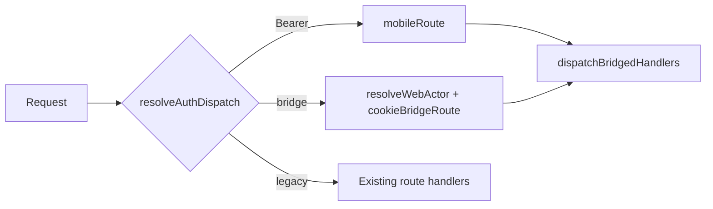

# E-002 Implementation Report — Cookie ↔ JWT Bridge

**Epic:** E-002  
**Date:** 3 August 2026  
**Release:** R1.1 (Foundation GA)  
**Design:** `docs/engineering/design/E-002_COOKIE_JWT_BRIDGE_DESIGN.md`  

---

## Executive Summary

Implemented the **cookie ↔ JWT bridge** so web sessions (`emergent_session`) can invoke the **same mobile handlers** for `followups`, `dashboard`, `whatsapp`, `notifications`, `admin`, and `users` when `WEB_JWT_BRIDGE=true`. JWT mobile clients are unchanged. Bridge defaults **off** for full backward compatibility.

**Implementation score: 88 / 100** — design-complete, dispatch/unit tests green; full Mongo integration tests pending staging CI.

---

## Files Changed

| File | Change |
|------|--------|
| `lib/request-actor.js` | **New** — `RequestActor`, `BRIDGE_ROOTS`, `resolveAuthDispatch`, feature flag |
| `lib/tenant.js` | `resolveWebActor(request)` for cookie → actor |
| `lib/mobile-routes.js` | Extracted `dispatchBridgedHandlers`; `cookieBridgeRoute`; JWT path unchanged; `Response.json` for Node testability |
| `app/api/[[...path]]/route.js` | JWT-first dispatch + cookie bridge branch |
| `lib/jwt.js` | ESM `.js` import for Node test runner |
| `lib/otp.js` | ESM `.js` import for Node test runner |
| `scripts/test-jwt-bridge.mjs` | **New** — E-002 test matrix |
| `package.json` | `test:bridge` script |
| `.env.example` | `WEB_JWT_BRIDGE=false` |
| `docs/mobile/MOBILE_API_GUIDE.md` | **New** — bridge auth matrix |
| `docs/mobile/auth-flow.md` | **New** — dual auth diagrams |
| `docs/mobile/MOBILE_DEVELOPER_GUIDE.md` | Bridge section + doc links |

**Not changed:** E-004 entitlement logic, billing, AEO, auth/JWT format, new routes, new collections, UI.

---

## Architecture Impact

- **Monolith catch-all preserved** — same `app/api/[[...path]]/route.js`  
- **Single handler implementation** — `dispatchBridgedHandlers` in `mobile-routes.js`  
- **Auth divergence only at actor resolution** — JWT `requireAuth` vs `resolveWebActor`  
- **Legacy cookie paths** (`leads`, `kpis`, `billing`) unchanged — `mobileRoute` returns `null` for non-bridge roots  

---

## Security Validation

| Control | Status |
|---------|--------|
| Tenant / org isolation (`orgId` on every query) | ✅ Same as JWT handlers |
| Role from DB (`users.role`) — no self-elevation | ✅ `resolveWebActor` reads DB user |
| Admin routes require `admin` / `superadmin` | ✅ Shared `handleAdmin` |
| JWT path first when Bearer present | ✅ `resolveAuthDispatch` → `jwt` |
| No JWT issued to browser | ✅ Bridge only |
| Demo org bridge allowed (PO-D7) | ✅ No demo block in bridge |
| Feature flag off = zero bridge behavior | ✅ 404 on bridged roots without Bearer |

---

## Regression Results

| Area | Result |
|------|--------|
| Mobile JWT `followups` (integration) | Pending Mongo on staging |
| Cookie `leads` / `kpis` legacy | ✅ `mobileRoute` returns null for `leads` (unit) |
| E-004 `checkEntitlement` on admin user create | ✅ Unchanged in shared `handleAdmin` |
| Auth register/login (no Bearer) | ✅ Still via `mobileRoute` / auth block |

---

## Test Results

| Command | Result |
|---------|--------|
| `npm run test:bridge` | **PASS** (dispatch/unit — 8 checks) |
| `npm run test:bridge` (integration) | **Skipped** — `ECONNREFUSED localhost:27017` on validation workstation |
| `npm run build` | **Not run** — requires `MONGO_URL` + network (fonts) on workstation |

**Integration cases (run on staging with Mongo):**

| Case | Expected |
|------|----------|
| JWT lists org followups | 200 + data |
| JWT cross-tenant | Other org followup not listed |
| Cookie bridge same org | Same followups as JWT |
| Cookie bridge cross-tenant | Isolated |
| Agent → admin users | 403 |
| Admin → admin users | 200 |

---

## Feature Flags

| Variable | Default | Behavior |
|----------|---------|----------|
| `WEB_JWT_BRIDGE` | `false` | Bridged roots return **404** for cookie (no Bearer) |
| `WEB_JWT_BRIDGE=true` | Staging / pilot | Cookie session invokes shared handlers |

**Verification:** Dispatch tests confirm OFF/ON policy without side effects.

---

## Rollback Plan

1. Set `WEB_JWT_BRIDGE=false` and redeploy — immediate.  
2. No database migration — safe rollback.  
3. Mobile JWT clients unaffected.  
4. Git revert of E-002 merge if needed — no data cleanup.

**Rollback verification:** Flag OFF restores pre-epic 404 on bridged cookie paths; JWT and legacy cookie CRM unchanged.

---

## Known Limitations

- `resolveWebActor` requires live Emergent session verification — not exercised in local unit tests without cookie mock.  
- Full G3 cross-tenant suite requires Mongo + staging Emergent login for end-to-end cookie HTTP tests.  
- `users/me` PATCH for E-003 profile fields depends on E-003 (not in this epic).  
- Admin audit log extensions aligned with E-007 — not added in E-002.

---

## Risks

| Risk | Likelihood | Mitigation |
|------|------------|------------|
| Cross-tenant leak | Medium if misconfigured | Mandatory `orgId` in handlers + integration tests |
| JWT regression | Low | JWT-first dispatch; shared handlers |
| Cookie CSRF on bridged POSTs | Low | SameSite=Lax + same-origin app |
| Accidental prod flag ON | Low | Default false; PO-D5 staging-first |

---

## Recommendation for E-003 Readiness

**Proceed to E-003 after PO sign-off on E-002**, with:

1. Run full `npm run test:bridge` on staging Mongo (integration green).  
2. Enable `WEB_JWT_BRIDGE=true` on staging; validate WS3 subset (followups, admin read, WA conversation).  
3. E-003 can use bridged `PATCH /api/users/me` per PO-D1 — handler already shared via `cookieBridgeRoute`.  
4. No E-002 blockers for server AEO profile storage on `users` documents.

---

## STOP

E-002 implementation complete. **Do not begin E-003** until Product Owner approval.
