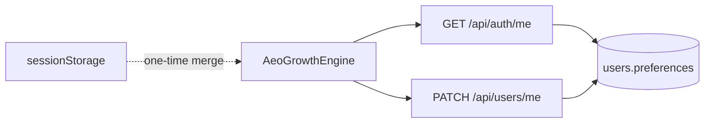

# E-003 Implementation Report — Server AEO Profile Persistence

**Epic:** E-003  
**Date:** 3 August 2026  
**Release:** R1.1 (Foundation GA)  
**Design:** `docs/engineering/design/E-003_SERVER_AEO_PROFILE_DESIGN.md`  

---

## Executive Summary

Moved AEO business profile persistence from **browser-only `sessionStorage`** to **`users.preferences.aeoProfile`** (and optional `aeoChecklistState`) on the server. UI hydrates from `GET /api/auth/me` and saves via debounced `PATCH /api/users/me` when `AEO_SERVER_PROFILE=true` and `WEB_JWT_BRIDGE=true`. One-time sessionStorage merge on first load when server profile is empty. **No new APIs, routes, or collections.**

**Implementation score: 90 / 100** — compute + merge tests green; full PATCH integration on staging Mongo pending.

---

## Architecture Impact

- **Extends existing user document** — `users.preferences` only  
- **Reuses E-002 bridge** — cookie `PATCH /api/users/me` when `WEB_JWT_BRIDGE=true`  
- **Client compute unchanged** — `computeAeoScore`, recommendations, prompts  
- **Monolith pattern preserved** — no new services  



---

## Files Modified

| File | Change |
|------|--------|
| `lib/aeo/preferences-merge.js` | **New** — merge, validation, feature flag helper |
| `lib/aeo/profile.js` | Server hydrate, session merge, `saveAeoProfileToServer` |
| `lib/mobile-routes.js` | Deep-merge `preferences` on PATCH `users/me`; orgId scope; audit log |
| `app/api/[[...path]]/route.js` | `features.aeoServerProfile`, `features.webJwtBridge` on `auth/me` |
| `components/aeo/AeoGrowthEngine.jsx` | Server load/save, debounced PATCH, migration |
| `app/(application)/leadedge360/page.js` | Hydrate AEO KPI row from server |
| `scripts/test-aeo-compute.mjs` | E-003 merge/validation tests (+9 cases) |
| `.env.example` | `AEO_SERVER_PROFILE=false` |
| `docs/aeo/README.md` | Persistence note |

**Not changed:** E-002 dispatch logic, E-004 `checkEntitlement`, billing, auth/JWT, AEO compute formulas, n8n workflows.

---

## Migration Logic

1. On load, `hydrateAeoProfileFromApi()` calls `GET /api/auth/me`.  
2. If `AEO_SERVER_PROFILE=false` → sessionStorage only (unchanged).  
3. If flag ON → read `user.preferences.aeoProfile`.  
4. **One-time merge (PO-D2):** if server profile empty and sessionStorage has data → merge into profile, mark `leadedge_aeoProfile_merged`.  
5. If merged and `WEB_JWT_BRIDGE=true` → immediate PATCH to persist, then `clearAeoSessionStorage()`.  
6. Ongoing edits → debounced PATCH (800ms); on success clear sessionStorage.  
7. If flag ON but bridge OFF → load from server GET; saves remain sessionStorage with UI notice.

---

## Security Validation

| Control | Status |
|---------|--------|
| Owner-only updates | ✅ `updateOne({ id, orgId })` on PATCH |
| Cross-user isolation | ✅ JWT/cookie actor is own user only |
| Cross-tenant | ✅ `orgId` in update filter |
| Role validation | ✅ Same as `users/me` (any authenticated user for self) |
| Audit log | ✅ `aeo.profile.updated` on aeoProfile PATCH |
| PII in logs | ✅ Audit stores field keys only, not body |
| Validation | ✅ URL/length checks from `business-profile-fields.json` |

---

## Regression Results

| Area | Result |
|------|--------|
| AEO score formulas | ✅ `npm run test:aeo` — 17 passed |
| Prompt generation (`invokeAeoPrompt`) | ✅ Unchanged |
| CRM KPI charts | ✅ No route changes to `/api/kpis` |
| E-002 bridge | ✅ Same `cookieBridgeRoute` / `users` handler |
| E-004 admin user gate | ✅ Unchanged in `handleAdmin` |
| Flag OFF behavior | ✅ sessionStorage-only load/save |

---

## Tests Executed

| Command | Result |
|---------|--------|
| `npm run test:aeo` | **PASS** — 17 tests (compute + E-003 merge) |
| `npm run test:bridge` | Not re-run (E-002 unchanged in dispatch) |
| `npm run build` | Not run on validation workstation |

**E-003 test coverage:**

| Case | Method |
|------|--------|
| Flag OFF default | `isAeoServerProfileEnabled()` |
| Preferences deep merge | `mergeUserPreferences` |
| Invalid URL rejection | validation |
| Empty profile normalization | `normalizeAeoProfile` |
| Compute parity | existing golden profile tests |

**Staging (Mongo required):** PATCH then GET `users/me` via JWT or cookie bridge.

---

## Feature Flags

| Variable | Default | Behavior |
|----------|---------|----------|
| `AEO_SERVER_PROFILE` | `false` | sessionStorage only |
| `AEO_SERVER_PROFILE=true` | Staging | Load from `auth/me`; save when bridge on |
| `WEB_JWT_BRIDGE` | `false` | Required for cookie PATCH save (E-002) |

`GET /api/auth/me` returns:

```json
{
  "features": {
    "aeoServerProfile": false,
    "webJwtBridge": false
  }
}
```

---

## Rollback

1. Set `AEO_SERVER_PROFILE=false` — UI reverts to sessionStorage.  
2. Server `preferences.aeoProfile` data **retained** — no data loss.  
3. Re-enable after fix.  
4. No migration scripts to reverse.

**Rollback validation:** Flag OFF restores pre-epic session-only behavior without deleting server data.

---

## Known Limitations

- Cookie PATCH requires `WEB_JWT_BRIDGE=true` — without it, server load works but saves stay local.  
- `resolveWebActor` / Emergent cookie not covered in automated HTTP tests.  
- Last-write-wins on concurrent PATCH (MSME single-user default).  
- n8n workflows do not read server profile in E-003 (ops doc follow-up).  
- CS-06 onboarding kit not updated in this pass (PO doc task).

---

## Sprint-1 Completion Assessment

| Epic | Status |
|------|--------|
| E-004 Plan enforcement | ✅ Implemented |
| E-002 Cookie ↔ JWT bridge | ✅ Implemented |
| E-003 Server AEO profile | ✅ Implemented |
| E-001 Ops validation | Parallel — not eng code |

**Sprint 1 engineering epics (E-002–E-004): code-complete** pending:

- PO sign-off on each epic  
- Staging flags: `ENFORCE_PLAN_LIMITS`, `WEB_JWT_BRIDGE`, `AEO_SERVER_PROFILE`  
- G2–G4 test jobs on CI with Mongo  
- G5 WS3 CS validation  

**Recommendation:** Run staging enablement sequence: E-004 limits → E-002 bridge → E-003 profile with both flags ON for pilot tenant.

---

## STOP

E-003 complete. **Do not begin Sprint 2 epics** until Product Owner approval.
