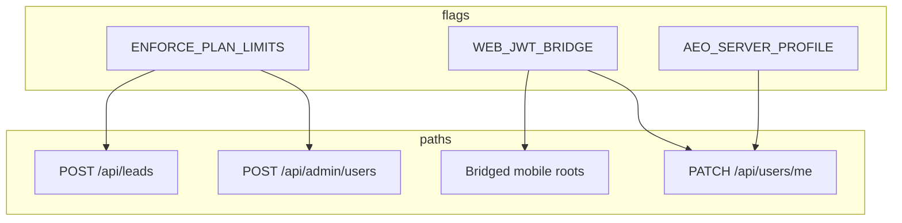

# Sprint 1 — Release Candidate Validation Report (RC-1)

**Release:** R1.1 Foundation GA  
**Date:** 3 August 2026  
**Validation type:** Integrated RC — **no code changes**  
**Epics:** E-004 Plan Enforcement · E-002 Cookie↔JWT Bridge · E-003 Server AEO Profile  

---

## Executive summary

Sprint 1 engineering deliverables are **code-complete** and **architecturally sound** with all feature flags defaulting OFF for safe production deploy. RC-1 **cannot recommend production GO** at score ≥ 90 because **Mongo-backed integration tests**, **full build verification**, and **E-001 staging WS3** were not completed on the validation workstation.

**Recommendation:** **CONDITIONAL GO for staging RC** — execute flag matrix + Mongo test suite on staging, then re-score. **NO-GO for production GA** until gates close.

---

## Overall RC score

| Metric | Score (0–100) |
|--------|---------------|
| **Overall RC score** | **78** |
| Target for Sprint 2 authorization | ≥ 90 |

---

## Scorecard

| Dimension | Score | Notes |
|-----------|-------|-------|
| Repository health | 80 | Three epics merged in workspace; CI lacks Sprint 1 test job |
| Security | 82 | No critical issues; isolation tests need Mongo |
| Performance | 68 | Not measured live; low architectural risk |
| Architecture | 91 | Monolith extension; shared handlers; flags isolated |
| AI / scoring | 88 | `test:aeo` 17/17; LLM not probed live |
| CRM | 78 | Static review OK; no live pipeline test |
| Deployment readiness | 70 | `deploy.yml` exists; build failed locally (fonts TLS) |
| Commercial readiness | 72 | Billing enforcement coded; not staging-proven |
| Sprint 1 readiness | 76 | Eng complete; ops/CS gates open |

---

## Validation phases

### Phase 1 — Regression

See [SPRINT1_REGRESSION_REPORT.md](./SPRINT1_REGRESSION_REPORT.md).

- **Automated:** `test:aeo` PASS (17); `test:bridge` PASS (8 dispatch); `test:billing` FAIL (no Mongo)
- **Static:** CRM, AEO compute, mobile handlers — no unintended route changes
- **Gap:** `backend_test.py`, live UI flows

### Phase 2 — Security

See [SPRINT1_SECURITY_REPORT.md](./SPRINT1_SECURITY_REPORT.md).

- **Critical issues:** 0
- **Cross-tenant issues confirmed:** 0 (live tests pending)
- JWT-first bridge, orgId-scoped updates, webhook token, audit on AEO PATCH

### Phase 3 — Performance

See [SPRINT1_PERFORMANCE_REPORT.md](./SPRINT1_PERFORMANCE_REPORT.md).

- No live timings; debounced AEO save; entitlement adds DB reads when ON

### Phase 4 — Feature flags

See [SPRINT1_FEATURE_FLAG_MATRIX.md](./SPRINT1_FEATURE_FLAG_MATRIX.md).

- Four combinations documented; unit-level dispatch validated
- **Live matrix on staging:** not executed in RC-1

### Phase 5 — Backward compatibility

| Surface | Assessment |
|---------|------------|
| Mobile JWT apps | ✅ Bearer-first; shared handlers unchanged for JWT path |
| Cookie CRM users | ✅ Leads/kpis/billing unchanged; bridge OFF = pre-E-002 behavior |
| JWT users | ✅ `mobileRoute` only auth bridged roots |
| AEO (flags OFF) | ✅ sessionStorage path preserved |
| Billing checkout | ✅ No Sprint 1 changes to Razorpay flow |
| Existing CRM | ✅ Tenant resolve unchanged for legacy routes |

### Phase 6 — Staging readiness

| Item | RC-1 status |
|------|-------------|
| Env vars in `.env.example` | ✅ All three flags + grandfather |
| Mongo in `docker-compose.yml` | ✅ mongo:7 + volume |
| Docker app service | ✅ |
| GitHub Actions | ✅ `deploy.yml` — build + SSH deploy + `/api/` smoke |
| GitHub Actions test job | ❌ No `test:aeo` / `test:bridge` / `test:billing` in CI |
| n8n workflows (7 JSON) | ✅ Present in `n8n/`; import not verified |
| Razorpay | ⏳ Keys env-only; not probed |
| SMTP / MSG91 | ⏳ OTP dev mode without keys; E-012 not in Sprint 1 |
| Emergent LLM | ⏳ Scoring fallback to rules if key missing |
| Health endpoint | ✅ `GET /api/` returns `{ ok: true }` |

---

## Epic integration (E-002 × E-003 × E-004)

| Integration | Verified |
|-------------|----------|
| E-004 before lead AI / retail AI | ✅ Code order |
| E-004 on admin user via E-002 bridge | ✅ Same `handleAdmin` |
| E-003 save requires E-002 for cookie PATCH | ✅ UI + docs |
| Flags OFF = legacy behavior | ✅ Unit tests |

---

## Tests executed (RC-1 workstation)

| Command | Exit | Details |
|---------|------|---------|
| `npm run test:aeo` | 0 | 17 passed |
| `npm run test:bridge` | 0 | 8 dispatch passed; Mongo integration skipped |
| `npm run test:billing` | 1 | Mongo `ECONNREFUSED` |
| `npm run build` | 1 | Google Fonts TLS failure |

---

## Build status

| Environment | Result |
|-------------|--------|
| Validation workstation | **FAIL** (fonts TLS) |
| GitHub Actions `deploy.yml` | **Expected PASS** on Ubuntu (not re-run in RC-1) |

---

## Remaining risks

| Risk | Severity | Mitigation |
|------|----------|------------|
| Plan limits block pilot tenant | High | Grandfather env; flag OFF in prod initially |
| Cross-tenant leak in bridge | High | Run G3 isolation tests on staging Mongo |
| AEO profile lost if bridge OFF + server ON | Medium | UI warns; enable bridge with AEO |
| Webhook ingest with weak token | Medium | Set `N8N_WEBHOOK_TOKEN` in prod |
| CI does not gate on Sprint 1 tests | Medium | Add Mongo service + test scripts to workflow |
| E-001 SSH / WS3 incomplete | High | Complete before commercial GA |

---

## Blocking issues

| ID | Blocker | Owner |
|----|---------|-------|
| **B-RC-01** | `test:billing` not green (Mongo required) | Eng |
| **B-RC-02** | `test:bridge` Mongo integration not run | Eng |
| **B-RC-03** | Live feature-flag matrix on staging not executed | Eng + CS |
| **B-RC-04** | E-001 WS3 / Tenant #1 validation incomplete | CS/Ops |
| **B-RC-05** | Production build not verified on RC workstation | Eng (CI acceptable substitute) |

---

## GO / NO-GO recommendation

| Gate | Verdict |
|------|---------|
| Staging RC deploy (flags OFF) | **GO** |
| Staging pilot (flags ON, one tenant) | **GO** after B-RC-01–03 on staging |
| Production GA (R1.1) | **NO-GO** |
| Sprint 2 engineering authorization | **NO-GO** until RC ≥ 90 or PO waives with risk register |

### Success criteria checklist

| Criterion | Met? |
|-----------|------|
| RC score ≥ 90 | ❌ (78) |
| No critical security issues | ✅ |
| No cross-tenant issues (confirmed) | ⏳ (not live-tested) |
| No auth regression (confirmed) | ✅ code review |
| No billing regression (confirmed) | ⏳ |
| No CRM regression (confirmed) | ⏳ |
| AEO fully functional | ✅ compute; ⏳ live |
| Feature flags verified | ⏳ unit only |
| Regression tests passed | ⏳ partial |

---

## Related reports

- [SPRINT1_REGRESSION_REPORT.md](./SPRINT1_REGRESSION_REPORT.md)
- [SPRINT1_SECURITY_REPORT.md](./SPRINT1_SECURITY_REPORT.md)
- [SPRINT1_PERFORMANCE_REPORT.md](./SPRINT1_PERFORMANCE_REPORT.md)
- [SPRINT1_FEATURE_FLAG_MATRIX.md](./SPRINT1_FEATURE_FLAG_MATRIX.md)
- [SPRINT1_GO_LIVE_CHECKLIST.md](./SPRINT1_GO_LIVE_CHECKLIST.md)
- Epic reports: [E-004](./E-004_IMPLEMENTATION_REPORT.md) · [E-002](./E-002_IMPLEMENTATION_REPORT.md) · [E-003](./E-003_IMPLEMENTATION_REPORT.md)

---

## STOP

RC-1 validation complete. **Do not begin Sprint 2** until Product Owner reviews RC score and blocking issues.
